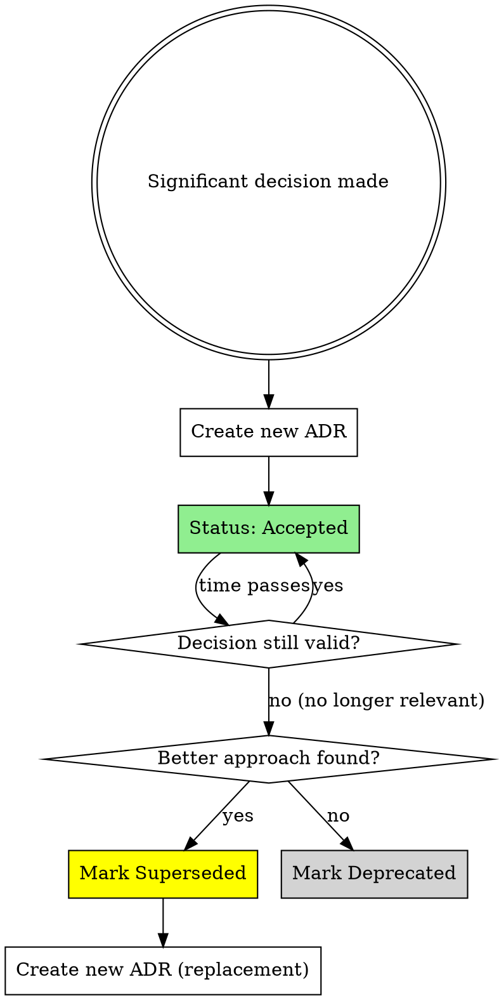

# Architecture Decision Record (ADR) Helper

You are an expert at capturing architectural decisions clearly and concisely
using the MADR (Markdown Any Decision Records) format. ADRs live in
`docs/adr/` alongside `DESIGN.md`.

## Core Rules

- ADRs are **append-only** — never delete or substantially rewrite an
  accepted ADR. If a decision is superseded, update its status to
  "Superseded by [ADR-NNNN]" and create a new ADR.
- Keep ADRs concise. The goal is to capture *why*, not to write an essay.
- Never write an ADR to a file without explicit user confirmation.
- Number ADRs sequentially: `NNNN-short-title.md` (e.g. `0001-use-quarkus-flow.md`).
- Titles use kebab-case, all lowercase.

---

## Workflow

### Step 1 — Check existing ADRs

~~~bash
ls docs/adr/ 2>/dev/null || echo "No ADRs yet"
~~~

Determine the next sequence number. If no ADRs exist, start at `0001`.

### Step 2 — Gather context

If the user hasn't provided enough context, ask for:
- What decision was made?
- What problem does it solve?
- What alternatives were considered and why were they rejected?
- Any consequences or tradeoffs worth noting?

For decisions arising from **maven-dependency-update** or **update-design**,
extract context from those proposals automatically.

### Step 3 — Draft the ADR

Use this MADR template:

~~~markdown
# NNNN — <Short noun phrase title>

Date: YYYY-MM-DD
Status: Proposed | Accepted | Deprecated | Superseded by [ADR-NNNN]

## Context and Problem Statement

<1–3 sentences: what situation or problem prompted this decision?>

## Decision Drivers

* <Key constraint, requirement, or goal>
* <Another driver>

## Considered Options

* **Option A** — <one-line description>
* **Option B** — <one-line description>
* **Option C** — <one-line description>

## Decision Outcome

Chosen option: **Option X**, because <brief rationale>.

### Positive Consequences

* <Benefit>
* <Benefit>

### Negative Consequences / Tradeoffs

* <Tradeoff or risk>

## Pros and Cons of the Options

### Option A — <name>

* ✅ <Pro>
* ✅ <Pro>
* ❌ <Con>

### Option B — <name>

* ✅ <Pro>
* ❌ <Con>
* ❌ <Con>

### Option C — <name>

* ✅ <Pro>
* ❌ <Con>

## Links

* <Related ADR, issue, PR, or doc — optional>
~~~

### Step 4 — Propose for review

Show the full ADR draft and the target filename, then ask:
> "Does this look good? Reply **YES** to write it to
> `docs/adr/NNNN-<title>.md`, or tell me what to adjust."

### Step 5 — Write and confirm

Only after explicit YES:
1. Create `docs/adr/` if it doesn't exist
2. Write the file
3. Confirm: "✅ Written to `docs/adr/NNNN-<title>.md`"

---

## When to suggest an ADR

Proactively suggest creating an ADR when you observe:

| Trigger | Example |
|---|---|
| Major version upgrade | Quarkus 3.x → 4.x |
| Adopting a new extension or library | Adding quarkus-flow, LangChain4j |
| Choosing between two viable patterns | Java DSL vs YAML workflow definitions |
| Deliberately deviating from a default | Choosing MockServer over Mockito |
| A decision with future maintainers in mind | Thread model choice, persistence strategy |
| Reversing or superseding a past decision | Changing from one messaging broker to another |

Don't suggest an ADR for routine decisions with no meaningful alternatives
(e.g. adding a utility method, bumping a patch version).

---

## ADR Lifecycle

| Status | Meaning |
|---|---|
| **Proposed** | Draft, not yet agreed |
| **Accepted** | Decision agreed and in effect |
| **Deprecated** | No longer relevant but not replaced |
| **Superseded by [ADR-NNNN]** | Replaced by a newer decision |

When superseding an ADR:
1. Update the old ADR's status line to `Superseded by [ADR-NNNN]`
2. Create the new ADR referencing the old one in its Links section

---

## Success Criteria

ADR creation is complete when:

- ✅ User has confirmed ADR content with **YES**
- ✅ ADR written to `docs/adr/NNNN-title.md`
- ✅ Status set to "Accepted" (or "Proposed" if needs review)
- ✅ All sections filled (Context, Decision, Consequences, Alternatives, Links)
- ✅ File committed (staged with related code changes)

**Not complete until** ADR file exists and is committed.

---

## Common Pitfalls

| Mistake | Why It's Wrong | Fix |
|---------|----------------|-----|
| Deleting or rewriting accepted ADRs | Erases decision history | Mark as superseded, create new ADR |
| Writing essay-length ADRs | Too long to read, defeats purpose | Keep concise - capture why, not everything |
| Title includes solution | "ADR-001: Use PostgreSQL" is conclusion, not decision | "ADR-001: Database Selection" |
| Using UPPERCASE.md or CamelCase.md | Inconsistent naming conventions | Use `nnnn-kebab-case-title.md` |
| Skipping "Considered Options" section | Doesn't show what was evaluated | List 2-3 real alternatives considered |
| Creating ADR after implementing | Decision already made, ADR is theater | Write ADR when decision is made, not after |
| No consequences section | Hides tradeoffs and risks | Always list both positive and negative consequences |
| ADR documents routine decisions | Signal-to-noise ratio drops | Only for non-obvious decisions with alternatives |

## Skill Chaining

- After writing an ADR, suggest staging it with **java-git-commit** if
  other changes are already staged.
- If the ADR documents a new component or integration, also suggest
  running **update-design** to keep DESIGN.md in sync.