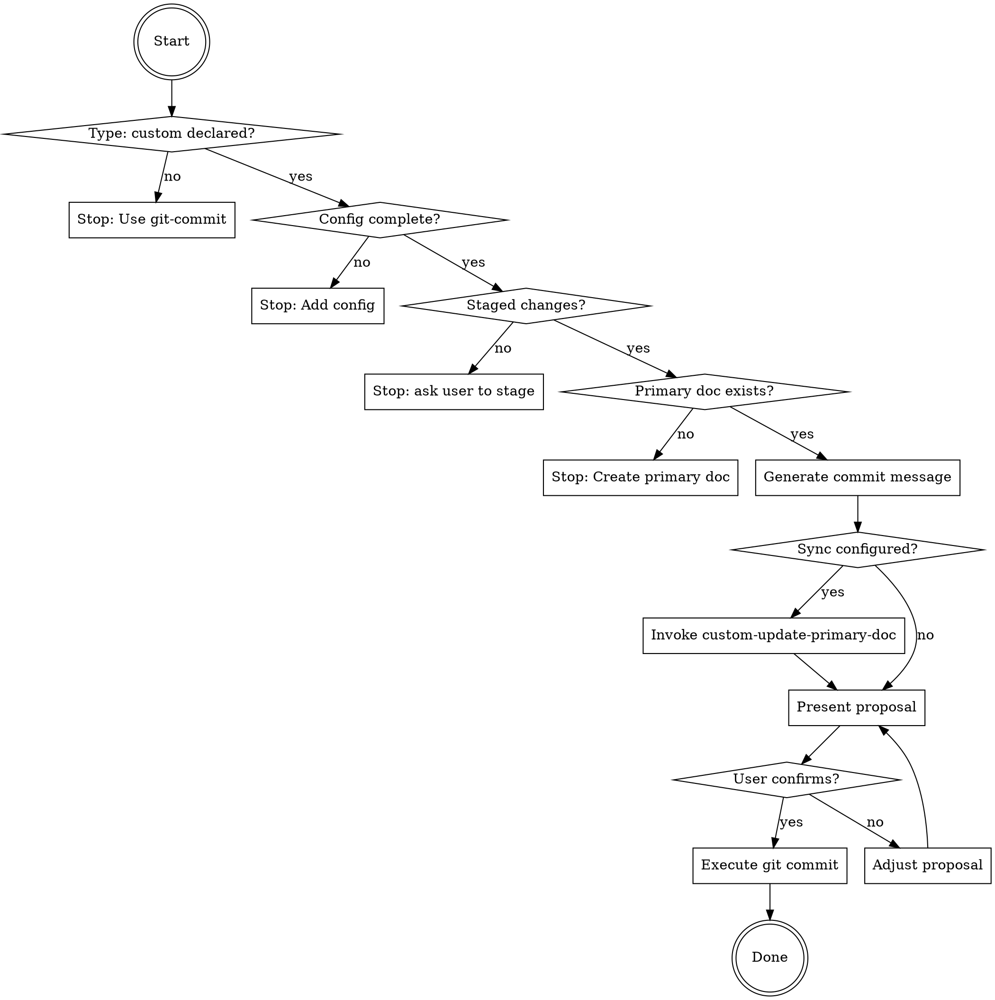

# Custom Project Commit Helper

You are an expert in creating clean, conventional Git commits for custom
project types (working groups, research, documentation, etc.) while keeping
primary documents synchronized.

**This skill extends `git-commit`** by adding:
- User-configured primary document synchronization
- Flexible sync strategy based on CLAUDE.md configuration
- Optional milestone alignment validation
- Optional metadata validation

For the core conventional commits workflow, refer to the `git-commit` skill.

## Prerequisites

**This skill builds on [`git-commit`]**.

Apply all rules from:
- **`git-commit`**: Subject line format (imperative mood, max 50 chars), Conventional Commits 1.0.0 specification, always wait for explicit user confirmation before committing, never add attribution unless user explicitly requests it

Then apply the custom project-specific patterns below.

## Core Rules

- Follow all rules from `git-commit` skill
- **Sync primary document when configured** — read sync strategy from CLAUDE.md
- Never run `git commit` until the user has explicitly confirmed
- Respect user's configuration in CLAUDE.md (don't guess or assume)

## Workflow

### Step 0 — Verify Project Type and Configuration

**Read CLAUDE.md for project type and configuration:**
```bash
cat CLAUDE.md 2>/dev/null
```

**If CLAUDE.md missing:**
Stop and prompt user:
> This skill requires CLAUDE.md with type: custom configuration.
>
> Please use `git-commit` instead - it will help you set up the project type.

**If CLAUDE.md exists but no Project Type:**
Stop and prompt user:
> CLAUDE.md exists but doesn't declare a project type.
>
> Please use `git-commit` - it will help you add the Project Type section.

**If CLAUDE.md declares different type:**
Stop and prompt user:
> ⚠️  CLAUDE.md declares type: {detected_type}, but you're using custom-git-commit.
>
> Please use the correct commit skill for your project type:
> - type: skills → use git-commit
> - type: java → use java-git-commit
> - type: generic → use git-commit

**If CLAUDE.md declares type: custom:**

Extract configuration:
- Primary Document path
- Sync Strategy
- Sync Rules (if strategy is configured)
- Current Milestone (optional)

**Check for required fields:**

If Primary Document missing:
> ⚠️  CLAUDE.md declares type: custom but missing "Primary Document" field.
>
> Add to CLAUDE.md:
> ```
> **Primary Document:** docs/your-doc.md
> ```

If Sync Strategy missing:
> ⚠️  CLAUDE.md declares type: custom but missing "Sync Strategy" field.
>
> Add to CLAUDE.md:
> ```
> **Sync Strategy:** bidirectional-consistency
> ```

If required fields present, continue to Step 1.

---

### Step 1 — Inspect staged changes

Same as `git-commit`:
```bash
git diff --staged --stat
git diff --staged
```

If nothing is staged, stop and tell the user:
> "Nothing is staged. Run `git add <files>` first, or tell me which files
> to stage."

---

### Step 2 — Check Primary Document Exists

Read Primary Document path from CLAUDE.md.

Check if it exists:
```bash
ls {primary_doc_path} 2>/dev/null
```

**If primary document missing:**
Stop and prompt user:
> ❌ Primary document not found: {primary_doc_path}
>
> CLAUDE.md declares this as the primary document, but it doesn't exist.
>
> Would you like me to help you create it? (YES/no)

If YES, work with user to create initial document.
If NO, stop and ask user to create it first.

**If primary document exists:**
Continue to Step 3.

---

### Step 3 — Generate commit message

Analyze the staged changes and draft one conventional commit message (see `git-commit` for format).

Hold it — don't show it yet.

---

### Step 4 — Sync Primary Document (if configured)

**Check if Sync Rules are configured in CLAUDE.md:**

Look for Sync Rules table in CLAUDE.md.

**If Sync Rules table exists and has entries:**
- Invoke `custom-update-primary-doc` skill, passing:
  - Primary document path
  - Sync strategy
  - Sync rules table
  - Staged files
- It will analyze staged changes and propose updates to primary document
- Hold those proposals

**If Sync Rules table is template/empty:**
Note for user:
> Note: Sync Rules not configured in CLAUDE.md.
> Primary document will not be auto-synced.
> Edit CLAUDE.md to add sync rules if you want automatic synchronization.

Continue without sync.

---

### Step 4a — Sync CLAUDE.md (if exists)

Check if CLAUDE.md exists (it should, since we verified it in Step 0):
```bash
ls CLAUDE.md 2>/dev/null
```

**If CLAUDE.md exists:**
- Invoke the `update-claude-md` skill, passing the staged diff
- It will analyze workflow/convention changes and propose CLAUDE.md updates
- Hold those proposals too

---

### Step 5 — Present proposal

**If primary doc sync or CLAUDE.md updates proposed**, show consolidated proposal:
```
## Staged files
<output of git diff --staged --stat>

## Proposed commit message
<type>[optional scope]: <description>

<optional body>

<optional footer>

## Proposed {primary_doc_name} updates (if any)
<output from custom-update-primary-doc skill>

## Proposed CLAUDE.md updates (if any)
<output from update-claude-md skill>
```

**Otherwise**, show standard proposal:
```
## Staged files
<output of git diff --staged --stat>

## Proposed commit message
<type>[optional scope]: <description>

<optional body>

<optional footer>
```

Then ask exactly:
> "Does this look good? Reply **YES** to commit, or tell me what to adjust."

---

### Step 6 — Commit (only after explicit YES)

**If documentation updates were proposed**, run in this exact order:
1. Let custom-update-primary-doc apply its changes (if proposed)
2. Let update-claude-md apply its changes (if proposed)
3. Stage updated files: `git add {primary_doc_path} CLAUDE.md` (only files that were changed)
4. Commit with the confirmed message:
```bash
git commit -m "<subject>" -m "<body if any>"
```
5. Confirm success:
```bash
git log --oneline -1
```

**If no documentation updates**, run in this exact order:
1. Commit with the confirmed message:
```bash
git commit -m "<subject>" -m "<body if any>"
```
2. Confirm success:
```bash
git log --oneline -1
```

---

## Commit Decision Flow



## Common Pitfalls (Custom Projects)

All pitfalls from `git-commit` apply, plus:

| Mistake | Why It's Wrong | Fix |
|---------|----------------|-----|
| Using without CLAUDE.md configuration | Can't sync primary doc | Use git-commit first to set up type |
| Empty Sync Rules table | Primary doc won't sync | Fill in sync rules or remove template |
| Wrong primary doc path | Sync will fail | Verify path in CLAUDE.md matches file |
| Forgetting to configure milestone | Can't track progress | Add Current Milestone to CLAUDE.md |

## Success Criteria

Commit is complete when:

- ✅ All files staged (or user confirmed which files to stage)
- ✅ CLAUDE.md declares type: custom with complete configuration
- ✅ Primary document exists
- ✅ Commit message generated and presented to user
- ✅ Documentation updates applied (if configured)
- ✅ User confirmed with explicit **YES**
- ✅ Commit executed successfully
- ✅ `git log --oneline -1` confirms commit exists

**Not complete until** all criteria met and commit confirmed in git log.

## Skill Chaining

**Invoked by:** User says "commit" in a type: custom project (after git-commit routes here)

**Invokes:**
- [`custom-update-primary-doc`] for primary document sync (automatic if Sync Rules configured)
- [`update-claude-md`] for workflow sync (automatic if CLAUDE.md exists)

**Can be invoked independently:** Yes, but git-commit will route here automatically for type: custom

**Note:** This skill handles all custom project types (working groups, research, API docs, etc.) using user configuration from CLAUDE.md

## Custom Project Types Examples

**Working Group:**
- Primary Document: `docs/vision.md` or `docs/charter.md`
- Sync: catalog entries → Vision sections, meeting notes → Governance
- Milestone: Phase-based (Phase 1, Phase 2, etc.)

**Research Project:**
- Primary Document: `THESIS.md` or `RESEARCH-PLAN.md`
- Sync: experiments → Methodology, papers → Bibliography
- Milestone: Chapter-based (Chapter 3, Chapter 4, etc.)

**API Documentation:**
- Primary Document: `docs/api-design.md`
- Sync: openapi.yaml → API Endpoints, examples → Examples section
- Milestone: Version-based (v2.1.0, v3.0.0, etc.)

**Standards/Specification:**
- Primary Document: `SPECIFICATION.md`
- Sync: implementations → Adoption, issues → Decisions
- Milestone: Draft status (WD, CR, PR, REC)
