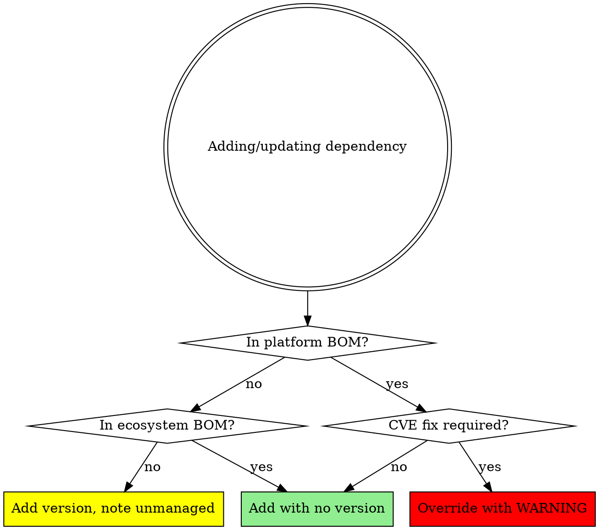

# Dependency Management Principles

Universal principles for managing dependencies in projects using BOM (Bill of
Materials) or similar dependency management patterns.

## Core Principles

- **BOM alignment first** — if a dependency is managed by a BOM/lockfile,
  never override the version without documenting why
- **Never downgrade** without explicit confirmation and documented reason
- **Never apply changes** without explicit user confirmation
- **Check compatibility** before upgrading versions
- **Prefer platform-aligned extensions** over generic libraries when both available

## Workflow

### Step 1 — Understand current state

Read the dependency manifest file to identify:
- Platform/framework version
- BOM or dependency management strategy
- Current dependency versions
- Any explicit version overrides

### Step 2 — Determine the update task

| User request | Action |
|---|---|
| "Upgrade platform" | Check latest platform version, propose upgrade |
| "Add dependency X" | Check if X is BOM-managed; if yes, add without version |
| "Bump dependency X" | Check if X is BOM-managed; warn if manually overriding |
| "Check for updates" | Run update check, filter by alignment risk |

### Step 3 — Check dependency management alignment

**BOM alignment decision flow:**



**BOM alignment rules:**

| Situation | Action |
|---|---|
| Dependency is in platform BOM | Add with no explicit version |
| Dependency is in ecosystem BOM | Add with no explicit version |
| Extension/plugin not in BOM | Specify version; note as "unmanaged" |
| Overriding BOM-managed version | Warn: "Only do this for CVE fixes or confirmed compatibility" |

### Step 4 — Check platform compatibility

For platform version upgrades:
- Check breaking changes in release notes
- Verify ecosystem compatibility (plugins, extensions)
- Check language/runtime version requirements
- Review migration guides

### Step 5 — Propose changes

Present clear proposal:

```
## Proposed dependency changes

| Package | Current | Proposed | BOM managed? | Notes |
|---|---|---|---|---|
| platform-core | 3.2.1 | 3.4.0 | — | Platform upgrade |
| plugin-x | 0.6.0 | 0.7.1 | No | Check release notes |

## BOM alignment check
✅ All other dependencies remain BOM-managed — no version drift.

## Risks
- plugin-x 0.7.1 release notes should be reviewed
- Check for breaking changes in platform 3.4.0
```

Then ask:
> "Does this look good? Reply **YES** to apply these changes,
> or tell me what to adjust."

### Step 6 — Apply and verify

Only after explicit YES:
1. Apply version changes to manifest file
2. Run build/compile check to verify changes
3. Report success or errors

---

## Success Criteria

Dependency update is complete when:

- ✅ User has confirmed changes with **YES**
- ✅ BOM alignment verified (no version drift)
- ✅ Build/compilation succeeds
- ✅ Changes committed to version control
- ✅ For major upgrades: ADR documenting decision (optional but recommended)

**Not complete until** all criteria met and changes committed.

---

## Common Pitfalls

| Mistake | Consequence | Fix |
|---------|-------------|-----|
| Adding version to BOM-managed dependency | Overrides BOM, causes version drift and conflicts | Remove version, let BOM manage it |
| Upgrading one dependency without checking BOM | Breaks compatibility with platform | Check dependency tree first |
| Using platform version in individual dependencies | Duplicate/conflicting version management | Only set in dependency management section |
| Bumping platform without checking ecosystem | Platform-ecosystem version mismatch | Update both in lockstep |
| Applying changes without build check | Silent compilation failures post-commit | Always verify build after changes |
| Upgrading major version without release notes | Breaking changes surprise you | Check release notes before proposing |
| Adding unmanaged version without noting it | Future confusion about explicit version | Note "unmanaged" in proposal |

---

## When to Create ADRs

Create Architecture Decision Records for:
- Major platform version upgrades (e.g., 3.x → 4.x)
- Adopting new significant dependencies/plugins
- Deliberately deviating from BOM (document why)
- Choosing between multiple viable dependency options

---

## Skill Chaining

Package-manager-specific skills (`maven-dependency-update` for Maven/Quarkus,
`npm-dependency-update`, `go-dependency-update`, etc.) implement these principles
with package-manager-specific commands, file formats, and tooling.
