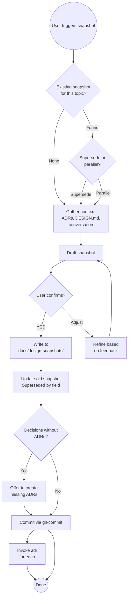

# Design Snapshot

Capture an immutable, dated record of the current design state: where the
project is, how it got here, and where it's going. Unlike DESIGN.md (a living
document), snapshots never change after they're written. They let you rewind
to any point in a project's evolution.

---

## What This Is Not

- **Not an ADR** — ADRs capture one decision deeply. Snapshots capture the full
  design state broadly and link to ADRs rather than duplicate them.
- **Not DESIGN.md** — DESIGN.md is the current truth, kept up to date. A snapshot
  is a freeze of a moment. Both coexist.
- **Not an implementation plan** — snapshots record state; `writing-plans` records intent.

---

## Workflow

### Step 1 — Check for existing snapshots on this topic

```bash
ls docs/design-snapshots/ 2>/dev/null | grep -i "<topic-keyword>"
```

**If existing snapshots found for this topic:**

Show the user the most recent one and ask:

> Found existing snapshot: `YYYY-MM-DD-topic.md`
>
> Does this new snapshot **supersede** it (the design has moved on) or is it
> **parallel** (a different angle on the same topic)?
>
> - **Supersede** — the old snapshot gets a "Superseded by" link pointing here
> - **Parallel** — both coexist independently (e.g. different subsystems)

Wait for user response before continuing.

### Step 2 — Gather context

Read in this order to reconstruct design state:

1. Any existing snapshot on this topic (from Step 1)
2. `docs/adr/` — all ADRs, note which are relevant to this topic
3. `DESIGN.md` or `docs/DESIGN.md` if it exists
4. `CLAUDE.md` for conventions and project type
5. Any spec or plan files mentioned in conversation
6. Conversation context — decisions made today that aren't yet in ADRs

Note which significant decisions have **no ADR yet** — these will be flagged at the end.

### Step 3 — Draft and confirm

Draft the snapshot using the template below. Present the full draft to the user
before writing anything to disk:

> Here is the draft snapshot. Review it carefully — once committed, it is
> immutable.
>
> [draft content]
>
> Confirm to write? **(YES / adjust)**

Wait for explicit YES or feedback. Iterate on feedback before writing.

### Step 4 — Write to disk

```
docs/design-snapshots/YYYY-MM-DD-<kebab-case-topic>.md
```

- Create `docs/design-snapshots/` if it doesn't exist
- Use today's date from system clock
- Topic slug: lowercase, hyphen-separated, ≤30 chars, no articles

```bash
mkdir -p docs/design-snapshots
# write snapshot file
```

### Step 5 — Update superseded snapshot (if applicable)

If Step 1 determined this supersedes an older snapshot, edit the older file:

Find the line:
```
**Superseded by:** *(leave blank — filled in if this snapshot is later superseded)*
```

Replace with:
```
**Superseded by:** [YYYY-MM-DD-topic](YYYY-MM-DD-topic.md)
```

### Step 6 — Prompt for missing ADRs

If significant decisions in the snapshot have no ADR yet, present the list:

> These decisions in this snapshot don't have ADRs yet:
> - [decision A] — should become ADR
> - [decision B] — should become ADR
>
> Want me to create ADRs for these? I'll invoke `adr` for each one after committing.

### Step 7 — Commit

Invoke `git-commit` with the staged snapshot file (and updated superseded file
if applicable). The commit message should reference the snapshot:

```
docs: add design snapshot YYYY-MM-DD-<topic>
```

If the user agreed to create ADRs in Step 6, invoke `adr` after the commit.

---

## Snapshot Decision Flow



---

## Snapshot Template

```markdown
# <Project/Topic> — Design Snapshot
**Date:** YYYY-MM-DD
**Topic:** <short description of what this snapshot covers>
**Supersedes:** [YYYY-MM-DD-topic](YYYY-MM-DD-topic.md) *(omit if none)*
**Superseded by:** *(leave blank — filled in if this snapshot is later superseded)*

---

## Where We Are

<2–4 sentences: the current state of the design. What exists or has been decided.
What the system looks like right now. A reader with no context should understand
the shape of the solution.>

## How We Got Here

Key decisions made to reach this point, in rough chronological order.
Each entry captures the decision, the rationale, and the alternatives
that were seriously considered but rejected.

| Decision | Chosen | Why | Alternatives Rejected |
|---|---|---|---|
| <topic> | <what was chosen> | <brief reason> | <what was not chosen> |

*(For decisions with their own ADR, link to the ADR in the table rather than
repeating full detail here.)*

## Where We're Going

<What work is planned next. Open questions still to be resolved.
Known unknowns. Directions that may be revisited.>

**Next steps:**
- <concrete next action>
- <concrete next action>

**Open questions:**
- <unresolved decision or unknown>
- <unresolved decision or unknown>

## Linked ADRs

| ADR | Decision |
|---|---|
| [ADR-0001 — title](../adr/0001-title.md) | <one-line summary> |

*(List all ADRs relevant to this snapshot, not just ones created today.
Omit this section if no ADRs exist yet.)*

## Context Links

- Related spec: [link if exists]
- Implementation plan: [link if exists]
- Related issues/PRs: [links if exist]
```

---

## Key Principles

**1. Immutable** — never edit an existing snapshot after it's committed. If the
design has moved on, create a new dated snapshot and fill in "Superseded by" on
the old one.

**2. Readable in isolation** — someone reading this snapshot 6 months later with
no conversation context should understand what was decided and why. Write for
that reader.

**3. Honest about unknowns** — the "Where We're Going" section must include open
questions. A snapshot with no open questions is almost certainly incomplete.

**4. Linked, not duplicated** — ADRs capture individual decisions in depth.
Snapshots link to them rather than repeat them.

**5. Always committed** — a snapshot that isn't committed isn't a snapshot, it's
a draft.

---

## Common Pitfalls

| Mistake | Why It's Wrong | Fix |
|---------|----------------|-----|
| Editing a committed snapshot | Destroys immutability — readers can't trust the record | Create a new dated snapshot; update "Superseded by" on the old one |
| Creating a snapshot without open questions | Design decisions rarely have zero unknowns | Push back — add at least one honest open question |
| Duplicating ADR content in the Decision table | Creates two sources of truth that will drift | Link to the ADR instead |
| Using snapshot instead of DESIGN.md update | Snapshot is a freeze, not the current truth | Update DESIGN.md too if the living doc needs updating |
| Forgetting to update the superseded snapshot | Old snapshot claims it's current when it isn't | Step 5 is mandatory when superseding |
| Skipping the confirm step | User can't correct mistakes after commit | Always show draft and wait for explicit YES |
| Vague topic slug | `2026-04-03.md` tells you nothing | Use `2026-04-03-auth-redesign.md` — topic in filename |

---

## Success Criteria

Snapshot is complete when:

- ✅ File exists at `docs/design-snapshots/YYYY-MM-DD-<topic>.md`
- ✅ All sections filled — no TBDs, no blanks, no "N/A" without explanation
- ✅ "Where We're Going" has at least one open question
- ✅ Relevant ADRs linked in the Linked ADRs table
- ✅ File committed to git
- ✅ If superseding: older snapshot has "Superseded by" field filled and committed
- ✅ If missing ADRs: user was offered the chance to create them

**Not complete until** all criteria met and snapshot appears in git log.

---

## Skill Chaining

**Invoked by:** User directly: "create a design snapshot", "snapshot where we are", "document our progress"

**Invokes:** [`adr`] — if significant decisions in the snapshot have no ADRs yet (offered, not automatic; user decides which decisions warrant an ADR); [`git-commit`] — to commit the snapshot file (routes to `java-git-commit`, `custom-git-commit`, etc. per CLAUDE.md project type)

**Does NOT invoke:** `writing-plans` (snapshots record state, not implementation intent); `java-update-design` or `update-primary-doc` (those update living docs; this creates an immutable record)
