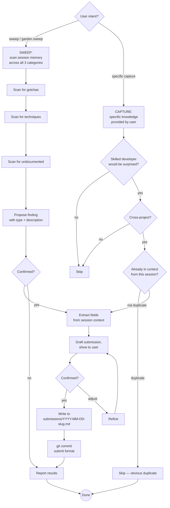

# Knowledge Garden

A cross-project, machine-wide library of hard-won technical knowledge —
three kinds of entries:

- **Gotchas** — bugs that silently fail, behaviours that contradict
  documentation, and workarounds that took hours to find
- **Techniques** — the umbrella for all non-obvious positive knowledge: specific
  how-to methods ("use pipe-pane + FIFO for headless tmux"), strategic design
  philosophy ("assert on side effects not LLM output"), and cross-cutting patterns.
  A skilled developer wouldn't naturally reach for it, but would immediately value
  it once shown. Labels distinguish sub-character (`#strategy`, `#testing`,
  `#ci-cd`) without creating separate categories that overlap.
- **Undocumented** — behaviours, options, or features that exist and work
  but simply aren't written down anywhere; only discoverable via source
  code, trial and error, or word of mouth

Stored at `~/claude/knowledge-garden/` so any Claude instance on this
machine can read and contribute to it.

**The bar for gotchas:** Would a skilled developer, familiar with the
technology, still have spent significant time on this problem? If yes —
it belongs.

**The bar for techniques:** Would a skilled developer be surprised this
approach exists, or would they have reached for something more complex?
If yes — it belongs.

**The bar for undocumented:** Does it exist, does it work, and would you
have no reasonable way to discover it from the official docs? If yes —
it belongs.

---

## What This Is Not

- **Not an idea log** — ideas go in `idea-log`
- **Not an ADR** — architecture decisions go in `adr`
- **Not how-to content** — step-by-step tutorials for standard documented APIs don't belong; the distinction is *non-obvious* knowledge vs *documented* knowledge
- **Not project-specific** — if it says "in ProjectX, the foo() method..." skip it;
  if it says "JavaParser's getByName() only searches top-level types..." it does
- **Not expected errors** — if it's in the docs with the fix, skip it
- **Not transient issues** — network flakes, temporary rate limits
- **Not general best practices** — "always validate input" isn't a technique; "you can use X to avoid Y in context Z in a way most people don't know about" is
- **Not documented behaviour presented as undocumented** — if it's in the official docs (even buried), it's not undocumented; the bar is genuinely absent from any documentation

---

## Garden Structure

```
~/claude/knowledge-garden/
├── GARDEN.md                   ← dual index (loaded into context, never detail)
├── submissions/                ← incoming entries from any Claude session
│   ├── 2026-04-04-cccli-gcd-dispatch.md
│   └── 2026-04-05-sparge-html-quirk.md
├── tools/                      ← cross-domain tools, techniques, and patterns
│   └── <domain>.md             ← e.g. tmux.md, llm-testing.md, maven.md
├── macos-native-appkit/
│   └── appkit-panama-ffm.md
├── java-panama-ffm/
│   └── native-image-patterns.md
├── graalvm-native-image/
├── quarkus/
└── <tech-category>/
    └── <topic>.md
```

**Three axes, one entry per fact:**
- **Directory** — where the content lives (by technology or problem domain)
- **Labels** — cross-cutting tags on technique entries (`#strategy`, `#testing`, `#ci-cd`, etc.)
- **GARDEN.md** — indexes every entry under all applicable axes; no content duplication

GARDEN.md has three index sections:
- `## By Technology` — all entries grouped by tech/tool (gotchas, techniques, and undocumented)
- `## By Symptom / Type` — gotchas grouped by failure pattern (silent failure, symptom misleads, etc.)
- `## By Label` — techniques grouped by cross-cutting character (`#strategy`, `#testing`, `#pattern`, etc.)

Each entry appears in exactly one file. The index cross-references it in multiple sections.

**`submissions/`** is how all Claude sessions contribute. Submissions are
written without reading the main garden files. A separate MERGE operation
integrates them, handling deduplication with its full context budget.

---

## The Submission Model

**Why submissions instead of direct writes:**

Reading garden files to check for duplicates costs the submitting Claude's
context window — the same window needed for the actual work that surfaced the
knowledge. Worse, the garden grows over time; checking every existing file
before each addition gets more expensive with every entry.

The solution: **write first, deduplicate later.**

- **Submitting Claude** writes a self-contained submission file. Cheap.
  No garden files read unless already in context for another reason.
- **Merging Claude** is a dedicated session whose whole job is reading
  submissions and integrating them. It has full budget for the merge.

**The only exception:** If the submitting Claude already has a garden file in
context (because it searched the garden earlier in the same session, or already
submitted the same entry this session), it should use that existing awareness
to avoid an obvious duplicate — but it must not read garden files *specifically*
to perform the duplicate check.

---

## Submission File Format

```
~/claude/knowledge-garden/submissions/YYYY-MM-DD-<project>-<slug>.md
```

**Version policy for the Stack field:**
- **Third-party libraries:** Always include version or range — `Quarkus 3.9.x`, `tmux 3.2+`, `GraalVM 25`. The gotcha may be fixed in a later version; future readers need to know if it applies to them.
- **"all versions"** — only use when you've verified the behaviour holds across versions, or when it's a fundamental language/protocol issue: `Java (all versions with lambda)`, `JEXL3 (all versions)`.
- **Own pre-1.0 projects** — omit version entirely; it isn't meaningful until the first public release. Revisit when 1.0 ships.

**Gotcha entry** (bug, silent failure, workaround):

```markdown
# Garden Submission

**Date:** YYYY-MM-DD
**Type:** gotcha
**Source project:** project-name (or "cross-project")
**Session context:** One sentence on what was being worked on when this surfaced
**Suggested target:** `<directory>/<file>.md` *(hint for merge Claude; not binding)*

---

## [Short imperative title — describes the weird thing, not the fix]

**Stack:** Technology, Library, Version — e.g. `Quarkus 3.9.x`, `tmux 3.2+`, `GraalVM 25`
**Symptom:** What you observe — especially the misleading part. Quote exact
error messages. "No error" is important context.
**Context:** When/where this applies. What setup triggers it.

### What was tried (didn't work)
- tried X — result
- tried Y — result

### Root cause
Why it happens. The underlying mechanism — WHY, not just WHAT.

### Fix
Code block or config. Be complete. Include what NOT to do alongside what works.

### Why this is non-obvious
The insight. What makes this a gotcha? Why would a skilled developer be misled?

---

## Garden Score

| Dimension | Score (1–3) | Notes |
|-----------|-------------|-------|
| Non-obviousness | — | |
| Discoverability | — | |
| Breadth | — | |
| Pain / Impact | — | |
| Longevity | — | |
| **Total** | **—/15** | |

**Case for inclusion:** [why this belongs]
**Case against inclusion:** [reservations, or "None identified"]
```

**Technique entry** (specific how-to, strategic approach, design philosophy, or pattern — all non-obvious positive knowledge):

```markdown
# Garden Submission

**Date:** YYYY-MM-DD
**Type:** technique
**Source project:** project-name (or "cross-project")
**Session context:** One sentence on what was being worked on when this surfaced
**Suggested target:** `<directory>/<file>.md` *(hint for merge Claude; not binding)*
**Labels:** `#label1` `#label2` *(cross-cutting tags; see Tag Index in GARDEN.md for existing ones)*

---

## [Short active title — what you can do, not that it's clever]

**Stack:** Technology, Library, Version — e.g. `Claude Code CLI`, `JUnit 5`, `Maven 3.x`; omit version for own pre-1.0 projects
**What it achieves:** One sentence — the outcome this technique produces.
**Context:** When/where this applies. What problem it solves.

### The technique
Code block or concrete description. Complete and runnable.

### Why this is non-obvious
What would most developers do instead? Why wouldn't they reach for this?
What's the insight that makes it work?

### When to use it
Conditions where this applies. Any limitations or caveats.

---

## Garden Score

| Dimension | Score (1–3) | Notes |
|-----------|-------------|-------|
| Non-obviousness | — | |
| Discoverability | — | |
| Breadth | — | |
| Pain / Impact | — | |
| Longevity | — | |
| **Total** | **—/15** | |

**Case for inclusion:** [why this belongs]
**Case against inclusion:** [reservations, or "None identified"]
```

**Choosing labels:** Pick tags that describe the *cross-cutting character* of the technique — `#strategy` for broad design philosophy, `#testing` for test patterns, `#ci-cd` for pipeline concerns, `#performance`, `#debugging`, or technology tags like `#tmux`, `#llm-testing`. Check the Tag Index in GARDEN.md first; reuse existing tags before inventing new ones.

**Undocumented entry** (behaviour/feature/option not in official docs):

```markdown
# Garden Submission

**Date:** YYYY-MM-DD
**Type:** undocumented
**Source project:** project-name (or "cross-project")
**Session context:** One sentence on what was being worked on when this surfaced
**Suggested target:** `<directory>/<file>.md` *(hint for merge Claude; not binding)*

---

## [Short title — describes what exists, not that it's undocumented]

**Stack:** Technology, Library, Version — e.g. `tmux 3.6`, `GraalVM 25`; version matters here as undocumented behaviour may appear/disappear across releases
**What it is:** One sentence — the feature, behaviour, or option that exists.
**How discovered:** Source code reading / trial and error / someone told me / commit history

### Description
Full description of what this does. Treat it as documentation that doesn't
exist yet. Be precise about conditions, defaults, edge cases.

### How to use it / where it appears
Code block or concrete example. Show it working.

### Why it's not obvious
Why would someone not know this exists? Is it in the source but not the docs?
Only mentioned in a GitHub issue? Only in an old commit message?

### Caveats
Any limitations, version constraints, or risks from relying on undocumented behaviour.

---

## Garden Score

| Dimension | Score (1–3) | Notes |
|-----------|-------------|-------|
| Non-obviousness | — | |
| Discoverability | — | |
| Breadth | — | |
| Pain / Impact | — | |
| Longevity | — | |
| **Total** | **—/15** | |

**Case for inclusion:** [why this belongs]
**Case against inclusion:** [reservations, or "None identified"]
```

The **Suggested target** is a hint to the merge Claude — which garden file this
likely belongs in. The merge Claude decides final placement after checking for
duplicates and related entries.

---

## Garden Score

Every submission includes a score. The score serves three purposes:
1. **Submitting Claude** — structured way to decide whether to offer the entry at all
2. **Merging Claude** — consistent basis for include/relate/discard decisions
3. **Future pruning** — preserved in garden files so borderline inclusions are revisitable

### Scoring dimensions

Rate each dimension 1–3:

| Dimension | 1 | 2 | 3 |
|-----------|---|---|---|
| **Non-obviousness** | Somewhat surprising; findable with effort | Would mislead most experienced devs | Would stump even experts; deeply counterintuitive |
| **Discoverability** | Buried in docs but findable | Source code / GitHub issues only | Trial and error; effectively invisible |
| **Breadth** | Narrow edge case or rare setup | Common pattern; many users will hit this | Affects almost anyone using this technology |
| **Pain / Impact** | Annoying but quickly diagnosed | Significant time loss; misleading symptoms | Silent failure, production risk, or data loss |
| **Longevity** | May be fixed or changed soon | Stable API; unlikely to change near-term | Fundamental behaviour; essentially permanent |

### Thresholds

| Score | Decision |
|-------|----------|
| 12–15 | **Strong include** — no question |
| 8–11 | **Include** — "case for" should outweigh "case against" |
| 5–7 | **Borderline** — needs a compelling "case for"; "case against" may disqualify |
| <5 | **Don't submit** — doesn't meet the bar |

### Score block (add to every submission)

```markdown
---

## Garden Score

| Dimension | Score (1–3) | Notes |
|-----------|-------------|-------|
| Non-obviousness | — | |
| Discoverability | — | |
| Breadth | — | |
| Pain / Impact | — | |
| Longevity | — | |
| **Total** | **—/15** | |

**Case for inclusion:** [1–2 sentences on why this belongs]
**Case against inclusion:** [1–2 sentences on reservations — too narrow, version-specific, may be fixed soon, etc. Write "None identified" if genuinely no reservations.]
```

### Preservation in garden files

After merging, append a compact metadata line at the end of each integrated entry:

```
*Score: 11/15 · Included because: [brief reason] · Reservation: [none / brief reason]*
```

This doesn't interrupt reading but survives in the file for future pruning decisions. Merging Claude fills it in from the submission's score block.

---

## Workflows

### CAPTURE (write a submission — default operation)

**Step 1 — Classify, score, and filter**

First, classify the type:
- **gotcha** — something that went wrong in a non-obvious way
- **technique** — a non-obvious approach that worked
- **undocumented** — something that exists and works but isn't in the docs

Is it cross-project? (Not tied to one specific codebase's logic.) If no → skip.

Then compute the Garden Score from conversation context (see Garden Score section):

| Dimension | Score (1–3) |
|-----------|-------------|
| Non-obviousness | |
| Discoverability | |
| Breadth | |
| Pain / Impact | |
| Longevity | |
| **Total** | **/15** |

Use the score to decide how to proceed:
- **12–15** → offer confidently: "Worth adding to the garden as a [type] — scored [N]/15."
- **8–11** → offer with brief framing: "This is borderline ([N]/15) — here's the case for and against including it."
- **5–7** → only offer if the case for is genuinely compelling; name the reservation
- **<5** → don't submit; optionally note "I considered submitting X but it didn't meet the bar ([N]/15)"

If uncertain about the score, offer: "Worth adding to the garden? Would go under [category]
as '[short title]' — it's a [gotcha / technique / undocumented]. I'd score it [N]/15."
Confirm before proceeding.

**Step 2 — Duplicate awareness check (context only, no reads)**

Ask: is any garden content already in context from this session?
- Searched the garden earlier → you know what's there; skip obvious duplicates
- Already submitted this entry this session → skip it
- Neither → proceed without reading anything; let the merge handle it

Do NOT run `grep -r` across the garden. Do NOT read garden files. The token
cost is not justified here; the merge Claude handles deduplication.

**Step 3 — Extract the 8 fields from conversation context**

Work from what's already known. Ask only for what's genuinely unclear.

| Field | Extract from |
|-------|-------------|
| Title | The surprising thing itself |
| Stack | Tools, libraries, versions mentioned |
| Symptom | What was observed / error messages |
| Context | When it occurs, what setup triggers it |
| What was tried | Failed approaches in the session |
| Root cause | The diagnosis reached |
| Fix | The working solution with code |
| Why non-obvious | Why the obvious approach failed |

**Step 4 — Determine the suggested target (don't read, just reason)**

Based on the technology stack, suggest the likely destination:

| Technology | Suggested target |
|-----------|-----------------|
| AppKit, WKWebView, NSTextField, GCD | `macos-native-appkit/appkit-panama-ffm.md` |
| Panama FFM, jextract, upcalls | `java-panama-ffm/native-image-patterns.md` |
| GraalVM native image | `graalvm-native-image/<topic>.md` |
| Quarkus | `quarkus/<topic>.md` |
| Git, tmux, Docker, CLI tools (any type) | `tools/<tool>.md` |
| Techniques spanning multiple technologies | `tools/<problem-domain>.md` e.g. `tools/llm-testing.md` |
| Doesn't fit existing | `<new-descriptive-dir>/<topic>.md` |

This is a hint only — the merge Claude decides final placement.

**File headers:** If the submission targets a file that doesn't exist yet, note the required header in the Suggested target field:
- Gotcha-only file: `# <Technology> Gotchas`
- Technique-only file: `# <Technology> Techniques`
- Mixed file: `# <Technology> Gotchas and Techniques`

Technology headings use tool/library names, not problem-domain names:
- ✅ `# tmux Gotchas and Techniques`
- ✅ `# LLM / Claude CLI — Gotchas and Techniques`
- ❌ `# Headless Terminal Testing Techniques` (problem domain, not a technology)

**Step 5 — Draft and confirm**

Draft the submission. Show it to the user:
> "Does this capture it accurately?"

Wait for confirmation before writing.

**Step 6 — Write the submission file**

```bash
mkdir -p ~/claude/knowledge-garden/submissions
# write YYYY-MM-DD-<project>-<slug>.md
```

**Step 7 — Commit**

```bash
cd ~/claude/knowledge-garden
git add submissions/
git commit -m "submit(<project>): '<short title>'"
```

**Step 8 — Report back**

Tell the user the submission file path and that it will be merged into the
garden in the next MERGE session.

---

### SWEEP (scan the current session for all three entry types)

Use when: "sweep", "garden sweep", "scan for garden entries", or at the
end of a session to systematically check for knowledge worth capturing.

Unlike CAPTURE (where you provide the specific knowledge), SWEEP reviews
the session from conversation memory and proposes findings. It covers all
three categories explicitly so none are missed.

**Step 1 — Scan for Gotchas** (non-obvious things that went wrong)

Review the session for:
- Bugs whose symptom misled about the root cause
- Silent failures with no error or warning
- Things that required multiple failed approaches before the fix
- Workarounds for things that "should" work but don't

For each candidate, compute the Garden Score before proposing, then present:
*"During this session we hit [X] — the symptom was [Y] but the actual cause was [Z]. Scored [N]/15 — worth submitting as a gotcha?"*

Include the score and a one-line case for/against so the user can make an informed decision without asking.

**Step 2 — Scan for Techniques** (non-obvious approaches that worked)

Review the session for:
- Solutions a skilled developer wouldn't naturally reach for
- Tool or API combinations used in undocumented or unexpected ways
- Patterns that solved a problem more elegantly than expected
- Things where the obvious approach would have been worse

For each candidate, compute the Garden Score before proposing, then present:
*"We used [approach] to [achieve outcome] — most developers would have [done it the hard way]. Scored [N]/15 — worth submitting as a technique?"*

**Step 3 — Scan for Undocumented** (exists but isn't in any docs)

Review the session for:
- Flags, options, or behaviours only discoverable via source code
- Features that work but have no official documentation
- Things discovered through trial and error or commit history
- Behaviours that only appear in GitHub issues or internal comments

For each candidate, compute the Garden Score before proposing, then present:
*"We discovered [X] — it exists and works but there's no documentation for it. Scored [N]/15 — worth submitting as undocumented?"*

**Score threshold during SWEEP:** Only propose candidates scoring ≥8. Below that, note briefly ("I considered [X] but it scored [N]/15 — below the bar") so the user knows it was evaluated.

**Step 4 — Submit confirmed entries**

For each finding confirmed by the user: run the CAPTURE workflow with
the specific content already known from context. Do NOT ask the user to
re-describe things you already know — extract from session memory.

**Step 5 — Report**

Tell the user:
- How many candidates were found in each category
- How many were confirmed and submitted
- If nothing was found: "Nothing garden-worthy surfaced in this session
  across gotchas, techniques, or undocumented items."

> **When to use SWEEP vs CAPTURE:**
> - **SWEEP** — when you want systematic coverage, don't have a specific
>   thing in mind, or are wrapping up a session
> - **CAPTURE** — when you know exactly what to add ("capture the X bug
>   we just fixed")

---

### MERGE (integrate submissions into the garden)

Run this as a dedicated operation — ideally a session whose primary purpose is
merging, with full context budget available for reading.

**When to run MERGE:**
- User says "merge the garden", "process garden submissions"
- There are several pending submissions (check: `ls ~/claude/knowledge-garden/submissions/`)
- Before a session that will need to search the garden for existing knowledge

**Step 1 — List pending submissions**

```bash
ls ~/claude/knowledge-garden/submissions/
```

**Step 2 — Read each submission** (small, targeted)

Read all submission files. They're compact by design.

**Step 3 — Load GARDEN.md index**

```bash
cat ~/claude/knowledge-garden/GARDEN.md
```

Scan all three sections (By Technology, By Symptom / Type, By Label) for entries similar to each submission.

**Step 4 — For likely duplicates: surgical read of relevant section**

If a submission looks similar to an existing entry, read only the relevant
section of the relevant file:

```bash
grep -A 30 "## <existing title>" ~/claude/knowledge-garden/<file>.md
```

Don't load entire garden files — read only the sections that might overlap.

**Step 5 — Classify each submission**

For each submission, check the Garden Score first:
- **Score 12–15** → include unless it's a duplicate
- **Score 8–11** → include if "case for" outweighs "case against"; relate if overlapping
- **Score 5–7** → only include if "case for" is compelling and "case against" is minor
- **Score <5** → discard; note in the report

Then classify against existing garden content:
- **New** — no matching entry exists; place in garden (subject to score threshold)
- **Duplicate** — identical to an existing entry; discard submission regardless of score
- **Related** — overlaps with an existing entry; enrich or note the variant

**Step 6 — Integrate new and related entries**

For new entries: append to the appropriate garden file. Then update GARDEN.md:

| Entry type | By Technology | By Symptom / Type | By Label |
|---|---|---|---|
| Gotcha | ✅ add | ✅ add under matching symptom category | — |
| Technique | ✅ add | — | ✅ add under each matching label |
| Undocumented | ✅ add | ✅ add (or new "Undocumented" category) | — |

**Creating a new garden file:** Add the correct header on line 1:
- `# <Technology> Gotchas` / `# <Technology> Techniques` / `# <Technology> Gotchas and Techniques`
- Use tool/library name, not problem-domain name (✅ `tmux` ❌ `Terminal Emulation`)

**Adding a technique:** Ensure the entry in the file has a `**Labels:**` field with at least one label from the Tag Index. Reuse existing tags before inventing new ones. If a new tag is needed, add it to the Tag Index.

For related entries: add a note under the existing entry, or create a "Variant" sub-section.

**Preserve the score:** At the end of each newly integrated entry, append the compact metadata line from the submission's score block:

```
*Score: 11/15 · Included because: [brief reason] · Reservation: [none / brief reason]*
```

This survives in the garden file for future pruning decisions.

**Step 7 — Remove processed submissions**

```bash
git rm ~/claude/knowledge-garden/submissions/<processed-file>.md
```

**Step 8 — Commit**

```bash
git add .
git commit -m "merge: integrate N submissions — <brief summary>"
```

**Step 9 — Report**

Tell the user how many submissions were merged, how many were duplicates,
how many were related entries, and which garden files were updated.

---

### SEARCH (retrieving entries)

1. Read `GARDEN.md` — check all three sections: By Technology, By Symptom / Type, and By Label
2. Follow the file link for full detail
3. If not in the index:
   ```bash
   grep -r "keywords" ~/claude/knowledge-garden/ --include="*.md" \
     --exclude-dir=submissions
   ```
4. Return the full entry (Symptom + Root Cause + Fix + Why Non-obvious)
5. If the user just fixed something related, offer to submit the new knowledge

---

### IMPORT (from project-level docs)

When importing from `BUGS-AND-ODDITIES.md` or similar:

1. Read the source document
2. For each entry, classify CROSS-PROJECT or PROJECT-LOCAL
3. Show classifications, ask for confirmation
4. For cross-project entries: write a submission file per entry (CAPTURE flow)
5. Report: N submissions written, M skipped as project-specific
6. Suggest running MERGE when convenient

---

## Proactive Trigger

Fire **without being asked** when:

**For gotchas:**
- Multiple approaches were tried before the fix was found
- The documented approach didn't work
- Something works in one context but silently fails in another
- The fix required knowledge no reasonable developer would find in the docs
- The user says: "that took way too long", "I'd never have guessed that",
  "weird behaviour"

**For techniques:**
- A non-obvious approach was used that solved a problem more elegantly than expected
- Something was discovered that most developers would do the hard way
- A combination of tools or APIs was used in a way the documentation doesn't describe
- The user says: "that's a neat trick", "I didn't know you could do that",
  "this should be documented somewhere", "that's clever"

**For undocumented:**
- A flag, option, or behaviour was found by reading source code, not docs
- Something works but there's no official explanation of why or how
- A feature was discovered through trial and error or a GitHub issue comment
- The user says: "this isn't in the docs", "I only found this in the source",
  "there's no documentation for this", "I had to dig through commits to find it"

Offer, don't assume — and name the type:
> "This was non-obvious — want me to submit it to the garden as a [gotcha /
> technique / undocumented]? Would go under [category] as '[short title]'."

---

## Decision Flow



---

## Common Pitfalls

| Mistake | Why It's Wrong | Fix |
|---------|----------------|-----|
| Reading garden files to check for duplicates during CAPTURE | Burns the submitting Claude's context budget; garden grows, cost grows | Write the submission; let MERGE handle deduplication |
| Skipping the submission and writing directly to garden files | Reintroduces the read-for-dedup problem | Always use submissions/ for new entries |
| Not including "Suggested target" in submission | Merge Claude has to infer from scratch | Include the likely destination as a hint |
| Not including **Type: gotcha / technique / undocumented** in submission | Merge Claude can't categorise correctly | Always declare the type |
| Undocumented: calling it undocumented when it's just buried in docs | Pollutes the undocumented category | Check the docs thoroughly first; the bar is genuinely absent from any documentation |
| Gotcha: title describes the fix not the weird thing | Can't find it by symptom | Title = the surprising behaviour, not the solution |
| Gotcha: fix has no code | Useless in 6 months | Complete, runnable code or config required |
| Gotcha: root cause says WHAT not WHY | Doesn't prevent misdiagnosis | Explain the mechanism, not just the outcome |
| Technique: title says "clever trick to..." | Condescending and unsearchable | Title = what it achieves: "Use X to avoid Y in context Z" |
| Technique: no "why non-obvious" section | Just becomes documentation | Must explain what developers would normally do instead |
| Adding general best practices as techniques | Not garden-worthy — it's well-known advice | The bar is: skilled developer would be surprised this exists |
| Using CAPTURE when you meant SWEEP | Asks user what to capture instead of proposing findings | Say "sweep" for systematic session review; "capture" for a known specific thing |
| SWEEP: asking the user what was discovered | Defeats the purpose — Claude has the context, user shouldn't have to re-explain | Scan session memory and propose specific candidates; don't ask open-ended questions |
| SWEEP: only checking gotchas | Techniques and undocumented items are easy to miss | Always check all three categories explicitly |
| Forgetting to run MERGE periodically | Submissions accumulate, garden stays stale | MERGE after 3–5 submissions, or before a search-heavy session |
| Deleting entries when a fix is released | Older versions still need it | Add "Resolved in: vX.Y" note; never delete |
| Technique submitted without Labels field | Merge Claude can't update By Label index correctly | Labels are mandatory on technique submissions |
| Labels invented without checking Tag Index | Proliferates near-duplicate tags | Always check Tag Index first; `#testing` not `#test`, `#llm-testing` not `#llm-test` |
| New garden file created without a header | File looks broken; inconsistent garden | First line must be `# <Technology> Gotchas` / `Techniques` / `Gotchas and Techniques` |
| Technology heading named after problem domain | Inconsistent; hard to find by tool name | Use tool/library name: `LLM / Claude CLI` not `AI Testing Patterns` |
| MERGE: By Label section not updated for new technique | Technique unfindable by cross-cutting concern | For every technique, add to By Label under each of its labels |
| MERGE: By Symptom / Type updated for a technique (not a gotcha) | Wrong section for techniques | By Symptom / Type is for gotchas; techniques go in By Label |
| Missing version for a 3rd party library | Future readers can't tell if the gotcha applies to them | Include version or range: `Quarkus 3.9.x`, `tmux 3.2+`; "all versions" only when verified |
| Version included for own pre-1.0 project | Version is meaningless before first release | Omit until 1.0; add a "Version: 1.0+" note at that point |

---

## Success Criteria

SWEEP is complete when:
- ✅ All three categories checked from session memory (gotchas, techniques, undocumented)
- ✅ Each finding proposed explicitly with type and description
- ✅ Confirmed entries submitted via CAPTURE
- ✅ Report given: N found, M submitted per category

CAPTURE is complete when:
- ✅ Submission file written to `~/claude/knowledge-garden/submissions/`
- ✅ No garden files were read specifically for duplicate detection
- ✅ User confirmed the draft before writing
- ✅ Committed with `submit(<project>): '<title>'` format

MERGE is complete when:
- ✅ All submissions classified (new / duplicate / related)
- ✅ New entries appended to appropriate garden files (with correct file header if new file)
- ✅ Technique entries have `**Labels:**` field in the content file
- ✅ GARDEN.md updated: By Technology always; By Symptom/Type for gotchas; By Label for techniques
- ✅ New labels added to Tag Index if used
- ✅ Processed submissions removed
- ✅ Committed with `merge:` format

SEARCH is complete when:
- ✅ Full entry returned for any matching bugs
- ✅ grep run (excluding submissions/) if topic not in index

**The garden is useful if:** Six months from now, a Claude can find the
relevant entry faster than searching the web or rereading conversation history.

---

## Skill Chaining

**Invoked by:** `superpowers:systematic-debugging` — offered proactively when
a debugging session reveals something non-obvious; user directly ("submit to
the garden", "add this to the garden", "merge garden submissions")

**Invokes:** Nothing — handles its own git commits to `~/claude/knowledge-garden/`

**Reads from:**
- `~/claude/knowledge-garden/GARDEN.md` — for SEARCH and MERGE only
- `~/claude/knowledge-garden/submissions/` — for MERGE only
- Garden detail files — MERGE only, surgical section reads

**Complements:** `idea-log`, `adr`, `write-blog` — the garden holds
reusable cross-project technical gotchas none of those capture
