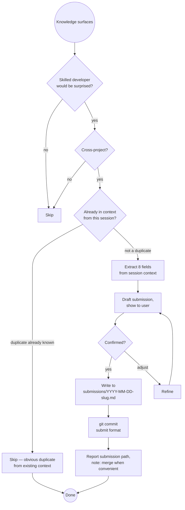

# Knowledge Garden

A cross-project, machine-wide library of hard-won technical gotchas — bugs
that silently fail, behaviours that contradict documentation, and workarounds
that took hours to find. Stored at `~/claude/knowledge-garden/` so any Claude
instance on this machine can read and contribute to it.

**The bar:** Would a skilled developer, familiar with the technology, still
have spent significant time on this? If yes, it belongs in the garden.

---

## What This Is Not

- **Not an idea log** — ideas go in `idea-log`
- **Not an ADR** — architecture decisions go in `adr`
- **Not how-to content** — tutorials and explanations don't belong here
- **Not project-specific** — if it says "in ProjectX, the foo() method..." skip it;
  if it says "JavaParser's getByName() only searches top-level types..." it does
- **Not expected errors** — if it's in the docs with the fix, skip it
- **Not transient issues** — network flakes, temporary rate limits

---

## Garden Structure

```
~/claude/knowledge-garden/
├── GARDEN.md                   ← dual index (loaded into context, never detail)
├── submissions/                ← incoming entries from any Claude session
│   ├── 2026-04-04-cccli-gcd-dispatch.md
│   └── 2026-04-05-sparge-html-quirk.md
├── macos-native-appkit/
│   └── appkit-panama-ffm.md
├── java-panama-ffm/
│   └── native-image-patterns.md
├── graalvm-native-image/
├── quarkus/
└── <tech-category>/
    └── <topic>.md
```

**`submissions/`** is how all Claude sessions contribute. Submissions are
written without reading the main garden files. A separate MERGE operation
integrates them, handling deduplication with its full context budget.

---

## The Submission Model

**Why submissions instead of direct writes:**

Reading garden files to check for duplicates costs the submitting Claude's
context window — the same window needed for the actual work that surfaced the
knowledge. Worse, the garden grows over time; checking every existing file
before each addition gets more expensive with every entry.

The solution: **write first, deduplicate later.**

- **Submitting Claude** writes a self-contained submission file. Cheap.
  No garden files read unless already in context for another reason.
- **Merging Claude** is a dedicated session whose whole job is reading
  submissions and integrating them. It has full budget for the merge.

**The only exception:** If the submitting Claude already has a garden file in
context (because it searched the garden earlier in the same session, or already
submitted the same entry this session), it should use that existing awareness
to avoid an obvious duplicate — but it must not read garden files *specifically*
to perform the duplicate check.

---

## Submission File Format

```
~/claude/knowledge-garden/submissions/YYYY-MM-DD-<project>-<slug>.md
```

```markdown
# Garden Submission

**Date:** YYYY-MM-DD
**Source project:** project-name (or "cross-project")
**Session context:** One sentence on what was being worked on when this surfaced
**Suggested target:** `<directory>/<file>.md` *(hint for merge Claude; not binding)*

---

## [Short imperative title — describes the weird thing, not the fix]

**Stack:** Technology, Library, Version (be specific)
**Symptom:** What you observe — especially the misleading part. Quote exact
error messages. "No error" is important context.
**Context:** When/where this applies. What setup triggers it.

### What was tried (didn't work)
- tried X — result
- tried Y — result

### Root cause
Why it happens. The underlying mechanism — WHY, not just WHAT.

### Fix
Code block or config. Be complete. Include what NOT to do alongside what works.

### Why this is non-obvious
The insight. What makes this a gotcha? Why would a skilled developer be misled?
```

The **Suggested target** is a hint to the merge Claude — which garden file this
likely belongs in. The merge Claude decides final placement after checking for
duplicates and related entries.

---

## Workflows

### CAPTURE (write a submission — default operation)

**Step 1 — Quality and project filter**

Is this non-obvious enough? Is it cross-project? See the bar above.
If uncertain, offer: "Worth adding to the garden? Would go under [category]
as '[short title]'." — confirm before proceeding.

**Step 2 — Duplicate awareness check (context only, no reads)**

Ask: is any garden content already in context from this session?
- Searched the garden earlier → you know what's there; skip obvious duplicates
- Already submitted this entry this session → skip it
- Neither → proceed without reading anything; let the merge handle it

Do NOT run `grep -r` across the garden. Do NOT read garden files. The token
cost is not justified here; the merge Claude handles deduplication.

**Step 3 — Extract the 8 fields from conversation context**

Work from what's already known. Ask only for what's genuinely unclear.

| Field | Extract from |
|-------|-------------|
| Title | The surprising thing itself |
| Stack | Tools, libraries, versions mentioned |
| Symptom | What was observed / error messages |
| Context | When it occurs, what setup triggers it |
| What was tried | Failed approaches in the session |
| Root cause | The diagnosis reached |
| Fix | The working solution with code |
| Why non-obvious | Why the obvious approach failed |

**Step 4 — Determine the suggested target (don't read, just reason)**

Based on the technology stack, suggest the likely destination:

| Technology | Suggested target |
|-----------|-----------------|
| AppKit, WKWebView, NSTextField, GCD | `macos-native-appkit/appkit-panama-ffm.md` |
| Panama FFM, jextract, upcalls | `java-panama-ffm/native-image-patterns.md` |
| GraalVM native image | `graalvm-native-image/<topic>.md` |
| Quarkus | `quarkus/<topic>.md` |
| Git, tmux, Docker, CLI tools | `tools/<tool>.md` |
| Doesn't fit existing | `<new-descriptive-dir>/<topic>.md` |

This is a hint only — the merge Claude decides final placement.

**Step 5 — Draft and confirm**

Draft the submission. Show it to the user:
> "Does this capture it accurately?"

Wait for confirmation before writing.

**Step 6 — Write the submission file**

```bash
mkdir -p ~/claude/knowledge-garden/submissions
# write YYYY-MM-DD-<project>-<slug>.md
```

**Step 7 — Commit**

```bash
cd ~/claude/knowledge-garden
git add submissions/
git commit -m "submit(<project>): '<short title>'"
```

**Step 8 — Report back**

Tell the user the submission file path and that it will be merged into the
garden in the next MERGE session.

---

### MERGE (integrate submissions into the garden)

Run this as a dedicated operation — ideally a session whose primary purpose is
merging, with full context budget available for reading.

**When to run MERGE:**
- User says "merge the garden", "process garden submissions"
- There are several pending submissions (check: `ls ~/claude/knowledge-garden/submissions/`)
- Before a session that will need to search the garden for existing knowledge

**Step 1 — List pending submissions**

```bash
ls ~/claude/knowledge-garden/submissions/
```

**Step 2 — Read each submission** (small, targeted)

Read all submission files. They're compact by design.

**Step 3 — Load GARDEN.md index**

```bash
cat ~/claude/knowledge-garden/GARDEN.md
```

Scan both sections (By Technology, By Symptom Type) for entries similar to
each submission.

**Step 4 — For likely duplicates: surgical read of relevant section**

If a submission looks similar to an existing entry, read only the relevant
section of the relevant file:

```bash
grep -A 30 "## <existing title>" ~/claude/knowledge-garden/<file>.md
```

Don't load entire garden files — read only the sections that might overlap.

**Step 5 — Classify each submission**

For each submission:
- **New** — no matching entry exists; place in garden
- **Duplicate** — identical to an existing entry; discard submission
- **Related** — overlaps with an existing entry; enrich or note the variant

**Step 6 — Integrate new and related entries**

For new entries: append to the appropriate garden file, update GARDEN.md in
both index sections (By Technology + By Symptom Type).

For related entries: add a note under the existing entry, or create a
"Variant" sub-section.

**Step 7 — Remove processed submissions**

```bash
git rm ~/claude/knowledge-garden/submissions/<processed-file>.md
```

**Step 8 — Commit**

```bash
git add .
git commit -m "merge: integrate N submissions — <brief summary>"
```

**Step 9 — Report**

Tell the user how many submissions were merged, how many were duplicates,
how many were related entries, and which garden files were updated.

---

### SEARCH (retrieving entries)

1. Read `GARDEN.md` — check both By Technology and By Symptom Type sections
2. Follow the file link for full detail
3. If not in the index:
   ```bash
   grep -r "keywords" ~/claude/knowledge-garden/ --include="*.md" \
     --exclude-dir=submissions
   ```
4. Return the full entry (Symptom + Root Cause + Fix + Why Non-obvious)
5. If the user just fixed something related, offer to submit the new knowledge

---

### IMPORT (from project-level docs)

When importing from `BUGS-AND-ODDITIES.md` or similar:

1. Read the source document
2. For each entry, classify CROSS-PROJECT or PROJECT-LOCAL
3. Show classifications, ask for confirmation
4. For cross-project entries: write a submission file per entry (CAPTURE flow)
5. Report: N submissions written, M skipped as project-specific
6. Suggest running MERGE when convenient

---

## Proactive Trigger

Fire **without being asked** when:
- Multiple approaches were tried before the fix was found
- The documented approach didn't work
- Something works in one context but silently fails in another
- The fix required knowledge no reasonable developer would find in the docs
- The user says: "that took way too long", "I'd never have guessed that",
  "weird behaviour", "this should be documented somewhere"

Offer, don't assume:
> "This was non-obvious — want me to submit it to the garden? Would go under
> [category] as '[short title]'."

---

## Decision Flow



---

## Common Pitfalls

| Mistake | Why It's Wrong | Fix |
|---------|----------------|-----|
| Reading garden files to check for duplicates during CAPTURE | Burns the submitting Claude's context budget; garden grows, cost grows | Write the submission; let MERGE handle deduplication |
| Skipping the submission and writing directly to garden files | Reintroduces the read-for-dedup problem | Always use submissions/ for new entries |
| Not including "Suggested target" in submission | Merge Claude has to infer from scratch | Include the likely destination as a hint |
| Title describes the fix not the weird thing | Can't find it by symptom | Title = the surprising behaviour, not the solution |
| Fix has no code | Useless in 6 months | Complete, runnable code or config required |
| Root cause says WHAT not WHY | Doesn't prevent misdiagnosis | Explain the mechanism, not just the outcome |
| Forgetting to run MERGE periodically | Submissions accumulate, garden stays stale | MERGE after 3–5 submissions, or before a search-heavy session |
| Deleting entries when a fix is released | Older versions still need it | Add "Resolved in: vX.Y" note; never delete |

---

## Success Criteria

CAPTURE is complete when:
- ✅ Submission file written to `~/claude/knowledge-garden/submissions/`
- ✅ No garden files were read specifically for duplicate detection
- ✅ User confirmed the draft before writing
- ✅ Committed with `submit(<project>): '<title>'` format

MERGE is complete when:
- ✅ All submissions classified (new / duplicate / related)
- ✅ New entries appended to appropriate garden files
- ✅ GARDEN.md updated in both index sections
- ✅ Processed submissions removed
- ✅ Committed with `merge:` format

SEARCH is complete when:
- ✅ Full entry returned for any matching bugs
- ✅ grep run (excluding submissions/) if topic not in index

**The garden is useful if:** Six months from now, a Claude can find the
relevant entry faster than searching the web or rereading conversation history.

---

## Skill Chaining

**Invoked by:** `superpowers:systematic-debugging` — offered proactively when
a debugging session reveals something non-obvious; user directly ("submit to
the garden", "add this to the garden", "merge garden submissions")

**Invokes:** Nothing — handles its own git commits to `~/claude/knowledge-garden/`

**Reads from:**
- `~/claude/knowledge-garden/GARDEN.md` — for SEARCH and MERGE only
- `~/claude/knowledge-garden/submissions/` — for MERGE only
- Garden detail files — MERGE only, surgical section reads

**Complements:** `idea-log`, `adr`, `project-blog` — the garden holds
reusable cross-project technical gotchas none of those capture
