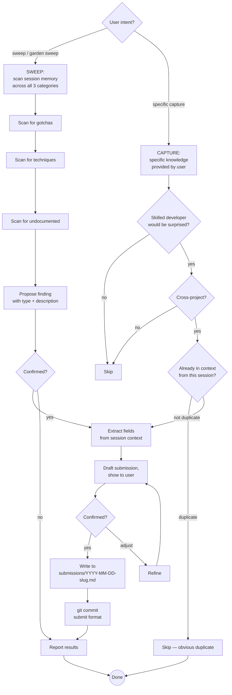

# Knowledge Garden

A cross-project, machine-wide library of hard-won technical knowledge —
three kinds of entries:

- **Gotchas** — bugs that silently fail, behaviours that contradict
  documentation, and workarounds that took hours to find
- **Techniques** — the umbrella for all non-obvious positive knowledge: specific
  how-to methods ("use pipe-pane + FIFO for headless tmux"), strategic design
  philosophy ("assert on side effects not LLM output"), and cross-cutting patterns.
  A skilled developer wouldn't naturally reach for it, but would immediately value
  it once shown. Labels distinguish sub-character (`#strategy`, `#testing`,
  `#ci-cd`) without creating separate categories that overlap.
- **Undocumented** — behaviours, options, or features that exist and work
  but simply aren't written down anywhere; only discoverable via source
  code, trial and error, or word of mouth

Stored at `~/claude/knowledge-garden/` so any Claude instance on this
machine can read and contribute to it.

**Proactive OFFER rule:** When conditions match the CSO description but the user didn't ask — offer in 2 sentences and wait for confirmation before engaging any workflow. The full CAPTURE/SWEEP/MERGE/DEDUPE workflows run only when the user responds YES or asks directly.

**The bar for gotchas:** Would a skilled developer, familiar with the
technology, still have spent significant time on this problem? If yes —
it belongs.

**The bar for techniques:** Would a skilled developer be surprised this
approach exists, or would they have reached for something more complex?
If yes — it belongs.

**The bar for undocumented:** Does it exist, does it work, and would you
have no reasonable way to discover it from the official docs? If yes —
it belongs.

---

## What This Is Not

- **Not an idea log** — ideas go in `idea-log`
- **Not an ADR** — architecture decisions go in `adr`
- **Not how-to content** — step-by-step tutorials for standard documented APIs don't belong; the distinction is *non-obvious* knowledge vs *documented* knowledge
- **Not project-specific** — if it says "in ProjectX, the foo() method..." skip it;
  if it says "JavaParser's getByName() only searches top-level types..." it does
- **Not expected errors** — if it's in the docs with the fix, skip it
- **Not transient issues** — network flakes, temporary rate limits
- **Not general best practices** — "always validate input" isn't a technique; "you can use X to avoid Y in context Z in a way most people don't know about" is
- **Not documented behaviour presented as undocumented** — if it's in the official docs (even buried), it's not undocumented; the bar is genuinely absent from any documentation

---

## Garden Structure

```
~/claude/knowledge-garden/
├── GARDEN.md                   ← dual index + metadata header (loaded into context, never detail)
├── CHECKED.md                  ← duplicate check pair log (sparse cross-product)
├── submissions/                ← incoming entries from any Claude session
│   ├── 2026-04-04-cccli-gcd-dispatch.md
│   └── 2026-04-05-sparge-html-quirk.md
├── tools/                      ← cross-domain tools, techniques, and patterns
│   └── <domain>.md             ← e.g. tmux.md, llm-testing.md, maven.md
├── macos-native-appkit/
│   └── appkit-panama-ffm.md
├── java-panama-ffm/
│   └── native-image-patterns.md
├── graalvm-native-image/
├── quarkus/
└── <tech-category>/
    └── <topic>.md
```

**`CHECKED.md`** tracks which pairs of entries have been semantically compared for duplicate detection. Only within-category pairs are checked. Pairs not appearing here are unchecked candidates for the next DEDUPE sweep.

**Three axes, one entry per fact:**
- **Directory** — where the content lives (by technology or problem domain)
- **Labels** — cross-cutting tags on technique entries (`#strategy`, `#testing`, `#ci-cd`, etc.)
- **GARDEN.md** — indexes every entry under all applicable axes; no content duplication

**GARDEN.md carries a metadata header at the top:**

```markdown
**Last assigned ID:** GE-0042
**Last full DEDUPE sweep:** YYYY-MM-DD
**Entries merged since last sweep:** 3
**Drift threshold:** 10
```

GARDEN.md has three index sections:
- `## By Technology` — all entries grouped by tech/tool (gotchas, techniques, and undocumented)
- `## By Symptom / Type` — gotchas grouped by failure pattern (silent failure, symptom misleads, etc.)
- `## By Label` — techniques grouped by cross-cutting character (`#strategy`, `#testing`, `#pattern`, etc.)

Each entry appears in exactly one file. The index cross-references it in multiple sections. Index entries include the GE-ID:

```
- GE-0001 [Entry Title](file.md#entry-title)
```

**`submissions/`** is how all Claude sessions contribute. Submissions are
written without reading the main garden files. A separate MERGE operation
integrates them, handling deduplication with its full context budget.

---

## The Submission Model

**Why submissions instead of direct writes:**

Reading garden files to check for duplicates costs the submitting Claude's
context window — the same window needed for the actual work that surfaced the
knowledge. Worse, the garden grows over time; checking every existing file
before each addition gets more expensive with every entry.

The solution: **write first, deduplicate later.**

- **Submitting Claude** writes a self-contained submission file. Cheap.
  No garden files read unless already in context for another reason.
- **Merging Claude** is a dedicated session whose whole job is reading
  submissions and integrating them. It has full budget for the merge.

**The only exception:** If the submitting Claude already has a garden file in
context (because it searched the garden earlier in the same session, or already
submitted the same entry this session), it should use that existing awareness
to avoid an obvious duplicate — but it must not read garden files *specifically*
to perform the duplicate check.

---

## Submission File Format

Four entry types: **gotcha** (bug/silent failure), **technique** (non-obvious approach), **undocumented** (exists but not in docs), **revise** (enrichment for existing entry).

Filename: `YYYY-MM-DD-<project>-GE-XXXX-<slug>.md` — GE-ID embedded for instant visibility.
Revise filename: include "revise" in slug — `YYYY-MM-DD-<project>-GE-XXXX-revise-<entry-slug>.md`

**Version policy:** Third-party libs always include version (`Quarkus 3.9.x`). "all versions" only when verified across versions. Own pre-1.0 projects: omit version.

**For complete templates (gotcha, technique, undocumented, revise), scoring dimensions, and post-merge entry format — see [submission-formats.md](submission-formats.md).**

**Score thresholds** (use for CAPTURE Step 1 and SWEEP decisions):

| Score | Decision |
|-------|----------|
| 12–15 | **Strong include** — no question |
| 8–11 | **Include** — "case for" should outweigh "case against" |
| 5–7 | **Borderline** — needs a compelling "case for"; "case against" may disqualify |
| <5 | **Don't submit** — doesn't meet the bar |

---

## Workflows

Full step-by-step instructions for all workflows: **[workflows.md](workflows.md)**

### CAPTURE
Submit a specific known entry. Assigns a GE-ID, scores against the bar (score thresholds above), does a light index-only duplicate check, writes to `submissions/`, and commits. Always commits `GARDEN.md` alongside the submission to keep the counter in sync.

### SWEEP
Systematically scan the current session across all three categories. Proposes scored candidates from conversation memory — never asks the user to re-describe. Use at session end or when you want systematic coverage.

### REVISE
Submit an enrichment to an existing entry: solution, alternative, variant, update, resolved, or deprecated. Include "revise" in the filename so MERGE identifies it immediately.

### MERGE
Dedicated session operation. Reads pending submissions, classifies against the garden index, integrates new entries, runs medium duplicate check, updates CHECKED.md, removes processed submissions, commits. Requires full context budget — run as a standalone session.

### DEDUPE
Full within-category duplicate sweep triggered when drift threshold is exceeded. Compares unchecked pairs, resolves duplicates with user confirmation, logs results to CHECKED.md, resets drift counter.

### SEARCH
Read GARDEN.md index → follow file link for full detail → grep if not in index.

### IMPORT
Import from project-level bug docs into the garden via CAPTURE flow. Classifies each entry as cross-project or project-local before writing submissions.


## Proactive Trigger

Fire **without being asked** when:

**For gotchas:**
- Multiple approaches were tried before the fix was found
- The documented approach didn't work
- Something works in one context but silently fails in another
- The fix required knowledge no reasonable developer would find in the docs
- The user says: "that took way too long", "I'd never have guessed that",
  "weird behaviour"

**For techniques:**
- A non-obvious approach was used that solved a problem more elegantly than expected
- Something was discovered that most developers would do the hard way
- A combination of tools or APIs was used in a way the documentation doesn't describe
- The user says: "that's a neat trick", "I didn't know you could do that",
  "this should be documented somewhere", "that's clever"

**For undocumented:**
- A flag, option, or behaviour was found by reading source code, not docs
- Something works but there's no official explanation of why or how
- A feature was discovered through trial and error or a GitHub issue comment
- The user says: "this isn't in the docs", "I only found this in the source",
  "there's no documentation for this", "I had to dig through commits to find it"

Offer, don't assume — and name the type:
> "This was non-obvious — want me to submit it to the garden as a [gotcha /
> technique / undocumented]? Would go under [category] as '[short title]'."

**Also fire for REVISE** when:
- A solution is found for a problem that was previously unsolved or only had a workaround
- An alternative approach surfaces that's meaningfully different from the known one
- A garden entry's status changes (bug fixed upstream, feature deprecated)
- The user says: "we finally fixed that", "turns out there's a better way", "that's been fixed in the new version"

Offer:
> "This looks like a solution to an existing garden entry — want me to submit a REVISE to enrich '[entry title]' with the fix?"

If the entry isn't in context but the problem is clearly documented somewhere in the garden, the user can confirm and the REVISE workflow will locate it.

---

## Decision Flow



---

## Common Pitfalls

| Mistake | Why It's Wrong | Fix |
|---------|----------------|-----|
| Reading garden files to check for duplicates during CAPTURE | Burns the submitting Claude's context budget; garden grows, cost grows | Write the submission; let MERGE handle deduplication |
| Skipping the submission and writing directly to garden files | Reintroduces the read-for-dedup problem | Always use submissions/ for new entries |
| Not including "Suggested target" in submission | Merge Claude has to infer from scratch | Include the likely destination as a hint |
| Not including **Type: gotcha / technique / undocumented** in submission | Merge Claude can't categorise correctly | Always declare the type |
| Undocumented: calling it undocumented when it's just buried in docs | Pollutes the undocumented category | Check the docs thoroughly first; the bar is genuinely absent from any documentation |
| Gotcha: title describes the fix not the weird thing | Can't find it by symptom | Title = the surprising behaviour, not the solution |
| Gotcha: fix has no code | Useless in 6 months | Complete, runnable code or config required |
| Gotcha: root cause says WHAT not WHY | Doesn't prevent misdiagnosis | Explain the mechanism, not just the outcome |
| Technique: title says "clever trick to..." | Condescending and unsearchable | Title = what it achieves: "Use X to avoid Y in context Z" |
| Technique: no "why non-obvious" section | Just becomes documentation | Must explain what developers would normally do instead |
| Adding general best practices as techniques | Not garden-worthy — it's well-known advice | The bar is: skilled developer would be surprised this exists |
| Using CAPTURE when you meant SWEEP | Asks user what to capture instead of proposing findings | Say "sweep" for systematic session review; "capture" for a known specific thing |
| Using CAPTURE for a solution to an existing entry | Creates a duplicate or near-duplicate instead of enriching the original | If the knowledge belongs with an existing entry, use REVISE |
| Adding a second solution without pros/cons | Reader can't choose between approaches | When 2+ solutions exist, restructure into Solution 1 / Solution 2 with explicit pros/cons for each |
| Retroactively reformatting single-solution entries to add pros/cons | Unnecessary churn; pros/cons only add value when there's a choice | Only add pros/cons when a second solution arrives |
| REVISE "resolved" entry: deleting the original content | Users on older versions still need the entry | Add "Resolved in: vX.Y" note — never delete the entry content |
| Not including "revise" in the REVISE submission filename | MERGE Claude has to infer from content rather than seeing it immediately | Always include "revise" in the filename slug |
| SWEEP: asking the user what was discovered | Defeats the purpose — Claude has the context, user shouldn't have to re-explain | Scan session memory and propose specific candidates; don't ask open-ended questions |
| SWEEP: only checking gotchas | Techniques and undocumented items are easy to miss | Always check all three categories explicitly |
| Forgetting to run MERGE periodically | Submissions accumulate, garden stays stale | MERGE after 3–5 submissions, or before a search-heavy session |
| Deleting entries when a fix is released | Older versions still need it | Add "Resolved in: vX.Y" note; never delete |
| Technique submitted without Labels field | Merge Claude can't update By Label index correctly | Labels are mandatory on technique submissions |
| Labels invented without checking Tag Index | Proliferates near-duplicate tags | Always check Tag Index first; `#testing` not `#test`, `#llm-testing` not `#llm-test` |
| New garden file created without a header | File looks broken; inconsistent garden | First line must be `# <Technology> Gotchas` / `Techniques` / `Gotchas and Techniques` |
| Technology heading named after problem domain | Inconsistent; hard to find by tool name | Use tool/library name: `LLM / Claude CLI` not `AI Testing Patterns` |
| MERGE: By Label section not updated for new technique | Technique unfindable by cross-cutting concern | For every technique, add to By Label under each of its labels |
| MERGE: By Symptom / Type updated for a technique (not a gotcha) | Wrong section for techniques | By Symptom / Type is for gotchas; techniques go in By Label |
| Missing version for a 3rd party library | Future readers can't tell if the gotcha applies to them | Include version or range: `Quarkus 3.9.x`, `tmux 3.2+`; "all versions" only when verified |
| Version included for own pre-1.0 project | Version is meaningless before first release | Omit until 1.0; add a "Version: 1.0+" note at that point |
| Omitting GE-ID from submission filename or header | MERGE can't reconcile the submission with CHECKED.md or DISCARDED.md | Always assign GE-ID in CAPTURE Step 0; embed in filename and `**Submission ID:**` header |
| Forgetting to commit GARDEN.md with the submission | Counter in GARDEN.md drifts; next submitter picks a duplicate ID | Stage both `submissions/` and `GARDEN.md` in Step 7 |
| Not updating CHECKED.md during MERGE | Loses track of which pairs have been compared; DEDUPE re-checks unnecessarily | Every comparison made during light check must be logged |
| Running DEDUPE across categories | Cross-category entries can't be duplicates; wastes context | Only compare within-category pairs |

---

## Success Criteria

SWEEP is complete when:
- ✅ All three categories checked from session memory (gotchas, techniques, undocumented)
- ✅ Each finding proposed explicitly with type and description
- ✅ Confirmed entries submitted via CAPTURE
- ✅ Report given: N found, M submitted per category

REVISE is complete when:
- ✅ Submission file written with "revise" in the filename
- ✅ Target entry path and exact title specified
- ✅ Revision kind declared (solution / alternative / variant / update / resolved / deprecated)
- ✅ User confirmed the draft before writing
- ✅ Committed with `submit(<project>): revise '<title>' — <what's new>` format

CAPTURE is complete when:
- ✅ GE-ID assigned and recorded in GARDEN.md counter before submission written
- ✅ Filename includes GE-ID: `YYYY-MM-DD-<project>-GE-XXXX-<slug>.md`
- ✅ Submission header includes `**Submission ID:** GE-XXXX`
- ✅ Light duplicate check (index scan) performed; scanned IDs noted
- ✅ No garden detail files were read specifically for duplicate detection
- ✅ User confirmed the draft before writing
- ✅ GARDEN.md committed alongside submission (counter update)
- ✅ Committed with `submit(<project>): GE-XXXX '<title>'` format

MERGE is complete when:
- ✅ All submissions classified (new / duplicate / related)
- ✅ New entries appended to appropriate garden files (with correct file header if new file)
- ✅ Technique entries have `**Labels:**` field in the content file
- ✅ GARDEN.md updated: By Technology always; By Symptom/Type for gotchas; By Label for techniques
- ✅ New labels added to Tag Index if used
- ✅ GE-IDs verified from submission filenames/headers; added as `**ID:**` in entry headers and index
- ✅ GARDEN.md metadata updated: `Entries merged since last sweep` incremented
- ✅ Medium duplicate check (section read) performed for all new entries; results logged in CHECKED.md
- ✅ Discarded submissions recorded in DISCARDED.md with conflict GE-ID
- ✅ DEDUPE offered if drift threshold exceeded
- ✅ Processed submissions removed
- ✅ Validator run: `python3 ~/.claude/skills/garden/scripts/validate_garden.py` — exits 0 before commit
- ✅ Committed with `merge:` format

DEDUPE is complete when:
- ✅ All within-category unchecked pairs processed
- ✅ CHECKED.md updated with all results
- ✅ Related entries have cross-references
- ✅ Duplicate entries resolved (user confirmed which to keep)
- ✅ GARDEN.md drift counter reset
- ✅ Committed with `dedupe:` format

SEARCH is complete when:
- ✅ Full entry returned for any matching bugs
- ✅ grep run (excluding submissions/) if topic not in index

**The garden is useful if:** Six months from now, a Claude can find the
relevant entry faster than searching the web or rereading conversation history.

---

## Skill Chaining

**Invoked by:** `handover` — garden SWEEP is Step 2b of the wrap
checklist, capturing session gotchas/techniques before context is lost;
`superpowers:systematic-debugging` — offered proactively when a debugging
session reveals something non-obvious; user directly ("submit to the garden",
"add this to the garden", "merge garden submissions")

**Invokes:** Nothing — handles its own git commits to `~/claude/knowledge-garden/`

**Reads from:**
- `~/claude/knowledge-garden/GARDEN.md` — for SEARCH, MERGE, and DEDUPE
- `~/claude/knowledge-garden/CHECKED.md` — for MERGE (light duplicate check) and DEDUPE
- `~/claude/knowledge-garden/submissions/` — for MERGE only
- Garden detail files — MERGE and DEDUPE only, surgical section reads

**Complements:** `idea-log`, `adr`, `write-blog` — the garden holds
reusable cross-project technical gotchas none of those capture
