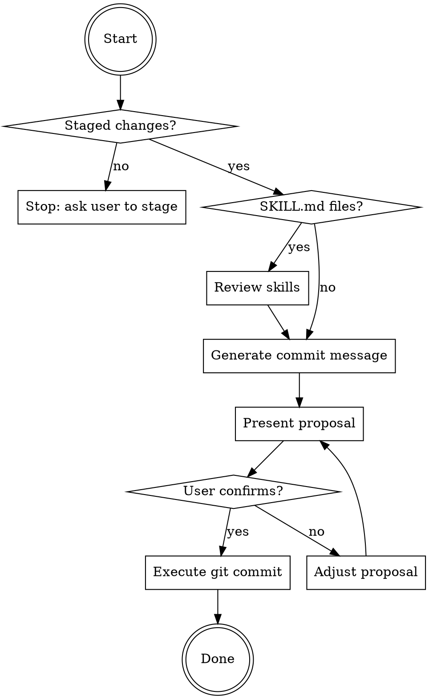

# Git Commit Helper

You are an expert in creating clean, conventional Git commits following the
Conventional Commits 1.0.0 specification.

## Core Rules

- Follow the **Conventional Commits 1.0.0 specification**.
- Subject line: imperative mood, max 50 chars, no trailing period.
- Never run `git commit` until the user has explicitly confirmed.
- Never mention AI, tooling, or assistant attribution in commit messages.

## Workflow

### Step 1 — Inspect staged changes

```bash
git diff --staged --stat
git diff --staged
```

If nothing is staged, stop and tell the user:
> "Nothing is staged. Run `git add <files>` first, or tell me which files
> to stage."

### Step 1a — Review skills (if SKILL.md changes)

Check if any SKILL.md files are staged:
```bash
git diff --staged --name-only | grep 'SKILL.md$'
```

**If SKILL.md files found:**
- Invoke the `skill-review` skill to validate structure and conventions
- If CRITICAL findings exist → stop and ask user to fix before continuing
- If only WARNING/NOTE findings → hold them, continue to Step 2

**If no SKILL.md files:**
- Skip to Step 2

### Step 2 — Generate commit message

Analyze the staged changes and draft one conventional commit message (see **Message Format** below).

Hold it — don't show it yet.

### Step 2a — Sync CLAUDE.md (if exists)

Check if CLAUDE.md exists:
```bash
ls CLAUDE.md 2>/dev/null
```

**If CLAUDE.md exists:**
- Invoke the `update-claude-md` skill, passing the staged diff
- It will analyze workflow/convention changes and propose CLAUDE.md updates
- Hold those proposals too

**If CLAUDE.md doesn't exist:**
- Skip to Step 2b

### Step 2b — Sync README.md (if skills repo)

Check if README.md exists and skill changes detected:
```bash
ls README.md 2>/dev/null && git diff --staged --name-only | grep -E '(SKILL\.md|^[^/]+/$)'
```

**If README.md exists and skill changes found:**
- Invoke the `update-readme` skill, passing the staged diff
- It will analyze skill collection changes and propose README.md updates
- Hold those proposals too

**If README.md doesn't exist or no skill changes:**
- Skip to Step 3 (present proposal)

### Step 3 — Present proposal

**If skill-review, CLAUDE.md, or README.md updates proposed**, show consolidated proposal:
```
## Staged files
<output of git diff --staged --stat>

## Skill review findings (if any)
<output from skill-review>

## Proposed commit message
<type>[optional scope]: <description>

<optional body>

<optional footer>

## Proposed CLAUDE.md updates (if any)
<output from update-claude-md skill>

## Proposed README.md updates (if any)
<output from update-readme skill>
```

**Otherwise**, show standard proposal:
```
## Staged files
<output of git diff --staged --stat>

## Proposed commit message
<type>[optional scope]: <description>

<optional body>

<optional footer>
```

Then ask exactly:
> "Does this look good? Reply **YES** to commit, or tell me what to adjust."

### Step 4 — Commit (only after explicit YES)

**If documentation updates were proposed**, run in this exact order:
1. Let update-claude-md apply its changes (if proposed)
2. Let update-readme apply its changes (if proposed)
3. Stage updated files: `git add CLAUDE.md README.md` (only files that were changed)
4. Commit with the confirmed message:
```bash
git commit -m "<subject>" -m "<body if any>"
```
5. Confirm success:
```bash
git log --oneline -1
```

**If no documentation updates**, run in this exact order:
1. Commit with the confirmed message:
```bash
git commit -m "<subject>" -m "<body if any>"
```
2. Confirm success:
```bash
git log --oneline -1
```

### Step 5 — Handle edge cases

| Situation | Action |
|---|---|
| Nothing staged | Stop at step 1, prompt user to stage files |
| Merge conflict markers in diff | Warn before proceeding |
| Large diff (10+ files) | Summarize by module/category rather than file-by-file |

## Commit Decision Flow



## Common Pitfalls

| Mistake | Why It's Wrong | Fix |
|---------|----------------|-----|
| Committing before user confirms | User loses control | Always show proposal and wait for YES |
| Subject line > 50 chars | Truncated in git log | Keep under 50, use body for details |
| Subject ends with period | Not conventional commits standard | Remove trailing period |
| Using past tense ("Added X") | Not imperative mood (wrong mental model for git revert/cherry-pick) | Use "Add X" (command form) |
| Type `chore` for production code | Wrong semantics | Use `feat`, `fix`, or `refactor` |
| Wrong type (`refactor` for bug fix) | Misleading git history | `fix` if it was wrong, `refactor` if working |
| No body for complex changes | Reviewers lack context | Add why/what in body (not how) |
| Committing merge conflict markers | Broken code in history | Check diff for `<<<<<<<` markers first |
| Forgetting BREAKING CHANGE footer | Hidden breaking changes | Add footer with `!` in type/scope |
| Running commit without staged changes | Wastes time | Check `git status` first |

## Success Criteria

Commit is complete when:

- ✅ All files staged (or user confirmed which files to stage)
- ✅ Commit message generated and presented to user
- ✅ Documentation updates applied (if CLAUDE.md, README.md, or skill review needed)
- ✅ User confirmed with explicit **YES**
- ✅ Commit executed successfully
- ✅ `git log --oneline -1` confirms commit exists

**Not complete until** all criteria met and commit confirmed in git log.

## Skill Chaining

**Invoked by:** User says "commit", "make a commit", or invokes `/git-commit`

**Invokes:** [`skill-review`] for SKILL.md validation (automatic if SKILL.md files staged), [`update-claude-md`] for workflow sync (automatic if CLAUDE.md exists), [`update-readme`] for skill collection sync (automatic if README.md exists and skill changes detected)

**Can be invoked independently:** Yes, this is the primary commit workflow for non-Java repositories

**Note:** For Java repositories with DESIGN.md, use `java-git-commit` instead (extends this skill with DESIGN.md sync)

## Message Format

```
<type>[optional scope]: <short imperative description>

[optional body — WHAT and WHY, not HOW, wrapped at 72 chars]

[optional footer — "Fixes #123", "BREAKING CHANGE: ...", etc.]
```

### Types

| Type | When to use |
|---|---|
| `feat` | New feature or capability |
| `fix` | Bug fix or correcting unintended behaviour |
| `docs` | Documentation only (README, comments, guides) |
| `refactor` | Restructuring with no functional change |
| `test` | Adding or updating tests |
| `build` | Build system or dependency changes |
| `chore` | Maintenance with no production code change (CI, tooling, version bumps) |
| `style` | Formatting only, no logic change (whitespace, imports) |
| `perf` | Performance improvement |

> `fix` vs `refactor`: if it corrects wrong behaviour → `fix`. If behaviour
> was already correct but code is cleaner → `refactor`.

### Scopes

Scope depends on repository structure. Common patterns:

| Repository Type | Scope Examples |
|---|---|
| Monorepo | Module names: `api`, `cli`, `web`, `docs` |
| Documentation | `readme`, `guide`, `tutorial`, `api-docs` |
| Libraries | `core`, `utils`, `parser`, `client` |
| Applications | Feature areas: `auth`, `search`, `config`, `ui` |

> When in doubt, use the directory name or component being modified.

### Breaking changes

Add `!` after the type/scope and a `BREAKING CHANGE:` footer:
```
feat(api)!: replace REST endpoints with GraphQL

BREAKING CHANGE: all API clients must migrate to GraphQL schema.
Fixes #88
```

## Examples

**Simple feature:**
```
feat(cli): add --verbose flag for detailed output
```

**Bug fix with context:**
```
fix(parser): handle empty input without crashing

Previously would throw NullPointerException when input was empty.
Now returns empty result gracefully.

Fixes #42
```

**Breaking change:**
```
feat(api)!: migrate from v1 to v2 endpoints

BREAKING CHANGE: all /api/v1/* endpoints removed. Use /api/v2/* instead.
See migration guide in docs/MIGRATION.md
```

**Documentation update:**
```
docs(readme): add installation instructions for Windows
```

**Refactoring:**
```
refactor(utils): extract validation logic to separate module

No functional changes, improves testability and reusability.
```
