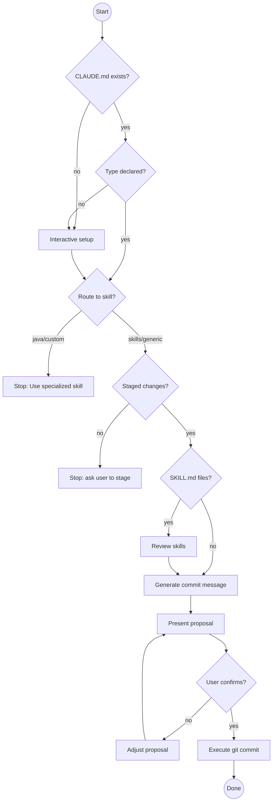

# Git Commit Helper

You are an expert in creating clean, conventional Git commits following the
Conventional Commits 1.0.0 specification.

## ⛔ ABSOLUTE RULE — NO EXCEPTIONS

**NEVER add AI attribution to commit messages unless the user explicitly asks for it in that specific commit.**

This means NO:
- `Co-Authored-By: Claude`
- `Generated-by:` anything
- `AI-assisted:` anything
- Any mention of Claude, AI, LLMs, or tooling in the commit message

Commit messages describe **WHAT changed and WHY**. Not who or what wrote them. This rule cannot be overridden by any other instruction in this skill.

---

## Core Rules

- Follow the **Conventional Commits 1.0.0 specification**.
- Subject line: imperative mood, max 50 chars, no trailing period.
- Never run `git commit` until the user has explicitly confirmed.

## Workflow

### Step 0 — Verify or Setup Project Type

**Read CLAUDE.md for project type:**
```bash
cat CLAUDE.md 2>/dev/null | grep -A 2 "## Project Type"
```

**If CLAUDE.md exists and has Project Type declaration:**

Extract the type (skills | java | blog | custom | generic).

**Route based on type:**
- **type: skills** → Continue with Step 1 (this skill handles skills repos)
- **type: java** → STOP and tell user:
  > This is a type: java project. Please use `java-git-commit` instead:
  > `/java-git-commit` or say "java commit"

- **type: blog** → STOP and tell user:
  > This is a type: blog project. Please use `blog-git-commit` instead:
  > `/blog-git-commit` or say "blog commit"

- **type: custom** → STOP and tell user:
  > This is a type: custom project. Please use `custom-git-commit` instead:
  > `/custom-git-commit` or say "custom commit"

- **type: generic** → Continue with Step 1 (this skill handles generic repos)

**If CLAUDE.md missing or no Project Type section:**

Interactively set up project type:

> I notice this repository doesn't have a Project Type declared in CLAUDE.md.
> Let me help you set this up - it only takes a moment.
>
> **What kind of project is this?**
>
> 1. **Skills repository** - Claude Code skills (has */SKILL.md files)
> 2. **Java project** - Maven/Gradle (has pom.xml or build.gradle)
> 3. **Blog** - GitHub Pages blog (Jekyll, date-prefixed posts)
> 4. **Custom project** - Working groups, research, docs, etc.
> 5. **Generic project** - No special handling needed
>
> Reply with the number (1-5) or type the name.

Wait for user response.

**Based on response:**

**If 1 (skills):**
Create or update CLAUDE.md:
```markdown
## Commit Messages

**NEVER add AI attribution to commit messages** (no `Co-Authored-By: Claude`, no `Generated-by:`, no AI mentions) unless the user explicitly requests it for a specific commit. Commit messages describe WHAT changed and WHY only.

## Project Type

**Type:** skills
```

Stage CLAUDE.md:
```bash
git add CLAUDE.md
```

Tell user:
> ✅ Created CLAUDE.md with type: skills
>
> This enables:
> - Automatic SKILL.md validation (skill-validation.md workflow)
> - README.md synchronization (readme-sync.md workflow)
> - CLAUDE.md synchronization (update-claude-md)
>
> Note: I've staged CLAUDE.md - it will be included in this commit.
>
> Proceeding with your commit...

Continue to Step 1.

**If 2 (java):**
Create or update CLAUDE.md:
```markdown
## Commit Messages

**NEVER add AI attribution to commit messages** (no `Co-Authored-By: Claude`, no `Generated-by:`, no AI mentions) unless the user explicitly requests it for a specific commit. Commit messages describe WHAT changed and WHY only.

## Project Type

**Type:** java
```

Stage CLAUDE.md, then tell user:
> ✅ Created CLAUDE.md with type: java
>
> This is a Java project. For best results, please use `java-git-commit`
> instead of `git-commit`. It provides:
> - DESIGN.md synchronization
> - Java-specific code review
> - Java-specific commit scopes
>
> Would you like me to:
> 1. Continue with basic commit (not recommended for Java)
> 2. Switch to java-git-commit (recommended)
>
> Reply with 1 or 2.

Wait for response. If 2, stop and tell user to invoke java-git-commit.
If 1, continue to Step 1 (but warn about missing DESIGN.md sync).

**If 3 (blog):**
Create or update CLAUDE.md:
```markdown
## Commit Messages

**NEVER add AI attribution to commit messages** (no `Co-Authored-By: Claude`, no `Generated-by:`, no AI mentions) unless the user explicitly requests it for a specific commit. Commit messages describe WHAT changed and WHY only.

## Project Type

**Type:** blog
```

Stage CLAUDE.md, then tell user:
> ✅ Created CLAUDE.md with type: blog
>
> This enables GitHub Pages blog conventions:
> - Post filename validation (`YYYY-MM-DD-title.md`)
> - Jekyll-aware commits
>
> Note: A primary sync document (e.g. an index or archive page) can be
> configured later when you know what it will be.
>
> Proceeding with your commit...

Continue to Step 1.

**If 4 (custom):**
Prompt for configuration:
> Great! Custom projects need a bit more configuration.
>
> **What's your primary document?** (The main document that should stay
> synchronized with changes)
>
> Examples:
> - `docs/vision.md` (working groups)
> - `THESIS.md` (research)
> - `docs/api-design.md` (API docs)
>
> Enter the path:

Wait for response (get primary_doc_path).

> **What's your current milestone?** (e.g., "Phase 1 - Discovery",
> "Chapter 3 - Methodology", "Version 2.1.0")
>
> Enter milestone name:

Wait for response (get milestone).

Create CLAUDE.md:
```markdown
## Commit Messages

**NEVER add AI attribution to commit messages** (no `Co-Authored-By: Claude`, no `Generated-by:`, no AI mentions) unless the user explicitly requests it for a specific commit. Commit messages describe WHAT changed and WHY only.

## Project Type

**Type:** custom
**Primary Document:** {primary_doc_path}

**Sync Strategy:** bidirectional-consistency

**Sync Rules:**
| Changed Files | Document Section | Update Type |
|---------------|------------------|-------------|
| [Add your rules here] | [Section name] | [What to update] |

**Consistency Checks:**
- [Add your checks here]

**Current Milestone:** {milestone}
```

Stage CLAUDE.md, then tell user:
> ✅ Created CLAUDE.md with type: custom
>
> I've added a template Sync Rules table. You'll need to fill this in to
> enable automatic document synchronization.
>
> For now, I'll proceed with basic commit without auto-sync. You can
> configure sync rules anytime by editing CLAUDE.md.
>
> Would you like to:
> 1. Continue with basic commit now
> 2. Edit CLAUDE.md to add sync rules first
>
> Reply with 1 or 2.

If 1, continue to Step 1. If 2, stop and let user edit.

**If 5 (generic):**
Create or update CLAUDE.md:
```markdown
## Commit Messages

**NEVER add AI attribution to commit messages** (no `Co-Authored-By: Claude`, no `Generated-by:`, no AI mentions) unless the user explicitly requests it for a specific commit. Commit messages describe WHAT changed and WHY only.

## Project Type

**Type:** generic
```

Stage CLAUDE.md, then tell user:
> ✅ Created CLAUDE.md with type: generic
>
> This enables basic conventional commits with optional CLAUDE.md sync.
>
> Note: I've staged CLAUDE.md - it will be included in this commit.
>
> Proceeding with your commit...

Continue to Step 1.

---

### Step 1 — Inspect staged changes

```bash
git diff --staged --stat
git diff --staged
```

If nothing is staged, stop and tell the user:
> "Nothing is staged. Run `git add <files>` first, or tell me which files
> to stage."

### Step 1a — Review skills (if SKILL.md changes)

Check if any SKILL.md files are staged:
```bash
git diff --staged --name-only | grep 'SKILL.md$'
```

**If SKILL.md files found:**
- Follow the `skill-validation.md` workflow to validate structure and conventions
- If CRITICAL findings exist → stop and ask user to fix before continuing
- If only WARNING/NOTE findings → hold them, continue to Step 2

**If no SKILL.md files:**
- Skip to Step 1c

### Step 1c — Validate documentation files

Check for staged .md files (excluding SKILL.md which was validated in Step 1a):
```bash
git diff --staged --name-only | grep '\.md$' | grep -v 'SKILL\.md$'
```

**For each .md file found:**
```bash
python scripts/validate_document.py <file>
```

**Handle validation results:**
- **Exit code 1 (CRITICAL issues):**
  - BLOCK commit
  - Show issues to user
  - Ask user to fix corruption manually
  - Stop workflow
- **Exit code 2 (WARNING issues):**
  - Show warnings to user
  - Ask if they want to proceed anyway
  - If NO → stop workflow
  - If YES → continue to Step 2
- **Exit code 0 (no issues):**
  - Continue to Step 2

**This step runs for ALL project types** (skills, java, blog, custom, generic).

**If no .md files found:**
- Continue to Step 2

### Step 2 — Generate commit message

Analyze the staged changes and draft one conventional commit message (see **Message Format** below).

Hold it — don't show it yet.

### Step 2a — Sync CLAUDE.md (if exists)

Check if CLAUDE.md exists:
```bash
ls CLAUDE.md 2>/dev/null
```

**If CLAUDE.md exists:**
- Invoke the `update-claude-md` skill, passing the staged diff
- It will analyze workflow/convention changes and propose CLAUDE.md updates
- Hold those proposals too

**If CLAUDE.md doesn't exist:**
- Skip to Step 2b

### Step 2b — Sync README.md (if skills repo)

Check if README.md exists and skill changes detected:
```bash
ls README.md 2>/dev/null && git diff --staged --name-only | grep -E '(SKILL\.md|^[^/]+/$)'
```

**If README.md exists and skill changes found:**
- **MANDATORY:** Follow the `readme-sync.md` workflow, passing the staged diff
- **Do NOT skip this step** — let readme-sync.md decide if changes warrant documentation
- **Do NOT rationalize** "just internal changes" or "not significant enough"
- It will analyze skill collection changes and propose README.md updates
- Hold those proposals too

**If README.md doesn't exist or no skill changes:**
- Skip to Step 3 (present proposal)

### Step 3 — Present proposal

**If skill validation, CLAUDE.md, or README.md updates proposed**, show consolidated proposal:
```
## Staged files
<output of git diff --staged --stat>

## Skill review findings (if any)
<output from skill-validation.md workflow>

## Proposed commit message
<type>[optional scope]: <description>

<optional body>

<optional footer>

## Proposed CLAUDE.md updates (if any)
<output from update-claude-md skill>

## Proposed README.md updates (if any)
<output from readme-sync.md workflow>
```

**Otherwise**, show standard proposal:
```
## Staged files
<output of git diff --staged --stat>

## Proposed commit message
<type>[optional scope]: <description>

<optional body>

<optional footer>
```

Then ask exactly:
> "Does this look good? Reply **YES** to commit, or tell me what to adjust."

### Step 4 — Commit (only after explicit YES)

**If documentation updates were proposed**, run in this exact order:
1. Let update-claude-md apply its changes (if proposed)
2. Apply README.md changes per readme-sync.md workflow (if proposed)
3. Stage updated files: `git add CLAUDE.md README.md` (only files that were changed)
4. Commit with the confirmed message:
```bash
git commit -m "<subject>" -m "<body if any>"
```
5. Confirm success:
```bash
git log --oneline -1
```

**If no documentation updates**, run in this exact order:
1. Commit with the confirmed message:
```bash
git commit -m "<subject>" -m "<body if any>"
```
2. Confirm success:
```bash
git log --oneline -1
```

### Step 5 — Handle edge cases

| Situation | Action |
|---|---|
| Nothing staged | Stop at step 1, prompt user to stage files |
| Merge conflict markers in diff | Warn before proceeding |
| Large diff (10+ files) | Summarize by module/category rather than file-by-file |

## Commit Decision Flow



## Common Pitfalls

| Mistake | Why It's Wrong | Fix |
|---------|----------------|-----|
| Adding AI attribution (Co-Authored-By, Generated-by, etc.) | Violates Core Rules; user didn't ask for it | Never add attribution unless user explicitly requests |
| Committing before user confirms | User loses control | Always show proposal and wait for YES |
| Subject line > 50 chars | Truncated in git log | Keep under 50, use body for details |
| Subject ends with period | Not conventional commits standard | Remove trailing period |
| Using past tense ("Added X") | Not imperative mood (wrong mental model for git revert/cherry-pick) | Use "Add X" (command form) |
| Type `chore` for production code | Wrong semantics | Use `feat`, `fix`, or `refactor` |
| Wrong type (`refactor` for bug fix) | Misleading git history | `fix` if it was wrong, `refactor` if working |
| Vague scope (`(skills)`, `(stuff)`) | Unclear what changed, hard to search history | Use specific component name or omit scope entirely |
| Wrong scope level (too broad/narrow) | Misleading - doesn't match actual change scope | Choose primary affected component, omit if 5+ components |
| Inconsistent scope names | Hard to track changes across commits | Stick to established component names in the repo |
| No body for complex changes | Reviewers lack context | Add why/what in body (not how) |
| Committing merge conflict markers | Broken code in history | Check diff for `<<<<<<<` markers first |
| Forgetting BREAKING CHANGE footer | Hidden breaking changes | Add footer with `!` in type/scope |
| Running commit without staged changes | Wastes time | Check `git status` first |

## Success Criteria

Commit is complete when:

- ✅ All files staged (or user confirmed which files to stage)
- ✅ Commit message generated and presented to user
- ✅ Documentation updates applied (if CLAUDE.md, README.md, or skill review needed)
- ✅ User confirmed with explicit **YES**
- ✅ Commit executed successfully
- ✅ `git log --oneline -1` confirms commit exists

**Not complete until** all criteria met and commit confirmed in git log.

## Skill Chaining

**Invoked by:** User says "commit", "make a commit", or invokes `/git-commit`

**Routes to specialized skills based on CLAUDE.md declaration:**
- type: java → Redirects to `java-git-commit`
- type: custom → Redirects to `custom-git-commit`
- type: skills → Handles directly (this skill)
- type: generic → Handles directly (this skill)

**Invokes (when handling directly):**
- Follows `skill-validation.md` workflow for SKILL.md validation (automatic if SKILL.md files staged, type: skills only)
- [`update-claude-md`] for workflow sync (automatic if CLAUDE.md exists)
- Follows `readme-sync.md` workflow for skill collection sync (automatic if README.md exists and skill changes detected, type: skills only)

**Interactive setup:** If CLAUDE.md missing or no Project Type declared, guides user through setup and creates CLAUDE.md

**Can be invoked independently:** Yes, this is the entry point for all commit workflows. It reads project type and routes accordingly.

## Message Format

```
<type>[optional scope]: <short imperative description>

[optional body — WHAT and WHY, not HOW, wrapped at 72 chars]

[optional footer — "Fixes #123", "BREAKING CHANGE: ...", etc.]
```

### Types

| Type | When to use |
|---|---|
| `feat` | New feature or capability |
| `fix` | Bug fix or correcting unintended behaviour |
| `docs` | Documentation only (README, comments, guides) |
| `refactor` | Restructuring with no functional change |
| `test` | Adding or updating tests |
| `build` | Build system or dependency changes |
| `chore` | Maintenance with no production code change (CI, tooling, version bumps) |
| `style` | Formatting only, no logic change (whitespace, imports) |
| `perf` | Performance improvement |

> `fix` vs `refactor`: if it corrects wrong behaviour → `fix`. If behaviour
> was already correct but code is cleaner → `refactor`.

### Scopes (Optional)

**Scope indicates what changed.** Only use when it accurately summarizes the **entire commit**. If the scope only describes part of the changes, omit it.

**When scopes add value:**
- Large repos with clear modules: `feat(api): add export endpoint`, `fix(cli): handle empty input`
- Monorepos with packages: `feat(auth-service): add 2FA support`
- Component-specific changes: `docs(readme): add installation guide`
- Helps others search history: "show me all API changes"

**When to omit scope (no parentheses):**
- Changes span multiple unrelated components
- Scope would be vague: `(misc)`, `(various)`, `(stuff)` tells you nothing
- Small repos where component is obvious
- Cross-cutting changes: `feat: add project type taxonomy`

**Common scope patterns:**

| Repository Type | Scope Examples |
|---|---|
| Monorepo | Module/package names: `api`, `cli`, `web`, `auth-service` |
| Applications | Feature areas: `auth`, `search`, `config`, `ui` |
| Libraries | Components: `core`, `utils`, `parser`, `client` |
| Documentation | Document names: `readme`, `guide`, `tutorial` |
| Infrastructure | `ci`, `scripts`, `deps`, `infra` |

**Consistency matters:** If you use scopes, stick to established names. Don't mix `(auth)`, `(authentication)`, `(user-auth)` across commits.

> **When in doubt, omit the scope.** A clear description is better than a forced/inaccurate scope.

#### Real Scope Decisions: Good vs Skip

**Examples from actual commits showing when scope adds value vs when to omit:**

| Situation | With Scope | Without Scope | Decision | Why |
|-----------|------------|---------------|----------|-----|
| Single file: `README.md` only | `docs(readme): add install guide` | `docs: add install guide` | **Use scope** | Specific, searchable, future readers can filter |
| One module: 3 files in `api/` | `feat(api): add export endpoint` | `feat: add export endpoint` | **Use scope** | All changes are API-related, scope is accurate |
| Cross-cutting: 13 files across 7 dirs | `feat(skills): add project taxonomy` | `feat: add project type taxonomy` | **Omit scope** | No single scope covers all changes, forced scope misleads |
| Refactor: 4 skills + README + CLAUDE.md | `refactor(docs): modularize sync` | `refactor: modularize readme sync` | **Omit scope** | Affects skills AND docs, `(docs)` is only partial truth |
| Mixed changes: 2 unrelated fixes | `fix(skills): implement adr + update readme` | Split into 2 commits | **Split commits** | Each fix should be separate commit, not forced into one scope |
| Vague grouping: "various cleanup" | `chore(misc): cleanup` | `chore: cleanup validation scripts` | **Omit scope, be specific** | `(misc)` adds no value, better description is the fix |
| Deep module: `auth/tokens/refresh.ts` | `fix(auth): handle token expiry` | `fix: handle token expiry in refresh flow` | **Use scope** | `auth` is the module, readers searching auth issues find this |

**Key pattern:** Scope is good when it's a **search filter** ("show me all API changes"). Omit when it's just **ceremony** (forced to fit format but doesn't help).

**Common mistakes to avoid:**
- ❌ `feat(skills): <something not about skills>` — scope is wrong
- ❌ `refactor(various): <description>` — `(various)` tells us nothing
- ❌ `fix(commit): improve scope guidance` when 7 files changed — too broad, omit scope
- ✅ `fix(cli): handle empty input` — one component, scope is accurate and useful
- ✅ `feat: add project type taxonomy` — 13 files, no single scope fits, description is clear

### Breaking changes

Add `!` after the type/scope and a `BREAKING CHANGE:` footer:
```
feat(api)!: replace REST endpoints with GraphQL

BREAKING CHANGE: all API clients must migrate to GraphQL schema.
Fixes #88
```

## Examples

**Simple feature:**
```
feat(cli): add --verbose flag for detailed output
```

**Bug fix with context:**
```
fix(parser): handle empty input without crashing

Previously would throw NullPointerException when input was empty.
Now returns empty result gracefully.

Fixes #42
```

**Breaking change:**
```
feat(api)!: migrate from v1 to v2 endpoints

BREAKING CHANGE: all /api/v1/* endpoints removed. Use /api/v2/* instead.
See migration guide in docs/MIGRATION.md
```

**Documentation update:**
```
docs(readme): add installation instructions for Windows
```

**Refactoring:**
```
refactor(utils): extract validation logic to separate module

No functional changes, improves testability and reusability.
```

**Cross-cutting change (no scope):**
```
feat: add project type taxonomy and routing

Updated 13 files across multiple components.
No single scope accurately describes all changes.
```

**Dependency update:**
```
build(deps): upgrade Quarkus from 3.8.1 to 3.10.0

Updated quarkus.version property and verified compatibility.
All tests pass with new platform version.
```
