# Session Handover

> **Terminology:** *handover* is the act (what you do at session end); *handoff* is the artifact (the `HANDOFF.md` file passed to the next session).

Generates a concise `HANDOFF.md` — a pointer document that gives the next
Claude session enough context to resume immediately. References are read on
demand; the handover itself stays small. Git history is the archive.

**Token budget:** HANDOFF.md should be readable in under 500 tokens. If it's
longer, trim — it has become a document, not a handover.

---

## What This Is Not

- **Not a design snapshot** — design-snapshot freezes design state as an
  immutable archival record. The handover is operational, mutable, overwritten
  each session.
- **Not a project blog entry** — the blog captures narrative for posterity.
  The handover captures operational context for the next 24–48 hours.
- **Not a knowledge-garden entry** — cross-project technical gotchas go in
  the garden. Session-specific context goes in the handover.
- **Not a replacement for CLAUDE.md** — CLAUDE.md is already auto-loaded
  and covers permanent conventions. Don't duplicate it here.

---

## Core Principles

### 1. Write only deltas — reference the rest

If something hasn't changed since the previous handover, **don't restate it**.
Write `*Unchanged — retrieve with: `git show HEAD~1:HANDOFF.md`*` for that
section and move on. Only sections that actually changed get written in full.

This keeps the current handover minimal. The git history holds everything else.

### 2. Git history is the archive

HANDOFF.md is a single file, overwritten each session and **always committed**.
Previous versions are free — they live in git. No separate archive directory
needed.

```bash
# How many handovers exist?
git log --oneline -- HANDOFF.md

# When was the last one written?
git log -1 --format="%ar" -- HANDOFF.md

# Read the previous handover (whole file)
git show HEAD~1:HANDOFF.md

# What changed between the last two handovers?
git diff HEAD~1 HEAD -- HANDOFF.md

# Read just one section of a previous handover (surgical)
git show HEAD~1:HANDOFF.md | grep -A 10 "## Open Questions"

# Find a handover from a specific date
git log --before="2026-04-03" -1 --format="%H" -- HANDOFF.md \
  | xargs -I{} git show {}:HANDOFF.md
```

These commands are cheap — use them rather than loading full files when only
part of the historical context is needed.

### 3. Commit is required, not optional

An uncommitted HANDOFF.md is invisible to git history — the archive doesn't
exist. Always commit. No exceptions.

### 4. Freshness check before reading

When starting a session, check how old the handover is before loading it:

```bash
git log -1 --format="%ar" -- HANDOFF.md   # → "3 days ago"
```

If it's more than a week old, flag it before using the context:
> "HANDOFF.md is 9 days old — some context may be stale. Verify key
> assumptions before building on it."

The next session can then choose to load a more recent intermediate handover
from git history if one exists.

### 5. Read nothing just to reference it

If a file is already in context from this session, summarise from memory.
If it isn't, write the path — the next session reads it only if the task
requires it. This is the knowledge-garden GARDEN.md approach applied to
session continuity.

---

## Workflow

### Step 0 — Session wrap checklist

Before writing the handover, offer to create the supporting artifacts.
Present this exactly:

```
Session wrap — create before writing the handover?

[x] 1  write-blog       capture this session's work as a diary entry
[ ] 2  design-snapshot  freeze the current design state
[x] 3  update-claude-md sync any new workflow conventions
[x] 4  forage sweep     check for gotchas, techniques, undocumented
[ ] 5  journal-entry    document any design changes this session not yet in design/JOURNAL.md

Type numbers to toggle (e.g. "2 4"), "all" to toggle all on/off, or "go" to proceed:
```

- **Default:** write-blog, update-claude-md, forage sweep ticked; design-snapshot and journal-entry OFF
- **design-snapshot is off by default** — the project model is a single authoritative design document updated in place, not a growing snapshot chain. Only tick it for an explicit, intentional design freeze (e.g. a major milestone or architectural pivot worth preserving immutably). Without a workspace configured, the skill will fail or create the wrong directory.
- **journal-entry is off by default** — only tick if `design/JOURNAL.md` exists
  (i.e. Claude is on an epic branch). If it exists and there were design decisions
  this session not yet journalled, tick it and write the entry before the handover.
- **"all":** if all are on → turn all off; if any are off → turn all on
- **Numbers:** toggle individual items
- **"go" (or "ok", "yes", blank Enter if the UI allows it):** proceed with current selections

Run checked items **in this order** before continuing:
1. Forage sweep — done while context is full (findings may feed the blog)
2. update-claude-md — sync new conventions first
3. design-snapshot — only if explicitly ticked; requires workspace configured
4. journal-entry — write any missing JOURNAL.md entries before the handover
5. write-blog — written last so it can mention forage submissions and synthesise the complete session narrative including any new conventions

After all checked items complete, continue to Step 1.

---

### Step 1 — Check previous handover (cheap)

```bash
git log --oneline -3 -- HANDOFF.md
```

If a previous handover exists, get the diff to know what changed:

```bash
git diff HEAD -- HANDOFF.md 2>/dev/null || git show HEAD:HANDOFF.md 2>/dev/null
```

This tells you what sections are unchanged — don't rewrite those. Work from
the diff, not from loading the full previous file.

### Step 2 — Recall from context (free)

From the current session, recall:
- What changed from the last handover? (only write these)
- What decisions were made? What was tried and didn't work?
- What's blocking or uncertain?
- What's the single most important next action?

Do NOT read any project files to answer these. Work from conversation memory.

### Step 2b — Forage sweep (while context is still full)

**The sweep is done by the handover itself from conversation memory** —
not by invoking forage and asking it to find things. Forage
is only called once specific entries have been identified.

Review the session across all three categories. For each one, think
through what actually happened in the conversation:

**Gotchas** — did anything go wrong in a non-obvious way?
> Scan for: bugs whose symptom misled about root cause; silent failures
> with no error; things that required multiple failed approaches; workarounds
> for things that "should" work but don't.

**Techniques** — did any non-obvious approach work well?
> Scan for: solutions a skilled developer wouldn't naturally reach for;
> tool or API combinations used in undocumented ways; patterns that solved
> a problem more elegantly than expected.

**Undocumented** — was anything discovered that isn't in the official docs?
> Scan for: flags, options, or behaviours only findable via source code;
> features that work but have no documentation; things discovered through
> trial and error or commit history.

For each finding, **propose it explicitly** before proceeding:

> "During this session we hit X — [brief description]. Worth submitting
> to the garden as a [gotcha / technique / undocumented]?"

If confirmed → invoke `forage` CAPTURE with the specific content already
known from context. Do NOT invoke forage and ask it to find things.

If nothing surfaces in any category → proceed to Step 3.

> **Why here:** The context window is full. After the handover is written
> and the session ends, this knowledge is lost. The sweep costs near-zero
> from context; the cost of missing an entry is rediscovery time later.

The sweep is **always done** (even if it finds nothing). Completeness
matters — checking all three categories explicitly prevents the common
failure of only catching the most obvious kind (usually gotchas) and
missing techniques and undocumented items.

### Step 3 — Gather cheap orientation

```bash
git log --oneline -6        # recent commits
git status --short          # any uncommitted state
```

### Step 4 — Build the references table (locate, don't read)

```bash
ls snapshots/ | sort | tail -1   # latest snapshot path
ls blog/ | sort | tail -1        # latest blog entry path
ls adr/ | sort | tail -3         # recent ADRs
```

Run `ls` only — do not open the files. CLAUDE.md is auto-loaded; omit it.

### Step 5 — Write HANDOFF.md (delta-first)

Use the template and routing table in [handover-reference.md](handover-reference.md).

For each section: has it changed since last handover?
- **Changed** → write it in full
- **Unchanged** → write `*Unchanged — `git show HEAD~1:HANDOFF.md`*`
- **Doesn't exist yet** (first handover) → write all sections in full

Overwrite the previous HANDOFF.md completely.

### Step 5b — Suggest and offer to rename the session

Claude Code has a built-in `/rename` command that renames the current session.
Call it without arguments to auto-generate a name from context, or with an
argument to set a specific name.

**Before writing the handover**, generate a concise descriptive session name
from the session's content — 2–4 words, suitable as a display title, e.g.
"Hortora Design and Naming" or "Garden v2 Retrieval Redesign."

Then check whether the session already has a meaningful name. The auto-generated
names follow a random three-word pattern (e.g. `gleaming-stargazing-newell`,
`mellow-hopping-simon`). If the session appears to still be using one of these:

Present to the user:

> **Rename this session?**
>
> Suggested name: **`<Suggested Name>`**
>
> Type `/rename <Suggested Name>` to apply it.
>
> *(Tip: `/rename` with no arguments requires earlier conversation context to
> auto-generate — at session end it says "no conversation context yet".
> Always provide the name explicitly as shown above.)*

Wait for the user to type `/rename` (or decline). Do not proceed with the
handover commit until the naming step is resolved.

**If the session already has a meaningful custom name** → skip this step silently.

**Note:** `/rename` is a Claude Code built-in slash command, not a skill command.
Claude cannot invoke it directly — the user must type it. The skill's job is to
suggest the name and prompt at the right moment.

### Step 6 — Commit (required)

```bash
git add HANDOFF.md
git commit -m "docs: session handover YYYY-MM-DD"
```

Committing is mandatory. It's what makes git history the archive.

---

---

## Decision Flow

```mermaid
flowchart TD
    Trigger((Session ending))
    WrapChecklist[Show wrap checklist:\nwrite-blog / design-snapshot /\nupdate-claude-md / forage sweep /\njournal-entry\nmost on by default]
    UserToggles[User toggles items\nor types 'all' / Enter]
    GardenSweep[Forage sweep if checked:\ncheck gotchas / techniques /\nundocumented — all 3 categories]
    GardenFound{Anything\nworth submitting?}
    SubmitGarden[Invoke forage CAPTURE\nto write submission]
    WriteBlog[Invoke write-blog\nsingle-entry for this session]
    DesignSnap[Invoke design-snapshot\nfreeze current state]
    UpdateClaude[Invoke update-claude-md\nsync new conventions]
    CheckHistory[git log --oneline -3\n-- HANDOFF.md]
    HasPrevious{Previous\nhandover exists?}
    GetDiff[git diff HEAD -- HANDOFF.md\nidentify unchanged sections]
    Recall[Recall from context:\nwhat changed, decisions,\nnext step — zero cost]
    GitStatus[git log --oneline -6\ngit status --short]
    BuildRefs[ls to locate file paths\ndo not open files]
    Draft[Write HANDOFF.md:\nchanged sections in full,\nunchanged sections as references]
    TokenCheck{Over 500 tokens?}
    Trim[Mark more sections\nas unchanged references]
    Confirm[Show to user]
    UserApproves{Approved?}
    Refine[Adjust]
    Write[Write HANDOFF.md]
    Commit[git add HANDOFF.md\ngit commit — required]
    Done((Done))

    Trigger --> WrapChecklist
    WrapChecklist --> UserToggles
    UserToggles --> GardenSweep
    GardenSweep --> GardenFound
    GardenFound -->|yes| SubmitGarden
    GardenFound -->|no| UpdateClaude
    SubmitGarden --> UpdateClaude
    UpdateClaude --> DesignSnap
    DesignSnap --> WriteBlog
    WriteBlog --> CheckHistory
    CheckHistory --> HasPrevious
    HasPrevious -->|yes| GetDiff
    HasPrevious -->|no| Recall
    GetDiff --> Recall
    Recall --> GitStatus
    GitStatus --> BuildRefs
    BuildRefs --> Draft
    Draft --> TokenCheck
    TokenCheck -->|yes| Trim
    Trim --> Draft
    TokenCheck -->|no| Confirm
    Confirm --> UserApproves
    UserApproves -->|yes| Write
    UserApproves -->|adjust| Refine
    Refine --> Draft
    Write --> Commit
    Commit --> Done
```



---

## Common Pitfalls

| Mistake | Why It's Wrong | Fix |
|---------|----------------|-----|
| Restating unchanged context verbatim | Wastes tokens; the previous handover already has it | Write `*Unchanged — git show HEAD~1:HANDOFF.md*` |
| Skipping the commit | Makes git history useless as an archive | Commit is mandatory, not optional |
| Loading previous handover to check what's unchanged | Wastes tokens; use `git diff` instead | `git diff HEAD -- HANDOFF.md` shows only what changed |
| Loading GARDEN.md detail files | Index is enough; details load on demand | Always reference GARDEN.md (index), never sub-files |
| Copying CLAUDE.md content | Auto-loaded; pure duplication | Omit entirely |
| Skipping the freshness check | Old handover misleads the next session | `git log -1 --format="%ar" -- HANDOFF.md` before using |
| Writing "continue work" as next step | Too vague to act on | Be specific — name the file, command, or section |

---

## Success Criteria

Handover is complete when:

- ✅ Wrap checklist shown and user selections confirmed
- ✅ Forage sweep performed — all three categories checked (gotchas, techniques, undocumented)
- ✅ Any garden-worthy entries submitted via forage CAPTURE before writing the handover
- ✅ write-blog invoked (if checked) — session diary entry written
- ✅ design-snapshot invoked (if checked) — design state frozen; off by default
- ✅ update-claude-md invoked (if checked) — CLAUDE.md synced
- ✅ journal-entry written (if checked) — design/JOURNAL.md updated; off by default; only applicable on epic branches
- ✅ Session name offered — user was prompted to `/rename` or acknowledged the session already has a meaningful name
- ✅ HANDOFF.md exists at project root
- ✅ Readable in under 500 tokens
- ✅ Unchanged sections reference git history, not repeated content
- ✅ Immediate next step is specific enough to act on without asking
- ✅ References table uses paths only — no file content inline
- ✅ Nothing from CLAUDE.md is duplicated
- ✅ User confirmed before writing
- ✅ Committed to git (required — this is the archive mechanism)

**The test:** Could a fresh Claude reading only CLAUDE.md and HANDOFF.md
pick up the work in the next message, with git history available for any
context marked as "unchanged"? If yes — done.

---

## Skill Chaining

**Invoked by:** User directly at end of a session ("create a handover",
"end of session", "write a handover")

**Invokes:** [`forage`] — forage sweep (Step 2b) to submit any gotchas, techniques, or undocumented items before context is lost; [`write-blog`] — single-entry mode for this session's narrative (if checked); [`design-snapshot`] — to freeze current design state (if checked); [`update-claude-md`] — to sync any new conventions (if checked); journal entry (inline action, not a separate skill) — writes missing `design/JOURNAL.md` entries on epic branches (if checked); `git commit` directly for the handover itself

**Reads from (surgical, not upfront):**
- `git diff HEAD -- HANDOFF.md` — what changed from last handover
- `git log --oneline -6` — recent commits for orientation
- `ls` on workspace directories — locate paths without reading files
- `~/.hortora/garden/GARDEN.md` — only when including garden reference

**Complements:**
- `design-snapshot` — archival design state the handover points to
- `write-blog` — narrative context the handover points to
- `forage` — technical gotcha index the handover references
- `idea-log` — undecided possibilities the handover references

**Does NOT replace:** CLAUDE.md (auto-loaded), `--resume`/`--continue` flags
(restore conversation history for same-machine continuation)
