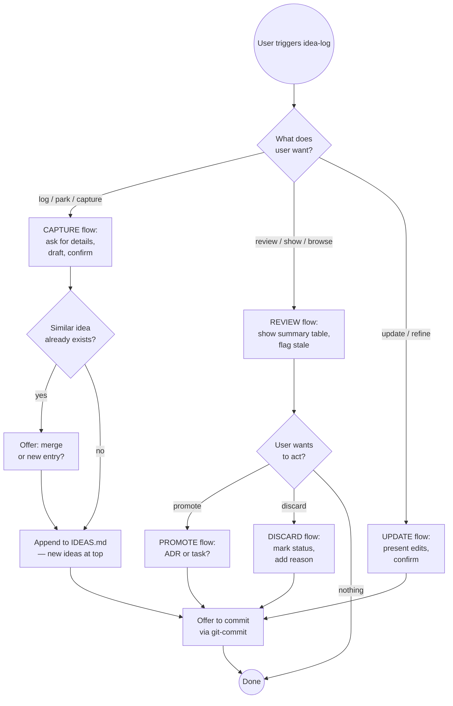

# Idea Log

A lightweight, living log for undecided possibilities: ideas worth remembering
but not ready to act on. Think of it as a parking lot for creative thinking —
a place to capture "what if we..." thoughts before they evaporate, without
committing to them.

Unlike ADRs (decisions made) or design snapshots (state frozen), the idea log
is deliberately informal and mutable. Ideas can be refined, promoted, or
discarded as the project evolves.

---

## What This Is Not

- **Not an ADR** — ADRs record decisions already made. Idea log holds
  possibilities not yet decided. When an idea becomes a decision, promote it.
- **Not a design snapshot** — Snapshots freeze the current state. The idea log
  is forward-looking and always mutable.
- **Not a task list** — If you're about to implement it, use a task. If you're
  parking it for later consideration, use the idea log.
- **Not a backlog** — Ideas here may never be acted on. That's fine. The log
  is a signal receiver, not a commitment.

---

## File Location

```
docs/ideas/IDEAS.md
```

A single flat file. All ideas live here regardless of topic. Keep it short
enough to skim — if it grows past ~50 active ideas, do a REVIEW pass.

---

## Entry Format

Each idea is a level-2 section:

```markdown
## YYYY-MM-DD — Short title (verb phrase or noun)

**Priority:** high | medium | low
**Status:** active | promoted | discarded

What the idea is and why it might be worth pursuing. 1–4 sentences.
Be specific enough that you'll understand this 6 months from now.

**Context:** What prompted this — code review finding, brainstorm, conversation,
observation. Include enough so the idea isn't orphaned from its origin.

**Promoted to:** *(leave blank — fill if promoted to ADR or task)*
```

**Priority guidance:**
- `high` — would meaningfully improve correctness, safety, or user experience; blocking nothing but worth soon
- `medium` — good idea, not urgent; revisit at next review
- `low` — interesting possibility, might never act on it; keep for inspiration

---

## Workflow

### Capturing an Idea (CAPTURE)

When the user wants to log an idea:

1. **Ask for the essentials** (if not already provided):
   - What's the idea? (1–2 sentences)
   - What prompted it? (context)
   - Priority guess? (offer `medium` as default if unsure)

2. **Check if a similar idea already exists:**
   ```bash
   grep -i "<keyword>" docs/ideas/IDEAS.md 2>/dev/null
   ```
   If a near-duplicate exists, ask: add as new entry or merge into existing?

3. **Draft the entry** using the format above. Use today's date.
   Present the draft — do NOT write until the user confirms or says "looks good".

4. **Append to IDEAS.md** (create `docs/ideas/` if needed).
   New ideas go at the TOP of the file, below any header.

5. **Offer to commit:**
   > "Idea logged. Commit now or keep editing?"
   If committing, invoke `git-commit` with message: `docs: log idea — <short title>`

---

### Reviewing Ideas (REVIEW)

When the user wants to see what's in the log (says "review ideas", "what ideas do we have",
"show the idea log"):

1. **Read IDEAS.md** and present a summary table:

   | Date | Title | Priority | Status |
   |------|-------|----------|--------|
   | YYYY-MM-DD | title | high | active |

2. **Flag stale ideas** — active ideas older than 90 days with no updates.
   Note: "These ideas are older than 90 days — worth promoting, discarding, or keeping?"

3. **Ask what they want to do:**
   - Promote an idea → run PROMOTE flow
   - Discard an idea → run DISCARD flow
   - Refine an idea → run UPDATE flow
   - Nothing now → done

---

### Promoting an Idea (PROMOTE)

When the user decides an idea is ready to become a decision or task:

1. **Confirm the promotion target:**
   > "Promote to ADR (for an architectural decision) or a task/issue (for implementation work)?"

2. **For ADR promotion:**
   - Fill in `**Promoted to:**` with a placeholder: `*(pending — see ADR created today)*`
   - Invoke `adr` with the idea's content as context
   - After ADR is written, come back and update the `**Promoted to:**` line with the ADR link
   - Change `**Status:**` to `promoted`

3. **For task/issue promotion:**
   - Fill in `**Promoted to:**` with the issue reference (e.g., `#42`) once created
   - Change `**Status:**` to `promoted`

4. **Commit IDEAS.md** (with the status update) alongside the ADR or issue creation.

---

### Discarding an Idea (DISCARD)

When an idea is no longer relevant:

1. Change `**Status:**` to `discarded`
2. Add a brief note explaining why: `**Discarded:** YYYY-MM-DD — <reason in one sentence>`
3. Do NOT delete discarded ideas — they're useful as "things we considered and rejected"
4. Commit with: `docs: discard idea — <short title>`

---

### Updating an Idea (UPDATE)

When the user wants to refine or add context to an existing idea:

1. Read the current entry
2. Present proposed edits — do NOT write until confirmed
3. Preserve the original date; add an update note if substantially changed:
   `*(updated YYYY-MM-DD — <brief reason>)*`
4. Commit if the update is significant

---

## Decision Flow



---

## IDEAS.md File Header

When creating `docs/ideas/IDEAS.md` for the first time, use this header:

```markdown
# Idea Log

Undecided possibilities — things worth remembering but not yet decided.
Promote to an ADR when ready to decide; discard when no longer relevant.

---
```

Then add entries below the `---` separator.

---

## Common Pitfalls

| Mistake | Why It's Wrong | Fix |
|---------|----------------|-----|
| Logging a decision as an idea | Ideas are undecided; decisions belong in ADRs | Ask "is this decided?" — if yes, use `adr` |
| Writing a novel per entry | Defeats the parking-lot purpose | Keep to 1–4 sentences + context; details go in ADRs |
| Deleting discarded ideas | Loses "what we considered and rejected" history | Change status to `discarded`, never delete |
| Putting ideas at the bottom | Buried ideas don't get reviewed | Always prepend new ideas at the top |
| Never reviewing the log | Stale ideas accumulate and lose signal | Flag ideas older than 90 days during REVIEW |
| Committing without confirmation | User can't course-correct the entry | Always show draft and wait before writing |
| Making the log a task list | Creates commitment where none was intended | If it's actionable now, create a task instead |

---

## Success Criteria

Idea capture is complete when:

- ✅ Entry written to `docs/ideas/IDEAS.md` (created if needed)
- ✅ Entry has date, title, priority, status, description, and context
- ✅ Duplicate check performed before writing
- ✅ User confirmed the draft before it was written
- ✅ Committed (or explicitly deferred)

Idea promotion is complete when:

- ✅ `**Status:**` updated to `promoted`
- ✅ `**Promoted to:**` filled with ADR number or issue reference
- ✅ IDEAS.md committed
- ✅ Target ADR or issue created (if it was the trigger)

---

## Skill Chaining

**Invoked by:** [`java-code-review`], [`ts-code-review`], [`python-code-review`] — when a review surfaces a possibility worth parking; [`design-snapshot`] — when reviewing a snapshot surfaces ideas not yet decided; user directly ("log this idea", "park that thought")

**Invokes:** [`adr`] — when promoting a high-priority idea to a formal architectural decision; [`git-commit`] — to commit IDEAS.md additions and status updates (routes to `java-git-commit`, `custom-git-commit`, etc. per CLAUDE.md project type)

**Does NOT invoke:** `design-snapshot` (snapshots freeze current state; idea log is forward-looking); `project-health` (idea log is a working document, not a quality gate)
