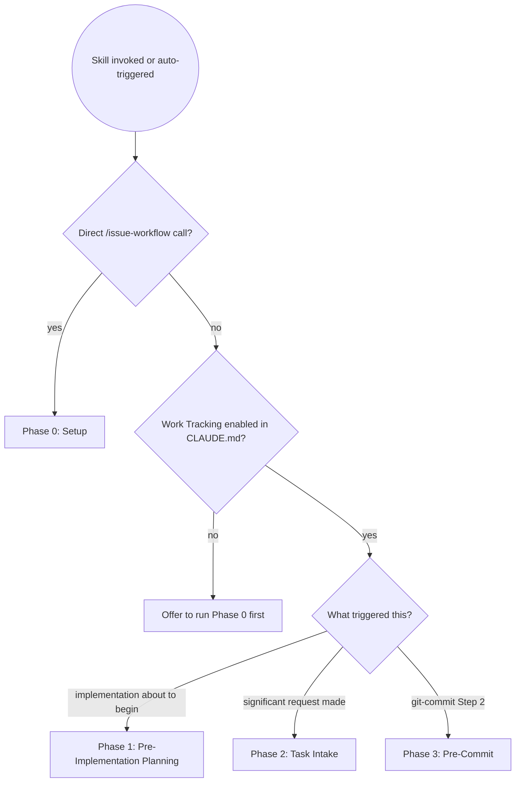
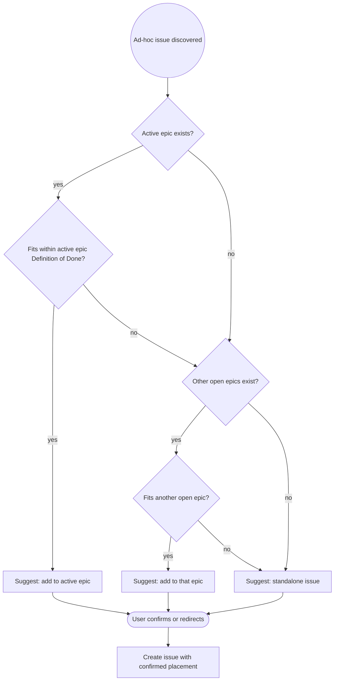

# Issue Workflow

Manages GitHub issues across the full development lifecycle — from planning
through implementation to commit.

| Phase | When it runs | What it does |
|-------|-------------|--------------|
| **0: Setup** | `/issue-workflow` called directly | Configure labels, write Work Tracking to CLAUDE.md |
| **1: Pre-Implementation** | Work Tracking enabled + implementation is about to begin | Create epic + child issues before any code is written |
| **2: Task Intake** | Work Tracking enabled + Claude is about to implement anything | Create issue + assess epic placement before writing code; detect cross-cutting |
| **3: Pre-Commit** | `git-commit` Step 2, Work Tracking enabled | Confirm issue linkage; split candidates; catch anything Phase 2 missed |

## Phase Routing



---

## Phase 0: Setup

Run when the user calls `/issue-workflow` directly, or when `git-commit` offers
it during CLAUDE.md initialisation.

### Step 1 — Detect GitHub repository

```bash
git remote get-url origin
```

Extract `owner/repo`. If it fails or is not a GitHub URL:
> ⚠️ Could not detect a GitHub repository. Issue tracking requires a GitHub
> remote. Please set one up and run `/issue-workflow` again.

Stop if no GitHub remote found.

### Step 2 — Check GitHub CLI

```bash
gh auth status
```

If not available or not authenticated:
> ⚠️ The GitHub CLI (`gh`) is required. Install from https://cli.github.com/
> and run `gh auth login`, then try again.

Stop if `gh` is not usable.

### Step 3 — Ask about scope

> **Issue tracking setup**
>
> I can link all your work to GitHub issues automatically. This gives you:
> - Clean release notes from closed issues (`gh release create --generate-notes`)
> - Commits that reference issues (`Refs #12`, `Closes #34`)
> - Automatic enforcement that issues exist before implementation begins
> - Suggestions to split commits when staged changes cover separate concerns
>
> **How would you like to proceed?**
>
> 1. **Start fresh** — configure issue tracking for ongoing work only
> 2. **Include past work** — I'll read the git history and help create issues for significant past work
> 3. **Skip** — no issue tracking for this project

Wait for user choice. If 3, stop.

### Step 4 — Create standard labels

```bash
gh label list --repo {owner/repo}
```

Create any missing labels — see **[github-setup.md](github-setup.md)** for the full label table and `gh label create` commands.

### Step 5 — Write Work Tracking to CLAUDE.md

Add or update the `## Work Tracking` section — see **[github-setup.md](github-setup.md)** for the complete template.

Confirm:
> ✅ Work Tracking configured in CLAUDE.md. Issue creation is now enforced before
> implementation begins.

### Step 6 — Past work reconstruction (if user chose option 2)

Use the `/retro-issues` skill for retrospective mapping of git history to
epics and issues. It is a dedicated on-demand command that analyses git log,
ADRs, blog entries, and design docs to propose a structured hierarchy before
creating anything on GitHub.

> Run `/retro-issues` to begin retrospective mapping.

---

## Phase 1: Pre-Implementation Planning

**Triggered by:** Work Tracking enabled + user signals implementation is about to begin
(says "implement", "start coding", "execute the plan", "let's build this", etc.).

Also check at session start when Work Tracking is enabled — if no active epic or
issue exists, surface Phase 1 before accepting the first task:

```bash
gh issue list --state open --label "epic" --repo {owner/repo} --limit 5
```

### Step 1 — Check prerequisites

```bash
git remote get-url origin   # needs a GitHub remote
gh auth status              # needs gh CLI authenticated
```

If either fails, offer to run Phase 0 first. If the user declines, note that
commits won't be issue-linked and continue.

### Step 2 — Prompt the user

> I'm about to start implementation. Would you like me to create a GitHub epic and
> child issues to track this work?
>
> - **Yes** — create epic + issues now (recommended)
> - **No** — proceed without issue tracking this session
> - **Already done** — give me the epic number and I'll link commits to it

If **No**, continue. If **Already done**, note the epic number and skip to Step 5.

### Step 3 — Create the epic

Derive title and description from the plan or user's description. Never ask the
user to fill in fields — infer and propose.

**Title rules:** Verb-first, outcome-focused, specific.
- ✅ "Add WKWebView + xterm.js terminal renderer"
- ❌ "WKWebView work" / "Plan 5b"

```bash
gh issue create \
  --title "{epic title}" \
  --label "epic,{type-label}" \
  --repo {owner/repo} \
  --body "$(cat <<'EOF'
## Overview
{What this epic delivers and why. 2–4 sentences.}

## Motivation
{The problem being solved. Why it matters now.}

## Scope
{Filled in after child issues are created.}

## Definition of Done
{Observable, specific end state — what does "this epic is complete" look like?}
EOF
)"
```

**Sub-epics:** If a child is itself large (days of work, multiple sub-tasks), give
it the `epic` label and create grandchild issues referencing it. The same title
and body rules apply at every level.

**Architectural distinctness → promote to sibling sub-epic.** When a concern is
architecturally distinct from the sub-epic it would otherwise fall under, promote
it to its own sub-epic at the parent level rather than burying it as a child issue.
Example: "Rule Base & Registry" is an architectural lifecycle concern and should be
a sibling sub-epic to "DSL arity permutations", not a child issue buried inside it.

### Organise by capability area, not by timing

**The primary axis for splitting work into epics and child issues is what is being
done and which system area it touches — not when it will be done or in what order.**

A well-named issue ("Data Store layer — PropagatingDataStore, subscription pattern")
remains meaningful long after the work ships. A phase-named issue ("Phase 2 —
foundation work") becomes meaningless immediately.

Phases are acceptable as a *secondary* form of categorisation within an issue or
epic — as acceptance-criteria checkboxes or an ordered task list — when a single
issue has natural internal sequencing that genuinely helps project management. But
phases must never be the primary organising principle of the issue hierarchy itself.

| ✅ Organised by capability | ❌ Organised by timing |
|---|---|
| "Data Store layer — subscription pattern" | "Phase 2 — foundation work" |
| "Rule Base & Registry — lifecycle hooks" | "Step 3 — registry" |
| "DSL arity permutations — varargs capture" | "Phase 1b — DSL work" |

### Step 4 — Create child issues

One issue per independent task. A task is independent if it can be reviewed,
merged, and reverted on its own.

**Title rules:** Same as epics — verb-first, outcome-focused, capability-named.
- ✅ "Implement myui_evaluate_javascript() to drive xterm.js from Java"
- ✅ "Data Store layer — PropagatingDataStore and subscription pattern"
- ❌ "JavaScript stuff" / "Task 3" / "Phase 2 work"

```bash
gh issue create \
  --title "{child title}" \
  --label "{type-label}" \
  --repo {owner/repo} \
  --body "$(cat <<'EOF'
## Context
Part of epic #{epic-number} — {epic title}. {Note any dependency on sibling issues.}

## What
{What needs to be built or changed. Outcome-focused — leave room for good judgment.}

## Acceptance Criteria
- [ ] {Specific, testable, observable outcome}
- [ ] {Cover the happy path AND the key failure/edge cases}

## Notes
{Pitfalls, relevant files, architectural constraints, known gotchas. Always include something.}
EOF
)"
```

Repeat for every task. Then update the epic's Scope checklist with real issue numbers:

```bash
gh issue edit {epic-number} --body "..." --repo {owner/repo}
```

### Step 5 — Establish active epic and active issue

At the end of Phase 1, hold two pieces of state for the rest of the session:

- **Active epic:** #{epic-number} — all planned work targets this epic
- **Active issue:** #{first-child-number} — the current child issue being worked on

State this explicitly:

```
Active epic:  #{N} — {epic title}
Active issue: #{M} — {first child title}

Commits should use:
- Refs #{M}   — work in progress (issue stays open)
- Closes #{M} — this commit completes the issue

When #{M} is closed, the next item in the epic Scope checklist becomes the active issue.
```

The active epic is used throughout the session to assess where ad-hoc issues belong
(Phase 2) and to pre-fill issue associations at commit time (Phase 3).

---

## Phase 2: Task Intake — Issue Creation & Cross-Cutting Detection

Runs **automatically** when Work Tracking is enabled and Claude is about to begin
implementing anything — a fix, feature, enhancement, refactor, or any other concrete
change to the codebase.

### Step 1 — Check for an active issue (lead behaviour)

Before writing a single line of code, check whether the work has an issue:

```bash
gh issue list --state open --limit 15 --repo {owner/repo}
```

**If an active issue already covers this work:** confirm it and proceed.

**If no issue exists:** don't ask — act. Infer what's being built, draft an issue
using the child body format (Context / What / Acceptance Criteria / Notes), and
apply **Ad-hoc Issue Placement** below to determine where it belongs. Then propose:

> I'm about to implement "{inferred title}". I've drafted an issue for this:
>
> **#{suggested title}**
> Context: {inferred context}
> What: {inferred outcome}
> Acceptance Criteria: {inferred criteria}
> Notes: {any known pitfalls or files}
>
> Placement: {active epic #N / epic #M / standalone} — {reason}
>
> Create it? **(YES / adjust / skip this session)**

Create on YES. On skip, note it and continue — but Phase 3 will catch it if the
commit arrives without a reference.

### Step 2 — Cross-cutting detection heuristics

A task likely spans multiple issues when it:

| Signal | Example |
|--------|---------|
| Uses "and" connecting distinct domains | "Add the skill **and** update the README **and** fix the validator" |
| Touches multiple architectural layers | Feature + tests + docs + unrelated bug fix |
| Would need multiple issue titles to describe | Each part would be a separate GitHub issue on its own |
| Mixes a new capability with an existing fix | "While we're at it, also fix..." |

### When NOT to flag

These belong together — don't split:
- Code change + its own tests
- Feature + its own documentation
- Bug fix + a regression test for it
- Refactor + updating affected imports

**Test:** Would reverting one part but not the other leave the repo in a valid
state? If yes, they're separate concerns.

### When cross-cutting is detected

> ⚠️ **This looks like it spans multiple concerns:**
>
> 1. **{Concern A}** — {description}
> 2. **{Concern B}** — {description}
>
> Working on all of these together risks a large mixed commit that's hard to
> review and impossible to revert cleanly.
>
> a) **Break it down** — I'll create separate issues and tackle them in order
> b) **Make it an epic** — one parent issue with these as child issues
> c) **Proceed as one** — if these genuinely belong together, tell me why

If **a** or **b**: create issues using the appropriate body format (child issue
for standalone, Phase 1 flow for epic).

If **c**: note the reason and continue — don't ask again this session.

### Ad-hoc Issue Placement

This logic applies whenever a new issue is created outside of Phase 1 planning —
bugs found mid-implementation, side tasks, enhancements that surface unexpectedly.

**Planned issues** (created during Phase 1 or explicitly during a planning discussion
before coding begins) automatically belong to the active epic. No confirmation needed —
add them to the Scope checklist directly.

**Ad-hoc issues** (discovered during implementation) require placement assessment.
Before creating, determine where the issue belongs:



Always surface the suggestion with reasoning before creating:

> I've found {bug/task/enhancement}: "{title}".
>
> **My suggestion:** {active epic #N / epic #M "{title}" / standalone}
> **Reason:** {fits within Definition of Done / belongs to different scope / too unrelated to any epic}
>
> Shall I create it there, or would you place it differently?

Infer title and body from context. Prompt only for fields that cannot be inferred.
When placed under an epic, add it to that epic's Scope checklist.

---

## Phase 3: Pre-Commit — Commit Split Detection & Issue Linking

Invoked by `git-commit` Step 2 when Work Tracking is enabled.

### Step 1 — Detect split candidates

```bash
git diff --staged --stat
git diff --staged --name-only
```

Flag when staged changes include **two or more independent concerns** where each
could stand alone as a meaningful commit.

Do NOT flag:
- Feature + its own tests
- Bug fix + its regression test
- Single-concern change across many files (a rename is still one thing)

**Flag these patterns:**
- New feature AND an unrelated bug fix
- Multiple unrelated bug fixes
- Documentation update AND a code change to a different area
- Config change AND a feature in a completely unrelated module

When a split is warranted:

> 📦 **Staged changes span two separate concerns:**
>
> **Concern 1:** {description} — {files}
> **Concern 2:** {description} — {files}
>
> Splitting gives you cleaner issue references, independent revert capability,
> and more accurate release notes.
>
> a) **Split** — I'll guide you through `git restore --staged` or `git add -p`
> b) **Keep together** — commit as-is (I'll note both issue refs in the message)
> c) **Show me the diff first**

If **a**:

```bash
# Unstage one concern, commit the other first
git restore --staged {files for concern 2}

# Or use interactive staging for fine-grained control
git add -p {files with mixed concerns}
```

Then commit the first concern, re-stage the second, commit that.

If **b**: include both refs — `Refs #45, Refs #31`.

### Step 2 — Verify issue linkage (fallback safety net)

By this point an issue should already exist from Phase 2. This step just confirms it.

**If an active issue is known:** offer the footer automatically:

> Linking to **#{N}: {title}** —
> - **Refs #{N}** — work in progress
> - **Closes #{N}** — this commit completes it

**If no issue is known (something slipped through Phase 2):**

```bash
gh issue list --state open --limit 15 --repo {owner/repo}
```

Run the full Phase 2 Step 1 flow now — infer, draft, place, propose. This is a
fallback, not the normal path. If it's happening frequently, Phase 2 isn't firing
early enough.

**Override — user explicitly says to skip ("commit as is", "no issue", "just commit it"):**

Ask once before complying:

> ⚠️ This commit won't be linked to any issue — it won't appear in release notes
> and breaks traceability. Are you sure? **(YES to confirm)**

If YES: proceed without a footer. If anything else: return to issue selection.

---

## What Makes a Great Issue Description

| Field | Good | Bad |
|-------|------|-----|
| Title | Verb-first, specific outcome | Vague noun / plan reference |
| Context | Names parent epic + sibling dependencies | Absent |
| What | Outcome-focused, leaves room for judgment | Prescriptive line-by-line |
| Acceptance criteria | Testable, covers edge cases | "It works" |
| Notes | Pitfalls, relevant files named | Empty |

## Issue Granularity

| Too coarse | Right | Too fine |
|------------|-------|---------|
| "Add terminal renderer" — weeks, can't close cleanly | "Bundle xterm.js as a resource in the .app" — days, single deliverable | "Add one line to bundle.sh" — a commit, not an issue |

One issue = one thing that can be independently released or reverted.

---

## Common Pitfalls

| Mistake | Why It's Wrong | Fix |
|---------|----------------|-----|
| Starting implementation without an issue | No traceability; release notes have gaps | Phase 1 is mandatory when Work Tracking is enabled |
| Leaving Notes empty | Fresh contributor goes in blind | Always include at least one file path or known pitfall |
| Vague acceptance criteria — "it should work" | Not verifiable in a PR review | Write what you'd check: "clicking X does Y, error Z is handled" |
| One giant issue | Can never be closed cleanly | One issue = one independently releasable/revertable thing |
| Epic with no Definition of Done | No way to know when it's complete | Write the observable end state before creating children |
| Issue per commit | Issues represent outcomes, commits are steps | Multiple commits can and should close one issue |
| Vague title — "fix stuff" | GitHub generates release notes from titles | Outcome-first: "Fix X when Y", "Add Z to W" |
| Wrong label | Wrong changelog section | `bug` = broken thing fixed, `enhancement` = new capability |
| Silently committing without an issue | User didn't make a deliberate choice | Always prompt for an issue; only skip after explicit "yes, skip it" confirmation |
| Creating ad-hoc issues without asking | User loses control of epic scope | Always surface placement suggestion and wait for confirmation |
| Treating planned issues as ad-hoc | Forces unnecessary confirmation on every planning step | Planned issues (Phase 1 or pre-coding discussion) go into the active epic automatically |
| Scope-creeping the epic silently | Bloated epic, vague Definition of Done | Apply placement assessment; when in doubt, suggest and confirm |

---

## Success Criteria

### Phase 0 (Setup) is complete when:
- ✅ GitHub remote detected and `gh` authenticated
- ✅ All standard labels created (including `epic`)
- ✅ `## Work Tracking` written to CLAUDE.md with all automatic behaviours
- ✅ User confirmed setup complete

### Phase 1 (Pre-Implementation) is complete when:
- ✅ User confirmed epic + child issues (or confirmed existing epic number)
- ✅ Epic created with all four sections filled (Overview / Motivation / Scope / Definition of Done)
- ✅ All child issues created with all four sections filled (Context / What / AC / Notes)
- ✅ Epic Scope checklist updated with real issue numbers
- ✅ Active issue stated — Claude knows which issue current work targets

### Phase 3 (Pre-Commit) is complete when:
- ✅ Split candidates surfaced and resolved (or user chose to keep together)
- ✅ Issue confirmed and included as `Refs #N` or `Closes #N` in commit footer
- ✅ If a new issue was created, its epic placement was assessed and confirmed

**The commit does not proceed without either a confirmed issue reference or an explicit
user confirmation to skip. Skipping silently is not permitted.**

**Not complete** for Phase 1 until the epic Scope checklist contains real issue numbers.

---

## Skill Chaining

**Invoked by:**
- User directly via `/issue-workflow` → Phase 0: Setup
- `git-commit` Step 0b → Phase 0: Setup (offered on new CLAUDE.md)
- `git-commit` Step 2 → Phase 3: Pre-Commit (automatic when Work Tracking enabled)
- Work Tracking automatic behaviours in CLAUDE.md → Phase 1 or Phase 2 (automatic)

**Invokes:** Nothing — this is a terminal skill. Issue numbers produced here feed
into `git-commit` commit messages via `Refs #N` / `Closes #N`.

**CLAUDE.md integration:** Phase 0 writes `## Work Tracking`. Once present, Claude
reads it at session start and enforces Phase 1 before implementation begins and
Phase 2 before significant tasks — without needing explicit invocation.
