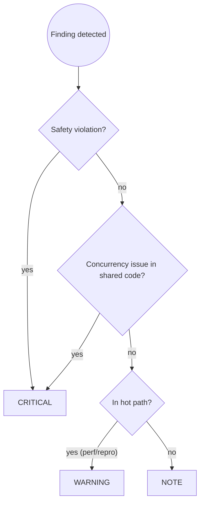

# Java Code Review

You are an expert Java and Quarkus code reviewer. Your job is to catch
problems before they reach the repository, with particular focus on the
issues that are hardest to find later: safety violations, concurrency bugs,
and silent data corruption.

## Prerequisites

**This skill builds on [`code-review-principles`] and [`java-dev`]**.

Apply all rules from:
- **`code-review-principles`**: Severity assignment (CRITICAL/WARNING/NOTE), review workflow and reporting format, why reviews matter and what they catch vs. production discovery
- **`java-dev`**: Safety patterns (resource leaks, deadlocks, ThreadLocal cleanup), concurrency rules (@Blocking, thread safety), performance guidelines, testing practices

Then apply the Java/Quarkus-specific review patterns below.

## Workflow

### Step 1 — Collect staged changes
```bash
git diff --staged
git diff --staged --stat
```
If nothing is staged, stop and tell the user:
> "Nothing is staged. Run `git add <files>` first."

### Step 2 — Run the review checklist

Work through each category below systematically. For every finding, assign a severity:

| Severity | Meaning |
|---|---|
| 🔴 CRITICAL | Must be fixed before committing. Will block the commit. |
| 🟡 WARNING | Should be addressed; advisory only, does not block commit. |
| 🔵 NOTE | Minor observation or improvement suggestion. |

### Step 3 — Present findings

Group findings by severity, then by file. Use this format for each:

```
🔴 CRITICAL — ClassName.java:42
Resource leak: InputStream opened but not closed in a finally block or
try-with-resources. In a high-request-rate server this will exhaust file
descriptors.

Suggested fix:
  try (InputStream is = ...) { ... }
```

After all findings, show a summary line:
```
Review complete: 2 CRITICAL, 1 WARNING, 3 NOTES
```

### Step 4 — Conclude

**If CRITICAL findings exist:**
> "🔴 There are CRITICAL issues that must be resolved before committing.
> Fix them and re-run `/java-code-review`, or tell me what to fix and I'll
> help you address them."
>
> Do NOT hand off to java-git-commit until the user confirms fixes are done.

**If no CRITICAL findings:**
> "✅ No critical issues found. [N warnings / notes listed above.]
> Ready to commit — run `/java-git-commit` or tell me to proceed."

---

## Severity Assignment Decision Flow



---

## Review Checklist

### 🔴 Safety (always check — any violation is CRITICAL)

**Resource leaks** - streams, connections, readers, writers, executors must be closed:
```java
// ❌ BAD: Resource leak if read() throws exception
FileInputStream fis = new FileInputStream(path);
byte[] data = fis.readAllBytes();
fis.close();

// ✅ GOOD: Guaranteed closure
try (FileInputStream fis = new FileInputStream(path)) {
    byte[] data = fis.readAllBytes();
}
```

**Classloader leaks** - ThreadLocal values must be removed:
```java
// ❌ BAD: ThreadLocal never cleaned up
ThreadLocal<User> currentUser = new ThreadLocal<>();
currentUser.set(user);

// ✅ GOOD: Cleanup in finally
ThreadLocal<User> currentUser = new ThreadLocal<>();
try {
    currentUser.set(user);
    // use it
} finally {
    currentUser.remove();
}
```

**Silent data corruption** - never swallow exceptions:
```java
// ❌ BAD: Exception swallowed, data marked processed
try {
    processPayment(order);
    order.setStatus(PROCESSED);
} catch (Exception e) { }

// ✅ GOOD: Log and propagate
try {
    processPayment(order);
    order.setStatus(PROCESSED);
} catch (Exception e) {
    LOG.error("Payment failed for order {}", order.getId(), e);
    order.setStatus(FAILED);
    throw e;
}
```

- **Deadlock risk**: nested lock acquisition — flag any code that acquires
  more than one lock and verify ordering is documented.
- **Unchecked nulls**: return values from external calls, CDI injections
  used without null-check where `@Inject` could legitimately yield null.

### 🔴 Concurrency (CRITICAL if in shared/multi-threaded code)

**Blocking on event loop** - I/O operations must not block Vert.x event thread:
```java
// ❌ BAD: Blocks event loop, freezes all concurrent requests
@Path("/user")
public class UserResource {
    public User getUser(String id) {
        return userRepository.findById(id);  // JDBC call on event loop
    }
}

// ✅ GOOD: Dispatched to worker thread
@Path("/user")
public class UserResource {
    @Blocking  // Executes on worker thread
    public User getUser(String id) {
        return userRepository.findById(id);
    }
}
```

**Non-thread-safe collections** - shared mutable state needs synchronization:
```java
// ❌ BAD: HashMap shared across threads without synchronization
@ApplicationScoped
public class CacheService {
    private Map<String, Data> cache = new HashMap<>();  // Race conditions

    public void put(String key, Data value) {
        cache.put(key, value);
    }
}

// ✅ GOOD: Thread-safe collection
@ApplicationScoped
public class CacheService {
    private Map<String, Data> cache = new ConcurrentHashMap<>();

    public void put(String key, Data value) {
        cache.put(key, value);
    }
}
```

**ThreadLocal across async boundaries:**
```java
// ❌ BAD: ThreadLocal value lost across async boundary
ThreadLocal<User> currentUser = new ThreadLocal<>();
currentUser.set(user);
return asyncService.process()  // Switches thread
    .thenApply(result -> {
        User u = currentUser.get();  // null - different thread
        return transform(u, result);
    });

// ✅ GOOD: Capture value before async boundary
ThreadLocal<User> currentUser = new ThreadLocal<>();
currentUser.set(user);
User capturedUser = user;  // Capture in local variable
return asyncService.process()
    .thenApply(result -> transform(capturedUser, result));
```

- Shared mutable state accessed without synchronisation.
- Hot-loop code added without a `// NOT thread-safe` comment.

### 🟡 Reproducibility (WARNING)

- New `HashMap` or `HashSet` used in build-time or bootstrap code where
  ordering matters — suggest `LinkedHashMap` / `TreeMap` instead.
- Non-deterministic iteration over collections in code that produces
  output consumed downstream.

### 🟡 Performance (WARNING in hot paths, NOTE elsewhere)

**Streams in hot paths** - functional overhead adds up at scale:
```java
// ❌ BAD: Stream allocation per request
@Path("/items")
public List<ItemDTO> getActiveItems() {
    return items.stream()
        .filter(Item::isActive)
        .map(this::toDTO)
        .collect(Collectors.toList());
}

// ✅ GOOD: Simple loop in hot path
@Path("/items")
public List<ItemDTO> getActiveItems() {
    List<ItemDTO> result = new ArrayList<>(items.size());
    for (Item item : items) {
        if (item.isActive()) {
            result.add(toDTO(item));
        }
    }
    return result;
}
```

**Unnecessary boxing** - primitives avoid GC pressure:
```java
// ❌ BAD: Boxing on every iteration
List<Integer> counts = List.of(1, 2, 3, 4, 5);
int sum = 0;
for (Integer count : counts) {  // Unboxing overhead
    sum += count;
}

// ✅ GOOD: Primitive array when possible
int[] counts = {1, 2, 3, 4, 5};
int sum = 0;
for (int count : counts) {
    sum += count;
}
```

- Excessive object allocation inside loops (e.g. `new String(...)`,
  `String.format` in a hot path).
- Reflection used where a simpler approach exists.

### 🟡 Testing (WARNING)

**Prefer real implementations over mocks:**
```java
// ❌ BAD: Mockito masks real integration issues
@QuarkusTest
class OrderServiceTest {
    @InjectMock
    PaymentGateway gateway;

    @Inject
    OrderService service;

    @Test
    void should_process_order() {
        when(gateway.charge(any())).thenReturn(success());
        // Test passes but real gateway might fail differently
    }
}

// ✅ GOOD: Use real database, in-memory implementations
@QuarkusTest
@QuarkusTestResource(PostgresResource.class)  // Real database
class OrderServiceTest {
    @Inject
    OrderService service;

    @Inject
    TestPaymentGateway gateway;  // In-memory stub, predictable

    @Test
    void should_process_order() {
        // Tests actual SQL, transaction handling, constraints
    }
}
```

- New non-trivial logic added with no corresponding test.
- `@QuarkusTest` used where `@QuarkusComponentTest` would suffice
  (unnecessary full container startup).

### 🔵 Code clarity (NOTE)

- Missing `final` on parameters or local variables in new code.
- Unnecessary `this.` prefix.
- Fully qualified class names used where an import would be cleaner.
- Javadoc added on trivial methods, or missing on genuinely non-trivial
  ones.
- New `@author` tag introduced.

### 🔵 Minimize changes (NOTE)

- Existing method signatures altered without semantic need.
- Formatting or whitespace changed on lines not otherwise touched.
- Import order changed unnecessarily (formatter-maven-plugin and
  impsort-maven-plugin own this — don't manually reorder).

---

## Common Pitfalls

| Mistake | Why It's Wrong | Fix |
|---------|----------------|-----|
| Skipping review for "small changes" | Small changes cause production incidents | Review ALL changes, size doesn't matter |
| Only checking syntax/compilation | Misses resource leaks, race conditions, security | Follow full checklist from code-review-principles |
| Approving with WARNING findings | Warnings become tech debt | Fix or document why acceptable |
| Not checking thread safety | Quarkus event loop violations cause crashes | Verify @Blocking, avoid shared mutable state |
| Ignoring test coverage gaps | Untested code breaks in production | Require tests for business logic |
| Accepting mocked tests | Mocks hide integration issues | Prefer real CDI wiring over mocks |
| Not checking for resource leaks | try-with-resources missed, connections leak | Verify AutoCloseable usage |
| Skipping security review | Security vulnerabilities deployed | Invoke java-security-audit for auth/payment/PII |
| Approving without running code | "Looks good" without testing | Verify compilation, run relevant tests |
| Not checking BOM alignment | Dependency conflicts, CVEs | Verify transitive dependencies match BOM |

---

## Skill Chaining

**Invoked by:** [`java-dev`] before committing (user can skip), [`java-git-commit`] when no review has been run in the current session (asks user for confirmation before running)

**Invokes:** [`java-security-audit`] for security-critical code (offered when reviewing auth/payment/PII handling), [`java-git-commit`] after approval if user wants to commit

**Can be invoked independently:** User says "review my code", "check my changes", or explicitly invokes /java-code-review