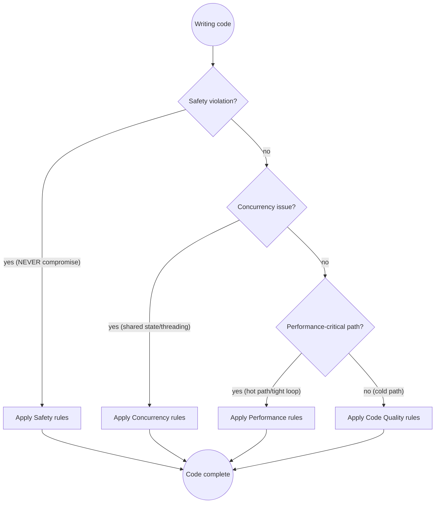

# Java Development

<!-- Attribution: Derived from and inspired by Sanne Grinovero's Java development rules.
     Refactoring section updated for dual MCP server strategy; MethodHandle guidance removed. -->

## Quick Reference

| Category | Rule | How to Apply |
|----------|------|--------------|
| **Safety** | Resource leaks | Always use try-with-resources for Closeable |
| | Deadlocks | Document lock ordering; minimize critical sections |
| | Classloader leaks | Remove ThreadLocal values in finally |
| | Silent corruption | Never swallow exceptions; log or rethrow |
| **Concurrency** | Thread model | Prefer thread-local or event-loop over shared state |
| | Vert.x integration | Never block I/O thread; use @Blocking annotation |
| | Single-threaded code | Add `// NOT thread-safe` comment |
| **Performance** | Hot paths | Avoid streams, boxing, allocations in tight loops |
| | Measuring | Profile before optimizing; don't pre-optimize cold code |
| **Testing** | Framework | JUnit 5 + AssertJ + QuarkusTest |
| | Mocking | Prefer real CDI/in-memory over Mockito |
| | Integration tests | Use real database, not mocks |
| **Code Quality** | Mutability | Mark new parameters/variables `final` unless mutated |
| | Imports | Use simple names with imports, not FQNs |
| | Documentation | Javadoc only for non-trivial methods; focus on why |
| | Changes | Minimize line changes; don't reformat untouched code |

## Rule Priority Decision Flow



**Priority order:** Safety > Concurrency > Performance > Code Quality

## Why These Rules Matter

**Resource leaks:** Unclosed HTTP connections exhausted 1024 file descriptors in 20 hours → daily pod restart. Fix: one missing try-with-resources block.

**Deadlocks:** Lock ordering violation between cache update and event publishing → service hung 3 hours at peak. Fix: document lock acquisition order, minimize critical sections.

**Classloader leaks:** ThreadLocal holding request-scoped beans blocked GC after hot redeployments → 200MB growth per deploy, OOM after 10 deploys. Fix: `ThreadLocal.remove()` in finally.

**Silent corruption:** Swallowed exception in payment handler → 1,200 transactions marked "processed" without processing, discovered 3 days later. Fix: log and rethrow.

**Blocking on event loop:** Synchronous JDBC in Vert.x handler → one 5-second query froze all endpoints. Fix: `@Blocking` annotation.

**Premature optimization:** Primitive arrays "for performance" in a startup-only config parser → off-by-one bug, 4 hours debugging. Cold paths don't need optimizing.

These are real incidents. The rules exist because the pain is real.

## Safety

Our code is deployed in mission-critical scenarios. Never compromise on:
- Resource leaks (file descriptors, memory, connections)
- Deadlocks or livelock
- Classloader leaks
- Silent data corruption

**Resource leaks:**
```java
// ❌ BAD: Stream not closed if exception thrown
FileInputStream fis = new FileInputStream(path);
byte[] data = fis.readAllBytes();
fis.close();  // Never reached if readAllBytes() throws

// ✅ GOOD: Guaranteed cleanup
try (FileInputStream fis = new FileInputStream(path)) {
    byte[] data = fis.readAllBytes();
}
```

**Classloader leaks:**
```java
// ❌ BAD: ThreadLocal never removed, holds classloader reference
ThreadLocal<RequestContext> context = new ThreadLocal<>();
context.set(new RequestContext());
// ... use it ...
// Classloader can't be GC'd after hot reload

// ✅ GOOD: Explicit cleanup
ThreadLocal<RequestContext> context = new ThreadLocal<>();
try {
    context.set(new RequestContext());
    // ... use it ...
} finally {
    context.remove();  // Releases classloader reference
}
```

**Silent data corruption:**
```java
// ❌ BAD: Exception swallowed, order marked complete incorrectly
try {
    processPayment(order);
    order.setStatus(COMPLETE);
} catch (Exception e) { }  // Payment failed but order shows complete

// ✅ GOOD: Log and propagate
try {
    processPayment(order);
    order.setStatus(COMPLETE);
} catch (Exception e) {
    LOG.error("Payment failed for order {}", order.getId(), e);
    order.setStatus(FAILED);
    throw e;
}
```

When a violation of these rules is detected in existing code, output a
**CRITICAL SAFETY WARNING** block with:
- The specific risk (e.g. "potential deadlock between locks A and B")
- The technical context (code path, thread model)
- Actionable fix suggestions

Emit runtime warnings in code when assumption violations can be detected at
runtime. Warning messages must be actionable, not generic.

## Reproducibility

Prefer deterministic behaviour. In non-performance-critical code (build tools,
bootstrap, configuration), prefer sorted structures over hash-based ones to
avoid ordering non-determinism.

In performance-critical runtime paths, efficiency takes precedence over
reproducibility — but document the tradeoff explicitly.

Security requirements (e.g. salted data structures) always take precedence.
Document the reason when security or correctness drives a structural decision.

**When to ask**: if it's unclear whether code is build-time or runtime-critical,
ask before proceeding.

## Concurrency

Most of our state is confined to a single thread. Prefer thread-local storage
or event-loop patterns over shared-state concurrency. This aligns with
Quarkus's Vert.x event-loop model — avoid blocking the I/O thread.

**Single-threaded code:**
```java
// ❌ BAD: No indication of thread model
public class EventProcessor {
    private List<Event> buffer = new ArrayList<>();  // Is this shared?

    public void add(Event e) {
        buffer.add(e);
    }
}

// ✅ GOOD: Explicit thread model
public class EventProcessor {
    // NOT thread-safe — designed for single-threaded use only
    private List<Event> buffer = new ArrayList<>();

    public void add(Event e) {
        buffer.add(e);
    }
}
```

**Blocking on event loop:**
```java
// ❌ BAD: JDBC call blocks event loop thread
@Path("/orders")
public class OrderResource {
    public Order create(OrderRequest req) {
        return orderRepo.persist(req);  // Blocks I/O thread
    }
}

// ✅ GOOD: Dispatched to worker thread
@Path("/orders")
public class OrderResource {
    @Blocking  // Runs on worker thread
    public Order create(OrderRequest req) {
        return orderRepo.persist(req);
    }
}
```

Always establish whether code is single- or multi-threaded before writing it.
Minimize critical sections. When they are unavoidable: document the lock
ordering, the invariants being protected, and any tradeoffs made.

## Performance

This codebase targets cloud-hosted Quarkus services where efficiency matters
at scale. Be mindful of allocations and GC pressure.

**Hot path optimization:**
```java
// ❌ BAD: Stream overhead in per-request path
@Path("/items")
public List<String> getActive() {
    return items.stream()
        .filter(Item::isActive)
        .map(Item::getName)
        .collect(Collectors.toList());
}

// ✅ GOOD: Simple loop for hot path
@Path("/items")
public List<String> getActive() {
    List<String> result = new ArrayList<>(items.size());
    for (Item item : items) {
        if (item.isActive()) {
            result.add(item.getName());
        }
    }
    return result;
}
```

**Avoid unnecessary boxing:**
```java
// ❌ BAD: Boxing creates GC pressure
List<Integer> counts = getCounts();
int sum = 0;
for (Integer count : counts) {  // Boxing/unboxing
    sum += count;
}

// ✅ GOOD: Primitives when possible
int[] counts = getCounts();
int sum = 0;
for (int count : counts) {
    sum += count;
}
```

- For hot paths, measure before optimizing — don't pre-optimize cold code

**What counts as performance-critical**: tight loops, per-request processing,
and any code path called at high frequency. Config parsing, startup code, and
build-time logic are generally not critical — use idiomatic Java there.

## Code duplication

Before writing new helpers or utilities, check for existing code that can be
reused. Prefer extension or composition over duplication.

## Code clarity

- Mark parameters and variables `final` in new code unless mutability is required
- Omit `this.` prefix unless required for disambiguation (e.g. constructor
  field assignments)
- Use simple class names with imports rather than fully qualified names, unless
  two classes share the same simple name in the same file
- **Never use String literals for class names or package names.** If the class
  or any class from the package exists on the classpath, derive the name from
  a `.class` reference — never hardcode it as a String. Strings are only
  acceptable when the target does not exist on the classpath (dynamic loading,
  external plugins, or framework APIs that only accept `String` with no
  class-based alternative).

```java
// ❌ BAD: string literals — silently break on rename/move/repackage
Logger log = Logger.getLogger("com.example.OrderService");
objectMapper.addMixIn(Order.class, "com.example.OrderMixin");
Class<?> clazz = Class.forName("com.example.OrderService");
reflections = new Reflections("com.example.service");

// ✅ GOOD: derived from .class — rename-safe, compile-time verified
Logger log = Logger.getLogger(OrderService.class.getName());
objectMapper.addMixIn(Order.class, OrderMixin.class);
Class<?> clazz = OrderService.class;
reflections = new Reflections(OrderService.class.getPackageName());

// ✅ GOOD: frameworks with class-based alternatives
@ComponentScan(basePackageClasses = OrderService.class)  // not basePackages = "com.example"

// ✅ ACCEPTABLE: class does not exist on the classpath (optional plugin)
Class<?> clazz = Class.forName("com.thirdparty.OptionalExtension");
```

- **Always use text blocks for multi-line strings.** Any string literal that spans
  more than one line must use Java text block syntax (`"""`). Never use string
  concatenation or `\n` escapes to build multi-line strings.

```java
// ❌ BAD: concatenation and escape sequences
String query = "SELECT id, name\n" +
               "FROM users\n" +
               "WHERE active = true";

// ✅ GOOD: text block
String query = """
        SELECT id, name
        FROM users
        WHERE active = true
        """;
```

## Testing

Preferred stack:
- **JUnit 5** — the standard test runner
- **AssertJ** — for fluent, readable assertions (used directly in quarkus-flow)
- **MockServer / MockWebServer** — for HTTP-level mocking of external services;
  prefer these over Mockito for integration scenarios involving HTTP dependencies
- **`@QuarkusTest`** — starts the full CDI container; use for any test that
  needs injection, lifecycle, or framework behaviour
- **`@QuarkusIntegrationTest`** — black-box testing against a built jar or
  native image; use for end-to-end validation
- **`@QuarkusComponentTest`** — lightweight CDI component testing without
  starting the full application; prefer over `@QuarkusTest` when testing a
  single bean in isolation

Prefer real CDI wiring in tests over mocking. Reach for Mockito only when
a dependency genuinely cannot be substituted with a real or in-memory
implementation.

Strive for a fully automated integration test. If impractical, discuss with
the user before skipping it.

Add unit tests for classes with complex logic or data transformations. Skip
unit tests when they only duplicate integration test coverage and create
excessive coupling.

### ⛔ Bug Fix Workflow — Mandatory

When investigating a bug:

1. **Write a failing test first.** Before touching the fix, write a test that
   reproduces the problem. Run it and confirm it fails for the right reason.
2. **Apply the fix.** Only after seeing the test fail.
3. **Verify the test passes.** Run the test again. It must go green.
4. **Verify no regressions.** Run the full test suite.
5. **Report back to the user only after step 4 passes.** Never claim a fix is
   complete until the tests confirm it.

A test written after the fix can pass for the wrong reasons. The failing test
is the evidence that the fix addresses the actual bug, not a coincidental
symptom.

## Documentation

Add Javadoc and comments only on non-trivial methods. Keep them brief.
Focus on *why* and *tradeoffs*, not *what* (the code shows what).

Choose class names carefully. When in doubt, propose 2–3 options before
proceeding.

Do not add `@author` tags unless explicitly requested.

## Minimize changes

Keep modified lines to a minimum to reduce conflicts and ease review:
- Do not alter existing method signatures unless semantically necessary
- Do not reformat lines that don't need changing — respect existing conventions
- Do not add `final` to existing method signatures (new code only)
- Do not change whitespace or imports in lines you're not otherwise touching

## Refactoring

Use a **three-tier tool strategy**, prioritized in this order:

**Tier 1 — intellij-index MCP (always prefer for semantic operations)**

When available, always use the `intellij-index` MCP server first — it provides
a rich semantic index with accurate cross-project references, type hierarchies,
and safe refactoring tools that text-based tools cannot match:

| Tool | Use For |
|------|---------|
| `ide_find_references` | Understand impact before any rename or move |
| `ide_find_definition` | Navigate to symbol definitions |
| `ide_refactor_rename` | Safe symbol rename across the entire project |
| `ide_move_file` | Safe file/class relocation |
| `ide_type_hierarchy` | Explore class/interface hierarchies |
| `ide_find_implementations` | Find all implementations of an interface |

**Before any rename or move:** always run `ide_find_references` first to
understand the full scope of impact.

**Tier 2 — Official JetBrains MCP (fallback)**

Fall back to the official `jetbrains` MCP tools only when `intellij-index`
doesn't provide the specific operation you need. It offers basic IDE integration
but lacks the semantic depth of the index server.

**Tier 3 — Native tools (routine operations)**

Use native tools (Read, Edit, Grep, Glob) for all routine file operations —
reading, searching, and targeted text edits. These are always appropriate for
non-semantic operations regardless of MCP availability.

If no MCP server is available when a semantic operation (rename, find
references, move) is needed:
1. Inform the user
2. Ask: continue with text-based tools (with risk of missed references), or
   start IntelliJ first?
3. If continuing without MCP: use `git diff` to validate scope, make changes
   conservatively, and run the build/tests after each logical step

## Common Pitfalls — These Thoughts Mean STOP

If you catch yourself thinking any of these, **STOP** and apply the correct approach:

| Rationalization | Problem | Impact | Fix |
|-----------------|---------|--------|-----|
| "Resource will close automatically" | Missing try-with-resources | FD exhaustion after 20hrs | Wrap in try-with-resources |
| "This is single-threaded, no sync needed" | Undocumented thread model | Future bugs when threading added | Add `// NOT thread-safe` comment |
| "I'll add the test after I finish this" | No test coverage | Gaps never get filled (spoiler: they never do) | Add integration test now |
| "This is performance-critical, streams are too slow" | Premature optimization | Bugs from complex code | Measure first with profiler |
| "Just this once I'll catch and ignore the exception" | Swallowed exception | Silent failures, lost data | Log exception or rethrow |
| "I know this blocks, but it's quick" | Blocking event loop | Cascading 503 errors | Use @Blocking annotation |
| "ThreadLocal cleanup isn't critical here" | Classloader leak | OOM after 10 deployments | Remove in finally block |
| "The lock order doesn't matter for this simple case" | Undocumented lock order | Deadlock when code grows | Document ordering now |
| "This allocation is trivial" | Boxing in hot loop | GC pressure, latency spikes | Use primitive types |
| "I'll use HashMap, order doesn't matter" | Non-deterministic ordering | Build flakiness | Use LinkedHashMap/TreeMap |
| "Mockito is faster than a real test database" | Mocked database | Mock/prod drift, broken prod (tests pass, prod burns) | Use @QuarkusTest + real DB |
| "Let me refactor this code I haven't read yet" | Refactoring unknown code | Breaking working functionality | Read and understand first |
| "I'll just use the class/package name as a String" | String class or package reference | Silently breaks on rename/move/repackage; not type-safe | Use `MyClass.class`, `.getName()`, or `.getPackageName()` |

## Prerequisites

**This skill builds on `testing-principles`.** Apply all rules from:
- **testing-principles**: test taxonomy (unit/integration/E2E), happy path / correctness / robustness coverage, coverage analysis checklist, high-value prioritization

## Skill Chaining

- **Before committing:** invoke `java-code-review` to catch safety, concurrency, and performance issues
- **After implementing or refactoring:** if the user wants to commit, invoke
  `java-git-commit`, which will also sync DESIGN.md via `java-update-design`
- **For architectural decisions:** suggest running `adr` to document significant decisions
- **For logging/observability setup:** invoke `quarkus-observability` when implementing structured logging, tracing, or metrics
- **For security-critical code:** invoke `java-security-audit` when handling authentication, authorization, payment, or PII
- **If architectural impact without commit:** suggest running `java-update-design` independently