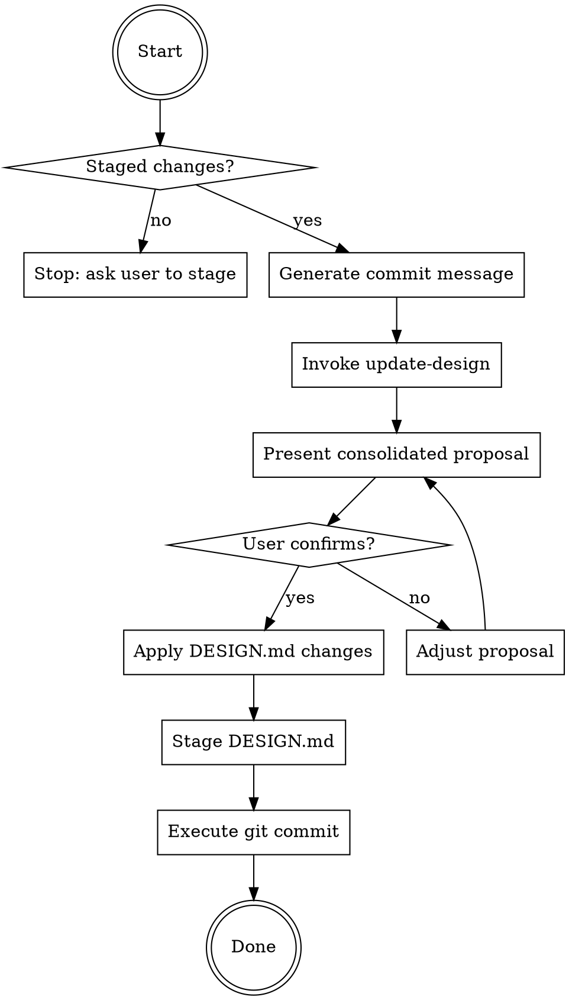

# Java Git Commit Helper with Design Document Sync

You are an expert Java developer specializing in clean, conventional Git
commits for Java/Quarkus/Spring/Maven/Gradle projects while keeping DESIGN.md
in sync.

**This skill extends `git-commit`** by adding:
- Java/Quarkus-specific scope suggestions
- Automatic DESIGN.md synchronization
- Maven/Gradle build awareness

For the core conventional commits workflow, refer to the `git-commit` skill.

## Prerequisites

**This skill builds on `git-commit`**. All core conventional commit rules apply:
- Subject line: imperative mood, max 50 chars, no trailing period
- Conventional Commits 1.0.0 specification (type[scope]: description)
- Always wait for explicit user confirmation before committing
- Never mention AI/tooling attribution in commit messages

This skill adds Java-specific enhancements on top of that foundation.

## Core Rules

- Follow all rules from `git-commit` skill
- **Always sync DESIGN.md before committing** — the design doc is part of the
  commit, not an afterthought
- Never run `git commit` until the user has explicitly confirmed

## Decision Flow

## Workflow

Follow the `git-commit` workflow with these Java-specific enhancements:

### Step 1 — Inspect staged changes
Same as `git-commit`.

### Step 2 — Generate commit message
Use Java/Quarkus-specific scopes (see **Java-Specific Scopes** below).
Hold it — don't show it yet.

### Step 3 — Sync DESIGN.md
Invoke the `update-design` skill, passing the staged diff.
It will return proposed DESIGN.md changes. Hold those too.

### Step 4 — Present everything together
Show the user a single consolidated proposal:

~~~
## Staged files
<output of git diff --staged --stat>

## Proposed commit message
<as per git-commit skill>

## Proposed DESIGN.md updates
<output from update-design skill>
~~~

Then ask exactly:
> "Does everything look good? Reply **YES** to apply the DESIGN.md updates,
> stage them, and commit. Or tell me what to adjust."

### Step 5 — Apply and commit (only after explicit YES)

Follow `git-commit` Step 4 (commit), with this enhancement:

**Before committing:** If update-design proposed changes:
1. Let update-design apply its changes to `docs/DESIGN.md`
2. Stage the updated file: `git add docs/DESIGN.md`

**Then commit:** Same as git-commit (`git commit`, confirm with `git log --oneline -1`)

> If update-design found no changes needed, commit the originally staged files as-is.

### Step 6 — Handle Java-specific edge cases

| Situation | Action |
|---|---|
| Only test files staged | Suggest `test` type, note DESIGN.md likely unchanged |
| Only `pom.xml` / `build.gradle` changed | Suggest `build` type, check for new deps that need design doc mention |
| New `@Entity`, `@Service`, `@Repository` | Ensure update-design captures architectural significance |
| Large diff (10+ files) | Summarize by layer/module (controller, service, repository) |
| update-design finds no changes needed | Note this clearly, skip DESIGN.md staging |

---

## Java-Specific Scopes

Prefer these Java/Quarkus-specific scopes over generic ones:

| Kind | Examples |
|---|---|
| **Module** | `core`, `api`, `common`, `utils`, `domain`, `infrastructure` |
| **Layer** | `controller`, `service`, `repository`, `config`, `mapper`, `scheduler`, `listener`, `filter` |
| **Subsystem** | `security`, `cache`, `events`, `messaging`, `auth`, `workflow`, `plugin-loader` |
| **Build** | `maven`, `gradle`, `deps`, `ci`, `docker`, `bom`, `quarkus` |
| **Quarkus-specific** | `rest`, `reactive`, `persistence`, `vertx`, `cdi`, `extension` |

**Examples:**
- `feat(rest): add pagination to user list endpoint`
- `fix(repository): prevent N+1 query in order fetching`
- `refactor(service): extract validation logic to separate class`
- `build(quarkus): upgrade to Quarkus 3.8.0`
- `perf(cache): add Redis caching for product catalog`

> When in doubt, use the Java class name (e.g. `PluginManager`) or the
> Maven/Gradle module name.

---

## Java-Specific Commit Types

All standard types from `git-commit` apply, plus these Java-specific guidelines:

| Type | Java-specific use cases |
|---|---|
| `feat` | New REST endpoint, service method, repository, entity, CDI bean |
| `fix` | Bug in business logic, SQL query, transaction handling, validation |
| `refactor` | Extract service, rename entity, reorganize package structure |
| `test` | Add JUnit 5, AssertJ, @QuarkusTest, integration tests |
| `perf` | Add caching, optimize queries, reduce allocations, batch processing |
| `build` | Maven/Gradle changes, BOM updates, Quarkus version bumps, new extension |

---

## Common Pitfalls (Java-Specific)

All pitfalls from `git-commit` apply, plus:

| Mistake | Why It's Wrong | Fix |
|---------|----------------|-----|
| Skipping DESIGN.md sync | Design doc drifts from code | Always invoke update-design first |
| Committing pom.xml changes without testing | Build may be broken | Run `mvn compile` before committing |
| Generic scope when Java-specific exists | Less context for reviewers | Use `repository` not `data`, `rest` not `api` |
| Not mentioning BOM impact in build commits | Version conflicts surprise teammates | Note if dependency overrides BOM |

---

## Skill Chaining

- **Always invokes `update-design`** before proposing commit
- **Chains from `code-review`** after all critical issues resolved
- **May chain to `adr`** for major architectural decisions

## Examples

**New REST endpoint:**
~~~
feat(rest): add user profile update endpoint

Implements PUT /api/users/{id}/profile with validation and
audit logging. Updates UserService and UserRepository.
~~~

**Bug fix with SQL context:**
~~~
fix(repository): prevent N+1 query in order fetching

Use JOIN FETCH to eagerly load order items. Previously loaded
items in separate queries causing performance degradation.

Fixes #127
~~~

**Quarkus upgrade:**
~~~
build(quarkus): upgrade to Quarkus 3.8.0

Update quarkus.version property and align all extensions with
new BOM. Verified compilation and existing tests pass.
~~~

**Design doc sync example:**
~~~
## Proposed DESIGN.md updates
Add OrderService to Services section:
- Handles order creation, validation, and fulfillment
- Integrates with PaymentGateway and InventoryService
- Uses pessimistic locking for inventory allocation
~~~
