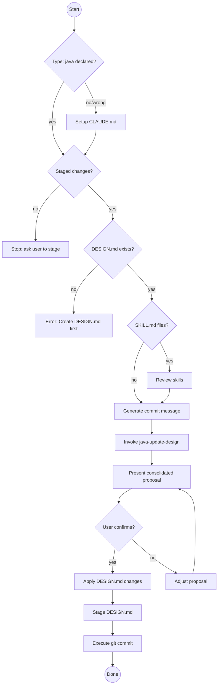

# Java Git Commit Helper with Design Document Sync

You are an expert Java developer specializing in clean, conventional Git
commits for Java/Quarkus/Spring/Maven/Gradle projects while keeping DESIGN.md
in sync.

**This skill extends `git-commit`** by adding:
- Java/Quarkus-specific scope suggestions
- Automatic DESIGN.md synchronization
- Maven/Gradle build awareness

For the core conventional commits workflow, refer to the `git-commit` skill.

## Prerequisites

**This skill builds on [`git-commit`]**.

Apply all rules from:
- **`git-commit`**: Subject line format (imperative mood, max 50 chars), Conventional Commits 1.0.0 specification, always wait for explicit user confirmation before committing, never add attribution unless user explicitly requests it

Then apply the Java/Quarkus-specific commit patterns below.

## Core Rules

- Follow all rules from `git-commit` skill
- **Always sync DESIGN.md before committing** — the design doc is part of the
  commit, not an afterthought
- Never run `git commit` until the user has explicitly confirmed

## Commit Decision Flow



## Workflow

Follow the `git-commit` workflow with these Java-specific enhancements:

### Step 0 — Verify Project Type Declaration

**Read CLAUDE.md for project type:**
```bash
cat CLAUDE.md 2>/dev/null | grep -A 2 "## Project Type"
```

**If CLAUDE.md missing:**
Offer to create it:
> This skill requires CLAUDE.md to declare the project type.
>
> I can create it for you. This is a Java project, so I'll set it up
> with type: java.
>
> Proceed? (YES/no)

If YES:
Create CLAUDE.md:
```markdown
## Project Type

**Type:** java
```

Stage it:
```bash
git add CLAUDE.md
```

Tell user:
> ✅ Created CLAUDE.md with type: java
>
> Note: I've staged CLAUDE.md - it will be included in this commit.
>
> Proceeding with Java commit workflow...

Continue to Step 1.

**If CLAUDE.md exists but no Project Type section:**
Offer to add it:
> I notice CLAUDE.md exists but doesn't declare a project type.
>
> I'll add the Project Type section for a Java project. Proceed? (YES/no)

If YES:
Update CLAUDE.md (prepend after header):
```markdown
## Project Type

**Type:** java

[existing content...]
```

Stage and continue to Step 1.

**If CLAUDE.md declares different type:**
Show mismatch error:
> ⚠️  Project type mismatch detected.
>
> CLAUDE.md declares: type: {detected_type}
> You invoked: java-git-commit (expects type: java)
>
> Options:
> 1. Update CLAUDE.md to type: java (if this is correct)
> 2. Use the correct commit skill for type: {detected_type}
>
> Which option? (1/2)

Handle based on response.
If 1: Update CLAUDE.md, stage, continue.
If 2: Stop and tell user which skill to use.

**If CLAUDE.md correctly declares type: java:**
Continue to Step 1.

---

### Step 1 — Inspect staged changes and verify DESIGN.md

First, same as `git-commit`:
```bash
git diff --staged --stat
git diff --staged
```

If nothing is staged, stop and tell the user:
> "Nothing is staged. Run `git add <files>` first, or tell me which files
> to stage."

**Then check for DESIGN.md:**
```bash
ls docs/DESIGN.md 2>/dev/null
```

If DESIGN.md doesn't exist, stop and tell the user:
> "❌ **Java projects require DESIGN.md for architectural documentation.**
>
> This file should live at `docs/DESIGN.md`. I can help you create it.
>
> Would you like me to invoke `java-update-design` to generate a starter DESIGN.md,
> or would you prefer to create it manually first?"

Do not proceed with the commit until DESIGN.md exists.

### Step 2 — Generate commit message

Analyze the staged changes and draft a commit message using Java/Quarkus-specific scopes (see **Java-Specific Scopes** below).

Hold it — don't show it yet.

### Step 3 — Sync documentation

**Always invoke both:**
1. Invoke `java-update-design` skill, passing the staged diff
   - Returns proposed DESIGN.md changes (if docs/DESIGN.md exists)
2. Invoke `update-claude-md` skill, passing the staged diff
   - Returns proposed CLAUDE.md changes (if CLAUDE.md exists)

Hold all proposals.

### Step 4 — Present everything together
Show the user a single consolidated proposal:

```
## Staged files
<output of git diff --staged --stat>

## Proposed commit message
<as per git-commit skill>

## Proposed DESIGN.md updates
<output from java-update-design skill, if any>

## Proposed CLAUDE.md updates
<output from update-claude-md skill, if any>
```

Then ask exactly:
> "Does everything look good? Reply **YES** to apply the documentation updates,
> stage them, and commit. Or tell me what to adjust."

### Step 5 — Apply and commit (only after explicit YES)

Follow `git-commit` Step 4 (commit), with this enhancement:

**Before committing:** Apply any proposed documentation changes:
1. If java-update-design proposed DESIGN.md changes:
   - Let java-update-design apply its changes to `docs/DESIGN.md`
   - Stage the updated file: `git add docs/DESIGN.md`
2. If update-claude-md proposed CLAUDE.md changes:
   - Let update-claude-md apply its changes to `CLAUDE.md`
   - Stage the updated file: `git add CLAUDE.md`

**Then commit:** Same as git-commit (`git commit`, confirm with `git log --oneline -1`)

> If neither skill found changes needed, commit the originally staged files as-is.

### Step 6 — Handle Java-specific edge cases

| Situation | Action |
|---|---|
| DESIGN.md missing | STOP — offer to create it via java-update-design or manually |
| Only test files staged | Suggest `test` type, note DESIGN.md likely unchanged |
| Only `pom.xml` / `build.gradle` changed | Suggest `build` type, check for new deps that need design doc mention |
| New `@Entity`, `@Service`, `@Repository` | Ensure java-update-design captures architectural significance |
| Large diff (10+ files) | Summarize by layer/module (controller, service, repository) |
| java-update-design finds no changes needed | Note this clearly, skip DESIGN.md staging |

---

## Java-Specific Scopes

Prefer these Java/Quarkus-specific scopes over generic ones:

| Kind | Examples |
|---|---|
| **Module** | `core`, `api`, `common`, `utils`, `domain`, `infrastructure` |
| **Layer** | `controller`, `service`, `repository`, `config`, `mapper`, `scheduler`, `listener`, `filter` |
| **Subsystem** | `security`, `cache`, `events`, `messaging`, `auth`, `workflow`, `plugin-loader` |
| **Build** | `maven`, `gradle`, `deps`, `ci`, `docker`, `bom`, `quarkus` |
| **Quarkus-specific** | `rest`, `reactive`, `persistence`, `vertx`, `cdi`, `extension` |

**Examples:**
- `feat(rest): add pagination to user list endpoint`
- `fix(repository): prevent N+1 query in order fetching`
- `refactor(service): extract validation logic to separate class`
- `build(quarkus): upgrade to Quarkus 3.8.0`
- `perf(cache): add Redis caching for product catalog`

> When in doubt, use the Java class name (e.g. `PluginManager`) or the
> Maven/Gradle module name.

---

## Java-Specific Commit Types

All standard types from `git-commit` apply, plus these Java-specific guidelines:

| Type | Java-specific use cases |
|---|---|
| `feat` | New REST endpoint, service method, repository, entity, CDI bean |
| `fix` | Bug in business logic, SQL query, transaction handling, validation |
| `refactor` | Extract service, rename entity, reorganize package structure |
| `test` | Add JUnit 5, AssertJ, @QuarkusTest, integration tests |
| `perf` | Add caching, optimize queries, reduce allocations, batch processing |
| `build` | Maven/Gradle changes, BOM updates, Quarkus version bumps, new extension |

---

## Common Pitfalls (Java-Specific)

All pitfalls from `git-commit` apply, plus:

| Mistake | Why It's Wrong | Fix |
|---------|----------------|-----|
| Committing without DESIGN.md | Java projects need architectural docs | Check for docs/DESIGN.md first, create if missing |
| Skipping DESIGN.md sync | Design doc drifts from code | Always invoke java-update-design first |
| Committing pom.xml changes without testing | Build may be broken | Run `mvn compile` before committing |
| Generic scope when Java-specific exists | Less context for reviewers | Use `repository` not `data`, `rest` not `api` |
| Not mentioning BOM impact in build commits | Version conflicts surprise teammates | Note if dependency overrides BOM |

---

## Skill Chaining

**Invoked by:** [`java-code-review`] after all critical issues resolved; [`quarkus-flow-dev`] and [`quarkus-flow-testing`] when ready to commit workflow work; [`quarkus-observability`] after observability configuration; [`maven-dependency-update`] after successful dependency updates; [`adr`] when committing an ADR alongside related changes

**Invokes:** [`java-update-design`] and [`update-claude-md`] before proposing commit (automatic)

**Can be invoked independently:** User says "commit", "smart commit", or explicitly invokes /java-git-commit in Java repositories

## Success Criteria

Commit is complete when:

- ✅ All files staged (or user confirmed which files to stage)
- ✅ Commit message generated with Java-specific scope
- ✅ DESIGN.md updates proposed (if docs/DESIGN.md exists)
- ✅ CLAUDE.md updates proposed (if CLAUDE.md exists)
- ✅ User confirmed with explicit **YES**
- ✅ Documentation changes applied and staged
- ✅ Commit executed successfully
- ✅ `git log --oneline -1` confirms commit exists

**Not complete until** all criteria met, documentation synced, and commit confirmed in git log.

---

## Examples

**New REST endpoint:**
```
feat(rest): add user profile update endpoint

Implements PUT /api/users/{id}/profile with validation and
audit logging. Updates UserService and UserRepository.
```

**Bug fix with SQL context:**
```
fix(repository): prevent N+1 query in order fetching

Use JOIN FETCH to eagerly load order items. Previously loaded
items in separate queries causing performance degradation.

Fixes #127
```

**Quarkus upgrade:**
```
build(quarkus): upgrade to Quarkus 3.8.0

Update quarkus.version property and align all extensions with
new BOM. Verified compilation and existing tests pass.
```

**Design doc sync example:**
```
## Proposed DESIGN.md updates
Add OrderService to Services section:
- Handles order creation, validation, and fulfillment
- Integrates with PaymentGateway and InventoryService
- Uses pessimistic locking for inventory allocation
```
