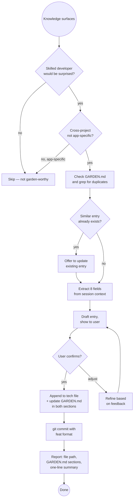

# Knowledge Garden

A cross-project, machine-wide library of hard-won technical gotchas — bugs
that silently fail, behaviours that contradict documentation, and workarounds
that took hours to find. Stored at `~/claude/knowledge-garden/` so any Claude
instance on this machine can read and contribute to it, across projects and
sessions.

**The bar:** Would a skilled developer, familiar with the technology, still
have spent significant time on this? If yes, it belongs in the garden.

---

## What This Is Not

- **Not an idea log** — ideas that may be acted on later go in `idea-log`
- **Not an ADR** — architecture decisions go in `adr`
- **Not how-to content** — tutorials and explanations don't belong here
- **Not project-specific** — if the entry says "in ProjectX, the foo() method..." it doesn't belong; if it says "JavaParser's getByName() only searches top-level types..." any JavaParser user benefits and it does
- **Not expected errors** — if it's in the docs with the fix, skip it
- **Not transient issues** — network flakes, temporary rate limits, one-off environment states

---

## Garden Location

```
~/claude/knowledge-garden/          ← cross-project git repo
├── GARDEN.md                       ← dual index (loaded into context)
├── macos-native-appkit/
│   └── appkit-panama-ffm.md
├── java-panama-ffm/
│   └── native-image-patterns.md
├── graalvm-native-image/
├── quarkus/
└── <tech-category>/
    └── <topic>.md
```

`GARDEN.md` is the index — one line per entry, enough to know if it's
relevant. It is dual-indexed: by technology AND by symptom type, so
entries can be found either by what you're working on or by what you're
experiencing.

---

## GARDEN.md Format (maintain this structure)

```markdown
# Knowledge Garden
Cross-project library of non-obvious bugs, gotchas, and unexpected behaviours.
Entries live in ~/claude/knowledge-garden/<category>/<file>.md

## By Technology

### macOS / AppKit
- [Title](macos-native-appkit/file.md#anchor) — one-line symptom

### Java / Panama FFM
- [Title](java-panama-ffm/file.md#anchor) — one-line symptom

## By Symptom Type

### Silent failures (no error, nothing happens)
- [Title](path/file.md#anchor) — technology: one-line symptom

### Contradicts documentation
- [Title](path/file.md#anchor) — technology: one-line symptom

### Works in one context, fails in another
- [Title](path/file.md#anchor) — e.g. JVM vs native image

### Symptom misleads about cause
- [Title](path/file.md#anchor) — technology: what you see vs what's wrong

### Multiple failed approaches before fix
- [Title](path/file.md#anchor) — technology: one-line

### Environment / configuration surprises
- [Title](path/file.md#anchor) — technology: one-line

## Tag Index
`#silent-failure` `#contradicts-docs` `#context-specific` `#symptom-misleads`
`#multi-attempt` `#version-specific` `#env-config`
```

---

## Entry Format

```markdown
---

## [Short imperative title — describes the weird thing, not the fix]

**Stack:** Technology, Library, Version (be specific)
**Symptom:** What you observe — especially the misleading part. Quote exact
error messages. "No error" is important context.
**Context:** When/where this applies. What setup triggers it.

### What was tried (didn't work)
- tried X — result
- tried Y — result
(If only one thing was tried before the fix, reconsider whether this is
garden-worthy — one attempt means it may not have been that non-obvious.)

### Root cause
Why it happens. The underlying mechanism — WHY, not just WHAT.

### Fix
Code block or config. Be complete. Include what NOT to do alongside
what works. "Use X instead" with no code is insufficient.

### Why this is non-obvious
The insight. What makes this a gotcha rather than just a bug? Why would
a skilled developer be misled?
```

---

## Quality Filter

Before adding any entry, apply these tests:

**The surprise test:** Would a skilled developer, familiar with this
technology, still have spent significant time on this? If no → skip.

**The project test:** Does the entry say "in [ProjectName], the foo()
method..."? If yes → it's project-specific, skip.

**The doc test:** Is this clearly documented with the fix in the official
docs? If yes → skip. (Underdocumented workarounds are fine.)

**Anti-patterns that disqualify an entry:**
- Title describes the fix: "Use getCharContent() for source reading" ❌
  vs "getCharContent(true) required — new File(URI) fails silently for
  in-memory sources" ✅
- Root cause says WHAT happened but not WHY it happens
- Fix has no code — just "use X instead"
- "What was tried" has only one item (reconsider the garden-worthiness)
- Entry is really just documentation of expected behaviour

---

## Workflows

### CAPTURE (adding an entry)

#### Step 1 — Apply the quality and project filter
Is this non-obvious enough? Is it cross-project? See Quality Filter above.
If uncertain: "Worth adding to the knowledge garden? Would go under [category]
as '[short title]'." — confirm before proceeding.

#### Step 2 — Extract the 8 fields from conversation context
Don't ask the user for each field one by one — extract from what's known.
Only ask if genuinely unclear:

| Field | Extract from |
|-------|-------------|
| Title | The surprising thing itself |
| Stack | Tools, libraries, versions mentioned |
| Symptom | What the user observed / error messages |
| Context | When it occurs |
| What was tried | Failed approaches in the session |
| Root cause | The diagnosis reached |
| Fix | The working solution with code |
| Why non-obvious | Why the obvious approach failed |

#### Step 3 — Determine the file

Map the technology to the correct directory and file:

| Technology | Directory | File |
|-----------|-----------|------|
| AppKit, WKWebView, NSTextField, NSWindow, GCD | `macos-native-appkit/` | `appkit-panama-ffm.md` or new file |
| Panama FFM, jextract, upcalls, downcalls | `java-panama-ffm/` | `native-image-patterns.md` or new file |
| GraalVM native image, reflect-config, reachability-metadata | `graalvm-native-image/` | new or existing |
| Quarkus | `quarkus/` | `quarkus-native.md` or new file |
| macOS PATH, SDKMAN, brew, version managers | `macos-native-appkit/` or new `macos/` | new file |
| Git, tmux, Docker, CLI tools | `tools/` | `<tool>.md` |
| Doesn't fit existing | Create `<descriptive-kebab-name>/` | new file |

If no existing file fits, create a new one with a descriptive kebab-case name.

#### Step 4 — Check for duplicates
```bash
grep -r "keywords from this issue" ~/claude/knowledge-garden/
```
If a related entry exists, offer to update it rather than duplicate.

#### Step 5 — Format and append

Draft the entry using the format above. Show it to the user:
> "Does this capture it accurately?"

On approval, append to the target file. The `---` separator is required.

#### Step 6 — Update GARDEN.md
Add one-line entries in TWO places:
1. Under the appropriate **By Technology** section
2. Under the appropriate **By Symptom Type** section (choose the most accurate)

New entries go at the top of each section (newest first).

Also add any new tags to the Tag Index if they don't already appear.

#### Step 7 — Commit
```bash
cd ~/claude/knowledge-garden
git add .
git commit -m "feat(<directory>): add '<short title of the weird thing>'"
```

Examples:
- `feat(macos-native-appkit): add 'GCD main queue blocks silently never execute'`
- `feat(java-panama-ffm): add 'Arena.ofAuto() throws on close()'`

#### Step 8 — Report back
Tell the user:
- File path where it was added
- Which two GARDEN.md sections were updated
- One-sentence summary of what was captured

---

### SEARCH (retrieving entries)

1. Read `GARDEN.md` — check both By Technology and By Symptom Type sections
2. Follow the file link to the relevant entry for full detail
3. If the topic doesn't appear in the index:
   ```bash
   grep -r "keywords" ~/claude/knowledge-garden/
   ```
4. Return the full entry (Symptom + Root Cause + Fix + Why Non-obvious)
5. If the user just fixed something related, offer to capture the new knowledge

---

### IMPORT (from project-level docs)

When importing from a `BUGS-AND-ODDITIES.md` or similar file:

1. Read the source document
2. For each entry, classify:
   - **CROSS-PROJECT** — technology quirk; any user of that tool could hit it
   - **PROJECT-LOCAL** — specific to this codebase's logic or configuration
3. Show the classification list, ask for confirmation or overrides before importing
4. For cross-project entries: capture each to the garden (Steps 1–8 above)
5. For project-local entries: skip, note why
6. Report: "Imported N entries, skipped M (project-specific)"

---

## Proactive Trigger

The reactive trigger ("add this to the garden") is easy. The proactive
trigger is what makes this skill genuinely valuable.

Fire **without being asked** when:
- Multiple approaches were tried before the fix was found
- The documented approach didn't work
- Something works in one context (JVM) but silently fails in another (native)
- The fix required knowledge that no reasonable developer would find in the docs
- The user says: "that took way too long", "I would never have guessed that",
  "weird behaviour", "this is completely undocumented", "we should remember this"

When proactively triggering, offer rather than assume:
> "This was non-obvious — want me to add it to the knowledge garden? It would
> go under [category] as '[short title]'."

---

## Decision Flow



---

## Common Pitfalls

| Mistake | Why It's Wrong | Fix |
|---------|----------------|-----|
| Title describes the fix ("Use NSTimer instead of dispatch_async") | Can't find it by symptom | Title must describe the weird thing: "GCD main queue blocks silently never execute when NSApp run is inside dispatch_async" |
| Only one item in "What was tried" | One attempt → probably not non-obvious | Reconsider garden-worthiness; or gather more context |
| Root cause says WHAT happened not WHY | Doesn't prevent misdiagnosis | Explain the mechanism: WHY does GCD serialise this way? |
| Fix has no code | Useless in 6 months | Include complete, runnable code or config |
| Adding project-specific entries | Pollutes the garden | Apply the project test strictly |
| Deleting entries when a fix is released | People on older versions still need it | Add "Resolved in: vX.Y" note; never delete |
| Skipping the GARDEN.md update | Entry becomes unfindable | Always update BOTH sections (By Technology + By Symptom Type) |
| Flat title ("NSTextField focus issue") | Too vague to be findable | Be specific: technology + exact behaviour + context |

---

## Bootstrapping

If `~/claude/knowledge-garden/` doesn't exist on first invocation:

1. Create the directory and initialize as a git repo:
   ```bash
   mkdir -p ~/claude/knowledge-garden
   cd ~/claude/knowledge-garden
   git init
   ```
2. Create `GARDEN.md` with the header and empty sections (By Technology + By Symptom Type + Tag Index)
3. Proceed with the capture — the first entry bootstraps the garden

Don't ask the user to set up the garden separately. Create it on first use.

---

## Success Criteria

CAPTURE is complete when:
- ✅ Entry appended to the correct `~/claude/knowledge-garden/<path>.md`
- ✅ `GARDEN.md` updated in **both** By Technology and By Symptom Type sections
- ✅ User confirmed the draft before it was written
- ✅ `git commit` with `feat(<dir>): add '<title>'` format executed
- ✅ User told which file and sections were updated

SEARCH is complete when:
- ✅ Full entry returned (not just the index line) for any matching bugs
- ✅ Grep run across all files if topic not found in index

IMPORT is complete when:
- ✅ Every source entry classified as CROSS-PROJECT or PROJECT-LOCAL
- ✅ User confirmed classifications before import
- ✅ Report shows exactly which were imported and which were skipped with reasons

**The garden is useful if:** Six months from now, Claude can find the relevant
entry faster than searching the web or rereading conversation history.

---

## Skill Chaining

**Invoked by:** `superpowers:systematic-debugging` — offered proactively at the end of a debugging session when the fix was non-obvious; user directly ("add this to the knowledge garden", "log this quirk", "future Claude should know this")

**Invokes:** Nothing — handles its own git commits directly to `~/claude/knowledge-garden/` (a separate repo from the current project); does NOT use `git-commit` skill

**Reads from:** `~/claude/knowledge-garden/GARDEN.md` (search and duplicate check); project-level `docs/BUGS-AND-ODDITIES.md` or similar (on import)

**Complements:** `idea-log` (undecided possibilities), `adr` (formal decisions), `project-blog` (project diary) — the knowledge garden holds reusable cross-project technical gotchas that none of those skills capture
