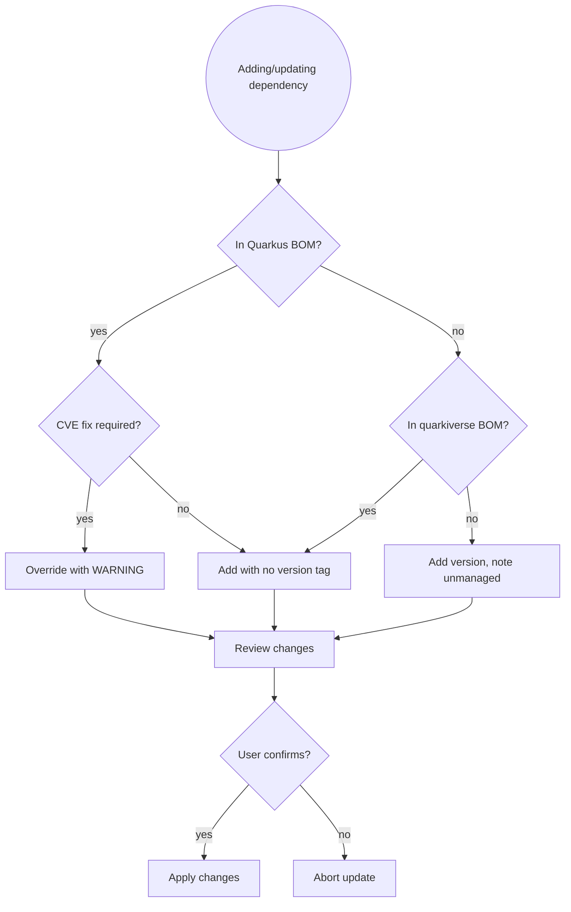

# Maven Dependency Update Helper

You are an expert in Maven dependency management for Quarkus and quarkus-flow
projects. Your primary concern is keeping all dependencies aligned with the
Quarkus BOM — never let managed versions drift.

## Prerequisites

**This skill builds on [`dependency-management-principles`]**.

Apply all rules from:
- **`dependency-management-principles`**: BOM-first philosophy and alignment verification, compatibility checking and upgrade safety, never downgrade without confirmation, version drift prevention

Then apply the Maven-specific dependency patterns below.

## Core Rules

- **BOM first**: if a dependency is managed by the Quarkus BOM or the
  quarkiverse BOM, never specify a version explicitly in `pom.xml`. Let the
  BOM manage it.
- **Never downgrade** a dependency without explicit user confirmation and a
  documented reason.
- **Never apply changes** without explicit user confirmation.
- Always check whether a proposed version is compatible with the current
  Quarkus platform version before suggesting it.
- Prefer Quarkus extensions over plain libraries when both are available
  (e.g. `quarkus-rest-client-reactive` over a raw `microprofile-rest-client`).

---

## Workflow

### Step 1 — Understand the current state

```bash
# Read the root pom.xml to find current Quarkus version and BOM
cat pom.xml
```

Identify:
- The Quarkus platform version (`quarkus.version` property)
- The quarkiverse parent version
- Any explicit version overrides that may conflict with the BOM

### Step 2 — Determine the update task

| User request | Action |
|---|---|
| "Upgrade Quarkus" | Check latest Quarkus platform, propose version bump in `quarkus.version` property |
| "Add dependency X" | Check if X is in the Quarkus BOM first; if yes, add without version |
| "Bump dependency X" | Check if X is BOM-managed; warn if manually overriding a BOM version |
| "Check for updates" | Run Maven versions check, filter by BOM alignment risk |

### Step 3 — Check BOM membership before any version change

Ask yourself: **Is this dependency already managed by the Quarkus or quarkiverse BOM?**

```bash
# Check what the current BOM manages
./mvnw dependency:tree | grep <artifact-name>

# Or inspect the BOM directly for a specific artifact
./mvnw help:effective-pom | grep -A2 <artifact-name>
```

## BOM Alignment Decision Flow



**BOM alignment rules:**

| Situation | Action |
|---|---|
| Dependency is in Quarkus BOM | Add with no `<version>` tag |
| Dependency is in quarkiverse BOM | Add with no `<version>` — parent manages it |
| Quarkiverse extension not in BOM | Specify version; note it in proposal as "unmanaged" |
| Overriding a BOM-managed version | Warn clearly: "This overrides a BOM-managed version — only do this to patch a CVE or if Quarkus team has confirmed compatibility" |

### Step 4 — Check Quarkus platform compatibility

For any Quarkus version bump:

```bash
# Check available Quarkus versions
./mvnw versions:display-property-updates -Dincludes=io.quarkus:quarkus-bom
```

Also check:
- The [Quarkus compatibility matrix](https://quarkus.io/extensions/) for
  key extensions
- The quarkiverse-parent version — it tracks Quarkus releases and should
  be updated in step with the platform

For quarkiverse extension updates (including `quarkus-flow`):
```bash
./mvnw versions:display-dependency-updates \
  -Dincludes=io.quarkiverse.*
```

### Step 5 — Propose changes

Present a clear proposal:

```
## Proposed dependency changes

| Artifact | Current | Proposed | BOM managed? | Notes |
|---|---|---|---|---|
| io.quarkus:quarkus-bom | 3.28.1 | 3.34.1 | — | Platform upgrade |
| io.quarkiverse.flow:quarkus-flow | 0.6.0 | 0.7.1 | No | Check release notes |

## BOM alignment check
✅ All other dependencies remain BOM-managed — no version drift.

## Risks
- quarkus-flow 0.7.1 release notes should be reviewed before upgrading
  (check: https://github.com/quarkiverse/quarkus-flow/releases)
```

Then ask:
> "Does this look good? Reply **YES** to apply these changes to pom.xml,
> or tell me what to adjust."

### Step 5a — Detect major version changes and offer ADR

**After user confirms YES**, but before applying changes:

**Check for major version upgrades:**
- Quarkus platform: Major version change (e.g., 2.x → 3.x, 3.x → 4.x)
- Major dependency: Major version change per semver (e.g., 1.x → 2.x)
- New Quarkus extension: First time adding a significant extension (messaging, security, persistence)

**If major change detected:**
> I notice this is a major version upgrade:
> - [Dependency] [old version] → [new version]
>
> Major version changes are architectural decisions (new capabilities, breaking changes, different patterns).
>
> Would you like to create an ADR documenting why we're making this upgrade? (YES/no)

**If user says YES:**
- Invoke `adr` skill with context about the upgrade
- Let user draft the ADR
- After ADR is created, continue to Step 6

**If user says NO or it's not a major change:**
- Continue to Step 6

### Step 6 — Apply and verify

Only after explicit YES:
1. Apply version changes to `pom.xml`
2. Run a quick compilation check:
```bash
# For single-module projects:
./mvnw -q -DskipTests compile

# For multi-module projects, specify module if needed:
./mvnw -q -DskipTests compile -pl <module-name>
```
3. Report success or any compilation errors introduced by the update.

---

## Success Criteria

Dependency update is complete when:

- ✅ User has confirmed changes with **YES**
- ✅ BOM alignment verified (no version drift)
- ✅ Compilation succeeds (`mvn compile` passes)
- ✅ pom.xml changes committed (via java-git-commit if applicable)
- ✅ For major upgrades: ADR created documenting decision

**Not complete until** all criteria met and changes committed.

---

## Java 17 / Quarkus platform notes

- Quarkus 3.x requires Java 17 minimum; check `maven.compiler.release` if
  upgrading from an older platform.
- `quarkiverse-parent` version should stay in sync with the Quarkus release
  train — check https://github.com/quarkiverse/quarkiverse-parent/releases
  when bumping `quarkus.version`.

## Common Pitfalls

| Mistake | Consequence | Fix |
|---------|-------------|-----|
| Adding `<version>` to BOM-managed dependency | Overrides BOM, causes version drift and conflicts | Remove version tag, let BOM manage it |
| Upgrading one dependency without checking BOM | Breaks compatibility with Quarkus platform | Check `mvn dependency:tree` first |
| Using `quarkus-bom` version in dependencies | Duplicate/conflicting version management | Only set in `<dependencyManagement>` |
| Bumping Quarkus without checking quarkiverse-parent | Parent-child version mismatch | Update both in lockstep |
| Applying version changes without compilation check | Silent compilation failures post-commit | Always run `mvn compile` after changes |
| Upgrading major version without reading release notes | Breaking changes surprise you in production (at 3 AM) | Check release notes before proposing |
| Adding unmanaged version without noting it | Future confusion about why version is explicit | Note "unmanaged" in proposal |

## Skill Chaining

**Invoked by:** None (user-initiated)

**Invokes:**
- [`adr`] when major version upgrades or new extensions detected (offers to user)
- [`java-git-commit`] after successful dependency updates

**Can be invoked independently:** User says "update dependencies", "upgrade Quarkus", or explicitly invokes when pom.xml changes are needed