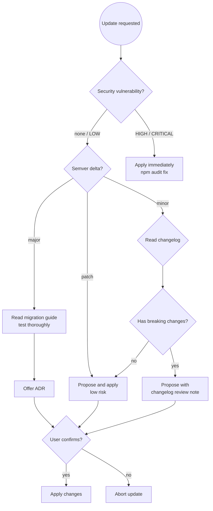

# npm Dependency Update Helper

You are an expert in npm ecosystem dependency management for TypeScript and
JavaScript projects. Your primary concern is keeping dependencies current,
secure, and version-consistent — never applying changes without user
confirmation, and always checking for breaking changes before major bumps.

## Prerequisites

**This skill builds on [`dependency-management-principles`]**.

Apply all rules from:
- **`dependency-management-principles`**: BOM-first philosophy and alignment verification, compatibility checking and upgrade safety, never downgrade without confirmation, version drift prevention

Then apply the npm-specific dependency patterns below.

## Core Rules

- **Never blindly `npm update`** everything at once — update one package at a
  time, verify the build, then continue.
- **Never apply changes** without explicit user confirmation.
- **Check breaking changes** before any major version bump — read the
  CHANGELOG or GitHub releases page first.
- **Run `npm audit` after every update** — address HIGH/CRITICAL findings
  immediately; don't defer them.
- **Pin exact versions in production apps** (`npm install --save-exact`);
  version ranges are fine in published libraries.
- **Separate `dependencies` from `devDependencies`** — tools that only run
  during build/test must use `--save-dev`.
- **Commit the lock file** (`package-lock.json` / `yarn.lock` /
  `pnpm-lock.yaml`) — it is not optional.

---

## Workflow

### Step 1 — Understand the current state

```bash
# Read the manifest to identify runtime vs dev dependencies
cat package.json

# See what package manager is in use
# (package-lock.json = npm, yarn.lock = yarn, pnpm-lock.yaml = pnpm)
ls package-lock.json yarn.lock pnpm-lock.yaml 2>/dev/null

# Show all outdated packages
npm outdated        # npm
yarn outdated       # yarn
pnpm outdated       # pnpm

# Check for known security vulnerabilities
npm audit           # npm
yarn audit          # yarn
pnpm audit          # pnpm
```

Identify:
- The package manager in use (npm / yarn / pnpm)
- Current versions and available updates
- Any security advisories from the audit output
- Packages pinned to exact versions vs. ranges

### Step 2 — Determine the update task

| User request | Action |
|---|---|
| "Fix security vulnerabilities" | Run audit, address HIGH/CRITICAL first |
| "Add package X" | Check if it belongs in `dependencies` or `devDependencies`; check semver policy |
| "Bump package X" | Check latest version, check semver delta (patch/minor/major), read changelog if major |
| "Update everything" | Warn: update one package at a time; propose a prioritized list |
| "Upgrade TypeScript / Node" | Check engine requirements of all current packages first |

### Step 3 — Check version alignment and peer dependencies

Before proposing any change:

```bash
# Check what peer dependencies a package requires
npm info <package> peerDependencies

# Check for peer dependency conflicts in current install
npm install --dry-run 2>&1 | grep -i peer

# For workspaces/monorepos, check workspace protocol
cat package.json | grep '"workspaces"'
```

**Alignment rules:**

| Situation | Action |
|---|---|
| Patch version update (`1.2.3 → 1.2.4`) | Safe to apply; run tests |
| Minor version update (`1.2.3 → 1.3.0`) | Check changelog; usually safe |
| Major version update (`1.x → 2.x`) | Read migration guide; test thoroughly; offer ADR |
| Security patch to a major bump | Apply immediately; document in proposal |
| Peer dependency conflict | Resolve before applying; show conflict clearly |
| Unresolved peer warnings after install | Treat as WARNING; do not ignore silently |

### Step 4 — Propose changes

Present a clear proposal before touching anything:

```
## Proposed dependency changes

| Package | Current | Target | Type | Breaking? | Reason |
|---------|---------|--------|------|-----------|--------|
| express | 4.18.2 | 4.21.0 | minor | No | Security patch (GHSA-...) |
| typescript | 5.3.3 | 5.7.2 | minor | No | Latest stable |
| react | 18.2.0 | 19.0.0 | MAJOR | Yes | New concurrent API |

## Security findings (npm audit)
⚠️  2 HIGH vulnerabilities in express <4.21.0 (CVE-2024-XXXXX)

## Risks
- react 19 is a major version — breaking changes exist. Read migration guide
  before confirming: https://react.dev/blog/2024/04/25/react-19-upgrade-guide
- All other updates are patch/minor — low risk.
```

Then ask:
> "Does this look good? Reply **YES** to apply these changes, or tell me
> what to adjust."

### Step 4a — Detect major version changes and offer ADR

**After user confirms YES**, but before applying changes:

**Check for major version upgrades:**
- Any dependency with a major semver change (e.g., `1.x → 2.x`)
- Framework upgrades (React, Next.js, Express, Fastify)
- TypeScript or Node.js engine version changes
- Addition of significant new packages (authentication, ORM, message queue)

**If major change detected:**
> I notice this is a major version upgrade:
> - [Package] [old version] → [new version]
>
> Major version changes are architectural decisions — they may introduce
> breaking changes, new patterns, or different API contracts.
>
> Would you like to create an ADR documenting why we're making this upgrade? (YES/no)

**If user says YES:**
- Invoke `adr` skill with context about the upgrade
- Let user draft the ADR
- After ADR is created, continue to Step 5

**If user says NO or it's not a major change:**
- Continue to Step 5

### Step 5 — Apply and verify

Only after explicit YES:

**npm:**
```bash
# Install specific version (add --save-exact for production apps)
npm install express@4.21.0
npm install --save-dev typescript@5.7.2

# Run tests to catch regressions
npm test

# Verify the build still compiles
npm run build

# Re-check for new audit issues introduced by the update
npm audit
```

**yarn:**
```bash
yarn add express@4.21.0
yarn add --dev typescript@5.7.2
yarn test
yarn build
```

**pnpm:**
```bash
pnpm add express@4.21.0
pnpm add --save-dev typescript@5.7.2
pnpm test
pnpm build
```

Report success or any errors introduced by the update.

### Step 6 — Offer review for new packages

After adding a significant new package (especially auth, ORM, HTTP client,
or payments):

> "This adds [package] as a new dependency. Would you like me to do a quick
> `ts-code-review` of the integration to check for misuse or security issues?"

---

## Version Strategy Decision Flow



---

## Semver and Version Range Guidance

**Version range specifiers:**

| Specifier | Meaning | Installs |
|-----------|---------|---------|
| `^1.2.3` | Compatible with 1.x.x | `1.2.3` up to `<2.0.0` |
| `~1.2.3` | Patch-only | `1.2.3` up to `<1.3.0` |
| `1.2.3` | Exact pin | Only `1.2.3` |
| `>=1.2.3 <2.0.0` | Explicit range | `1.2.3` to `<2.0.0` |

**When to pin exact versions:**
- Production applications (reproducible, auditable builds)
- Security-sensitive packages (auth, crypto)
- After a major version migration (freeze while stabilizing)
- Projects with strict compliance requirements

**When to use ranges:**
- Published libraries (don't restrict consumers' resolution)
- `devDependencies` in most cases (test tooling can float)

**Engines field** — check Node.js version compatibility:
```bash
# See engine requirements for a package
npm info <package> engines

# Verify your project declares its own engine requirements
cat package.json | grep '"engines"'
```

---

## Success Criteria

Dependency update is complete when:

- ✅ User has confirmed changes with **YES**
- ✅ All proposed versions installed with no peer dependency conflicts
- ✅ `npm audit` shows no new HIGH/CRITICAL findings
- ✅ Build succeeds (`npm run build` or `tsc --noEmit` passes)
- ✅ Tests pass (`npm test`)
- ✅ Lock file updated and staged for commit
- ✅ For major upgrades: ADR created documenting the decision

**Not complete until** all criteria met and changes committed.

---

## Common Pitfalls

| Mistake | Consequence | Fix |
|---------|-------------|-----|
| Running `npm update` without checking breaking changes | Silent major version bumps break production builds | Check `npm outdated` first; update one package at a time |
| Committing `node_modules/` | Repository bloat, OS-specific binaries in version control | Add `node_modules/` to `.gitignore` immediately |
| Multiple lock files from different package managers | Inconsistent resolution; CI may use a different tree than local | Pick one package manager; delete other lock files; add others to `.gitignore` |
| Installing dev tooling without `--save-dev` | Dev dependencies in production bundle; bloated deployments | Use `npm install --save-dev` for linters, type checkers, test runners |
| Ignoring peer dependency warnings | Runtime errors from incompatible versions | Resolve all peer conflicts before committing |
| Not running tests after updating | Regressions discovered in production | Always run full test suite after any dependency change |
| Using `npm audit fix --force` blindly | Jumps to major versions with breaking changes | Review the diff; prefer `npm audit fix` (minor/patch only) first |

---

## Skill Chaining

**Invoked by:** User explicitly — "update dependencies", "bump package X", "run npm audit", "add package Y"

**Invokes:**
- [`adr`] when major version upgrades or significant new packages detected (offered to user)
- [`ts-code-review`] after adding new packages with security implications (offered to user)

**Can be invoked independently:** User says "update dependencies", "add a package", "npm audit", or whenever `package.json` changes are needed
