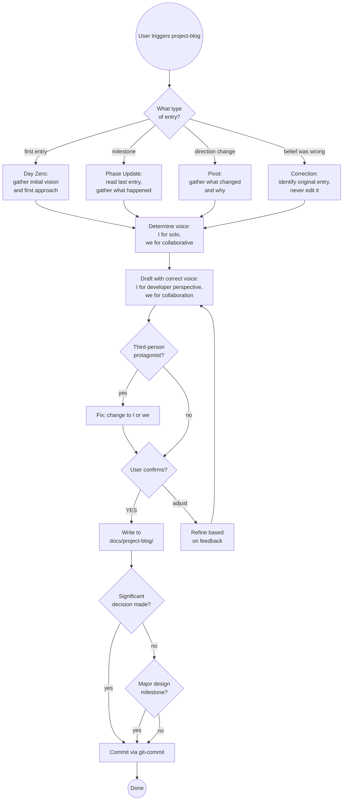

# Project Blog

A living diary of a project as it evolves — written in the moment, not in
hindsight. Each entry captures what the developer believed and intended at
that point, including aspirations that later changed, approaches that were
rejected, and pivots that happened mid-build.

This is not polished documentation. It is the honest, messy record of how
decisions actually get made: what was considered, what was rejected, what
constraints forced the change, and the "I don't know yet" moments that
standard project docs sanitise away.

---

## What This Is Not

- **Not a design snapshot** — Snapshots are formal, structured, and capture
  full design state. The blog is informal diary voice, written phase by phase.
- **Not an ADR** — ADRs record one decision formally. The blog narrates the
  story of how you got there, including everything considered and rejected.
- **Not the idea log** — The idea log parks undecided possibilities. The blog
  records what happened and why — including decisions, pivots, and discoveries.
- **Not a retrospective** — Never written after the fact. If a belief was
  wrong, a new entry corrects it — the old entry is never revised.
- **Not a technical spec** — Diary voice only.

---

## Voice and Perspective Rules

These rules are not optional. Applying them consistently is what makes the
blog feel authentic rather than generated.

**The developer's voice is "I"** — solo thinking, decisions made, what I
believed. Not "Mark Proctor thought X." Not "the developer found." Just "I."

> ✅ "I wanted something visual. A web app that showed all the skills."
> ❌ "Mark Proctor decided to build a web installer."
> ❌ "The developer believed X would work."

**The collaborative voice is "we"** — when Claude is a material participant.
Use "we" for work done together: things we built, bugs we found, decisions we
worked through. The reader understands "we" means the developer and Claude
collaborating.

> ✅ "We built the entire UI as one index.html file."
> ✅ "We discovered this the hard way after thinking everything was working."
> ✅ "We fixed it by making git-commit a BIDIRECTIONAL_EXEMPT skill."

**The rule:** "I" for what I thought, believed, wanted, or decided. "we" for
what we actually built, tried, found, or fixed. If in doubt: was Claude a
participant in doing this, or just hearing about it? "We" = Claude doing
things under the developer's direction. "I" = the developer's perspective
alone.

**Never use third-person for the developer.** If the blog says "Mark Proctor
built X" or "the user discovered Y," it's wrong. Fix it to "I built X" or
"we discovered Y."

---

## Tone Calibration by Phase

Different phases have different natural tones. Match the writing to the moment.

| Phase | Natural tone | Model after |
|-------|-------------|-------------|
| **Day Zero** | Exploratory, honest about assumptions, energetic | "I thought this would be..." |
| **Phase Update** | Problem-solution oriented, showing iteration | "We tried X — it failed because..." |
| **Architecture Deep-dive** | Introspective, constraint-focused, thinking out loud | Short punchy sentences, then longer explanations |
| **Pivot** | Honest about what was abandoned, clear about why | "We were wrong about X. Here's what actually happened." |
| **Milestone** | Forward-looking, pragmatic, naming what was validated | "This phase proved that..." |

**Signs the tone is wrong:**
- Past tense throughout — sounds like a report, not a diary
- "X was chosen because" — passive voice hides who decided
- "Future work will determine" — distance from uncertainty, not honest engagement
- Smooth narrative with no failed attempts — sanitised, not real

---

## Entry Types

| Type | When to use |
|------|------------|
| **Day Zero** | Before any work begins — initial vision, first approach, known unknowns |
| **Phase Update** | At a natural milestone — phase completed, significant work done |
| **Pivot** | When direction changes — what was considered, rejected, what forced the change |
| **Correction** | When something believed in an earlier entry proves wrong — honest about it, never edits the original |

---

## File Location

```
docs/project-blog/YYYY-MM-DD-phase-title.md
```

One file per entry. Dated, kebab-case title, ≤30 chars, no articles.
Previous entries are never edited — new entries reference them if needed.

---

## Entry Template

```markdown
# <Project Name> — <Phase Title>

**Date:** YYYY-MM-DD
**Type:** day-zero | phase-update | pivot | correction
**Corrects:** [YYYY-MM-DD-entry](YYYY-MM-DD-entry.md) *(only for correction entries)*

---

## What I Was Trying To Achieve
*(or "What We Were Trying To Achieve" for collaborative phases)*

<Context at this point. Where are we? What's the goal right now?
Write for a reader who hasn't followed the project — 2–4 sentences.>

## What I Believed Going In
*(or "What We Believed Going In")*

<Assumptions, expectations, what I thought would happen. Include things that
turned out to be wrong — that's the point. Write what you actually believed,
not what you wish you'd believed.>

## What We Tried and What Happened

<The actual work done. For planning sessions: decisions made and why.
For implementation: what was built, bugs found, unexpected constraints,
real vs expected behaviour. Be specific — include exact error messages,
command output, file paths. "No error" is important context.>

## What Changed and Why

<If anything pivoted, was rejected, or turned out differently than expected —
explain what changed and what caused it. Include what was tried before.
Omit this section if nothing changed.>

## What I Now Believe
*(or "What We Now Believe")*

<Current thinking, knowing it may change again. Honest about remaining
uncertainty. Don't pretend to certainty you don't have.>

---

**Next:** <One specific sentence on what's coming — sets up the next entry.>
```

---

## What Makes an Entry Credible

The most valuable entries show the iteration, not just the conclusion. These
signals make an entry feel like a real development diary rather than a
retrospective dressed up as one:

**Include:**
- Specific error messages verbatim: `"sync-local: unrecognized arguments: --skills"`
- Exact file paths: `scripts/validation/validate_web_app.py`
- What was tried before the fix, and why each attempt failed
- Numbers: "48 false positives," "17 validators," "six days"
- Code snippets even in day-zero posts if they clarify scope
- The moment something surprised you

**Avoid:**
- Smooth narratives with no failed attempts
- "We decided to use X" without saying what else was considered
- "This was complex" without saying *specifically* what was complex
- Vague future commitment: "we'll address this later"

---

## Workflow

### Step 1 — Determine entry type and voice

Ask the user (or infer from context):
- First entry ever? → **Day Zero**
- Phase milestone? → **Phase Update**
- Direction changing? → **Pivot**
- Earlier entry proved wrong? → **Correction**

Also determine: is this primarily solo exploration (use "I") or collaborative
work (use "we")? Both can appear in the same entry — use whichever fits each
sentence.

### Step 2 — Check existing entries

```bash
ls docs/project-blog/ 2>/dev/null | sort
```

For all types except Day Zero: read the most recent entry to understand
where the project left off. Note what was believed then — that context
shapes the new entry and ensures continuity.

For Correction entries: identify which entry is being corrected. The new
entry references it; **never edit the original**.

### Step 3 — Gather the story

Extract from conversation context rather than asking for all fields one by one.
Only ask for what's genuinely unclear:

- What was the goal at this point?
- What was believed going in (especially things that turned out to be wrong)?
- What was built/tried/found? What specific things failed before the fix?
- What changed direction, if anything?
- What's true now, knowing what we know?

### Step 4 — Draft with correct voice and tone

Apply the voice rules: "I" for the developer's perspective, "we" for
developer+Claude collaboration. Match tone to entry type.

**Do not default to "we" for everything.** A day-zero entry where the
developer is exploring ideas alone should be almost entirely "I." A phase
update where Claude was materially involved should use "we" throughout the
"What we tried" section.

Present the full draft. **Do NOT write to disk until the user confirms.**

### Step 5 — Confirm

> Here is the draft entry. Review it carefully — once committed, it is
> immutable (corrections go in a new entry, not an edit).
>
> [draft content]
>
> Confirm to write? **(YES / adjust)**

Wait for explicit YES or feedback. Iterate on feedback before writing.

### Step 6 — Write to disk

```bash
mkdir -p docs/project-blog
# write entry file
```

File name: `YYYY-MM-DD-<kebab-case-title>.md` — today's date, topic slug ≤30 chars.

### Step 7 — Offer related actions

After writing:

1. **Significant decision in the entry?** — offer to create a formal `adr`
2. **Major milestone?** — offer a `design-snapshot` to freeze the full state
3. **Commit** — invoke `git-commit` with message:
   ```
   docs: add project blog entry YYYY-MM-DD-<title>
   ```

---

## Decision Flow



---

## Common Pitfalls

| Mistake | Why It's Wrong | Fix |
|---------|----------------|-----|
| Using "Mark Proctor" as third-person | Creates distance; this is his diary | Change to "I" throughout |
| Using "we" for everything including solo thinking | Dilutes the collaboration signal; "we" should mean something | "I" for the developer's internal thinking; "we" for actual collaboration |
| Using "the developer" or "the user" | Same distancing problem as third-person names | Just use "I" |
| Writing in past tense throughout | Sounds like a retrospective, not a diary | Mix present-tense thinking: "I believed," "we think," "the question is" |
| Smooth narrative with no failed attempts | The value is in the iteration, not the conclusion | Include what was tried first, specifically why it failed |
| Vague errors: "X didn't work" | Tells future readers nothing useful | Include exact error messages, commands, file paths |
| Editing an earlier entry when beliefs change | Destroys the historical record | Write a new Correction entry that references the original |
| Skipping Day Zero | Loses the initial vision; no baseline | Always write the first entry before any work begins |
| Vague "Next:" section | Fails to set up the next entry | Be specific: "Next: we'll wire the web installer to the API and see if the state management holds up" |
| Linking to ADRs that don't exist yet | Creates dead links | Create the ADR first, then reference it |

---

## Success Criteria

Entry is complete when:

- ✅ File exists at `docs/project-blog/YYYY-MM-DD-<title>.md`
- ✅ Voice is correct: "I" for developer perspective, "we" for collaboration, no third-person protagonist
- ✅ All five sections filled — no TBDs (except "What Changed" which is optional if nothing changed)
- ✅ Specific details: error messages, file paths, failed attempts documented
- ✅ "Next:" teaser is specific, not vague
- ✅ User confirmed the draft before it was written
- ✅ File committed to git

For Correction entries additionally:
- ✅ Original entry NOT edited
- ✅ New entry links to the entry being corrected
- ✅ New entry explains what was wrong and what is now believed

**Not complete until** all criteria met and entry appears in git log.

---

## Skill Chaining

**Invoked by:** User directly ("write a blog entry", "update the project blog", "document this pivot"); also appropriate after `adr` captures a major decision, or after `design-snapshot` marks a significant milestone — the blog entry provides the narrative context the formal records don't capture

**Invokes:** [`adr`] — when a significant decision in the blog entry warrants a formal record; [`design-snapshot`] — when the entry marks a major milestone worth freezing as a formal state record; [`git-commit`] — to commit the entry (routes to `java-git-commit`, `custom-git-commit`, etc. per CLAUDE.md project type)

**Complements:** `adr` (formal decision record vs narrative story), `design-snapshot` (formal state freeze vs diary account of the journey), `idea-log` (undecided possibilities vs what actually happened and why)

**Does NOT invoke:** `update-primary-doc` or `java-update-design` — blog entries are a separate artifact, not a sync of an existing living doc
