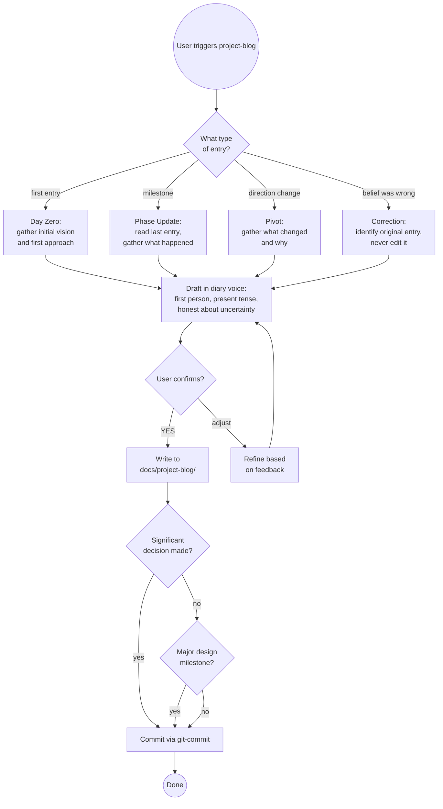

# Project Blog

A living diary of a project as it evolves — written in the moment, not in
hindsight. Each entry captures what the author believed and intended at that
point, including aspirations that later changed, approaches that were rejected,
and pivots that happened mid-build.

This is not polished documentation. It is the honest, messy record of how
decisions actually get made: what was considered, what was rejected, what
constraints forced the change, and the "we don't know yet" moments that
standard project docs sanitise away. The result is a record that shows the
real journey, not a cleaned-up version of it.

---

## What This Is Not

- **Not a design snapshot** — Snapshots are formal, structured, and capture
  full design state at a moment in time. The project blog is informal diary
  voice, written phase by phase as the project evolves.
- **Not an ADR** — ADRs record one decision deeply and formally. The blog
  narrates the story of how you got there, including everything you considered
  and rejected along the way.
- **Not the idea log** — The idea log parks undecided possibilities. The blog
  records what happened and why — including decisions, pivots, and discoveries.
- **Not a retrospective** — Never written after the fact. If a belief was
  wrong, a new entry corrects it — the old entry is never revised.
- **Not a technical spec** — No requirement lists, no feature tables. Diary
  voice only.

---

## Entry Types

| Type | When to use |
|------|------------|
| **Day Zero** | Before any code or work begins — captures initial vision, first approach, known unknowns |
| **Phase Update** | At a natural milestone — phase completed, significant work done |
| **Pivot** | When direction changes — what was considered, what was rejected, what forced the change |
| **Correction** | When something believed in an earlier entry is discovered to be wrong — honest about it, never edits the original |

---

## File Location

```
docs/project-blog/YYYY-MM-DD-phase-title.md
```

One file per entry. Dated, kebab-case title, ≤30 chars, no articles.
Previous entries are never edited — new entries reference them if needed.

---

## Entry Template

```markdown
# <Project Name> — <Phase Title>

**Date:** YYYY-MM-DD
**Type:** day-zero | phase-update | pivot | correction
**Corrects:** [YYYY-MM-DD-entry](YYYY-MM-DD-entry.md) *(only for correction entries)*

---

## What We Were Trying To Achieve

<Context at this point in the project. Where are we? What's the goal right now?
Write for a reader who hasn't followed the project — 2–4 sentences.>

## What We Believed Going In

<Assumptions, expectations, what we thought would happen. Include things that
turned out to be wrong — that's the point. Write what you actually believed,
not what you wish you'd believed.>

## What We Tried and What Happened

<The actual work done. For planning sessions: decisions made and why.
For implementation: what was built, bugs found, unexpected constraints,
real vs expected behaviour. Be specific.>

## What Changed and Why

<If anything pivoted, was rejected, or turned out differently than expected —
explain what changed and what caused it. Omit this section if nothing changed.>

## What We Now Believe

<Current thinking, knowing it may change again. Honest about remaining
uncertainty. Don't pretend to certainty you don't have.>

---

**Next:** <One sentence on what's coming in the next entry — sets up the
reader for the next phase.>
```

---

## Workflow

### Step 1 — Determine entry type

Ask the user (or infer from context):

- First entry ever on this project? → **Day Zero**
- Work completed on a phase? → **Phase Update**
- Direction changing? → **Pivot**
- Earlier entry proved wrong? → **Correction**

### Step 2 — Check existing entries

```bash
ls docs/project-blog/ 2>/dev/null | sort
```

For all types except Day Zero: read the most recent entry to understand
where the project left off. Note what was believed then — that context
shapes the new entry.

For Correction entries: identify which entry is being corrected. The new
entry references it and explains what was wrong, but **never edit the
original**.

### Step 3 — Gather the story

Ask for enough to write the entry honestly. Prompt for each section:

- **What we were trying to achieve** — Where are we in the project? What's the goal right now?
- **What we believed going in** — What assumptions did we carry into this phase? What did we expect?
- **What we tried and what happened** — What was actually done? What was discovered?
- **What changed and why** — Anything pivot, rejected, or surprising? What caused it?
- **What we now believe** — Current thinking, honest about uncertainty?
- **Next** — What's coming?

For Day Zero, "What we tried" covers initial exploratory thinking and first
approach. "What changed" is usually empty.

### Step 4 — Draft in diary voice

Write in first person, present-tense thinking. The reader should feel like
they're reading a live journal entry, not a retrospective report.

**Tone guidelines:**
- "We thought X would work because..." not "X was chosen because..."
- "We don't know yet whether..." not "Future work will determine..."
- "This turned out to be wrong because..." not "The previous approach was suboptimal"
- Include uncertainty explicitly — it's a feature, not a weakness

Present the full draft. **Do NOT write to disk until the user confirms.**

### Step 5 — Confirm

> Here is the draft entry. Review it carefully — once committed, it is
> immutable (corrections go in a new entry, not an edit).
>
> [draft content]
>
> Confirm to write? **(YES / adjust)**

Wait for explicit YES or feedback. Iterate on feedback before writing.

### Step 6 — Write to disk

```bash
mkdir -p docs/project-blog
# write entry file
```

File name: `YYYY-MM-DD-<kebab-case-title>.md` — use today's date, topic slug
≤30 chars.

### Step 7 — Offer related actions

After writing:

1. **If the entry contains a significant decision** — offer to create a formal
   `adr` to complement the narrative
2. **If the entry marks a major design milestone** — offer a `design-snapshot`
   to freeze the full state alongside the blog narrative
3. **Commit** — invoke `git-commit` with message:
   ```
   docs: add project blog entry YYYY-MM-DD-<title>
   ```

---

## Decision Flow



---

## Common Pitfalls

| Mistake | Why It's Wrong | Fix |
|---------|----------------|-----|
| Writing the entry after everything is done | Loses the honest "in the moment" voice; becomes a retrospective | Write entries while in the phase, not after it ends |
| Editing an earlier entry when beliefs change | Destroys the historical record — the point is to show the evolution | Write a new Correction entry that references the original |
| Writing in past tense throughout | Makes it read like a report, not a diary | Use "we think", "we believe", "we don't know yet" |
| Omitting uncertainty | Gives false confidence; sanitises the real experience | State uncertainty explicitly — it's valuable signal |
| Writing a pivot entry without explaining what was rejected | Reader can't understand the decision | Always include what was considered and why it was rejected |
| Skipping Day Zero | Loses the initial vision; no baseline to compare against | Always write the first entry before any work begins |
| Making the "Next" section too vague | Fails to set up the next entry | Be specific — "Next: we'll wire the web installer to the API and see if the state management holds up" |
| Linking to ADRs that don't exist yet | Creates dead links | Create the ADR first, then reference it |

---

## Success Criteria

Entry is complete when:

- ✅ File exists at `docs/project-blog/YYYY-MM-DD-<title>.md`
- ✅ All five sections filled — no TBDs, no empty sections (except "What Changed" which is optional if nothing changed)
- ✅ Diary voice throughout — first person, present-tense thinking
- ✅ "Next:" teaser present
- ✅ User confirmed the draft before it was written
- ✅ File committed to git

For Correction entries additionally:
- ✅ Original entry NOT edited
- ✅ New entry links to the entry being corrected
- ✅ New entry explains what was wrong and what is now believed

**Not complete until** all criteria met and entry appears in git log.

---

## Skill Chaining

**Invoked by:** User directly ("write a blog entry", "update the project blog", "document this pivot"); also appropriate after `adr` captures a major decision, or after `design-snapshot` marks a significant milestone — the blog entry provides the narrative context the formal records don't capture

**Invokes:** [`adr`] — when a significant decision in the blog entry warrants a formal record; [`design-snapshot`] — when the entry marks a major milestone worth freezing as a formal state record; [`git-commit`] — to commit the entry (routes to `java-git-commit`, `custom-git-commit`, etc. per CLAUDE.md project type)

**Complements:** `adr` (formal decision record vs narrative story), `design-snapshot` (formal state freeze vs diary account of the journey), `idea-log` (undecided possibilities vs what actually happened and why)

**Does NOT invoke:** `update-primary-doc` or `java-update-design` — blog entries are a separate artifact, not a sync of an existing living doc
