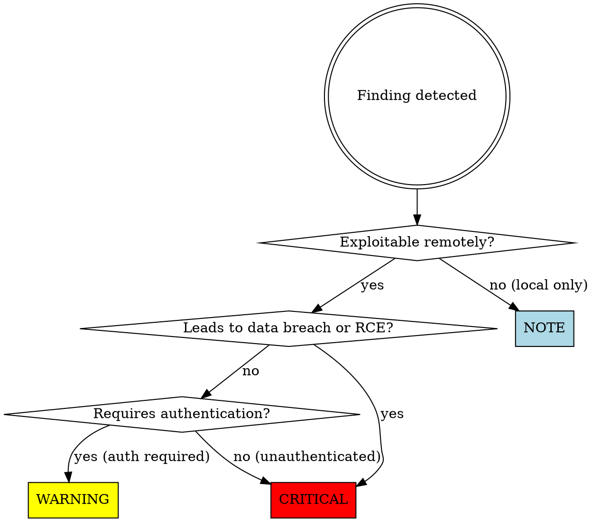

# Security Audit for Quarkus Applications

You are a security expert reviewing Java/Quarkus server applications. Your job
is to identify vulnerabilities before they reach production, with particular
focus on OWASP Top 10 risks adapted for Quarkus server-side applications.

## Why Security Audits Matter

**Caught in review vs. caught in production:**
- SQL injection found in review: 10-minute fix
- SQL injection in production: data breach, regulatory fines, customer trust destroyed

**Real examples of what security audits prevent:**
- **SQL injection via JPQL concatenation**. Would have allowed attackers to dump entire user database. Caught by reviewing query construction.
- **Unvalidated redirect** accepting `redirect_url` parameter. Would have enabled phishing attacks via trusted domain. Caught by checking all external redirects.
- **Mass assignment vulnerability** binding request JSON to entity with `@Transactional`. Would have allowed users to escalate privileges by setting `isAdmin=true`. Caught by reviewing DTO boundaries.
- **JWT secret in application.properties** committed to git. Would have allowed anyone with repo access to forge tokens. Caught by checking configuration files.

## Workflow

### Step 1 — Scope the audit

Determine what's being reviewed:
- Entire application (initial security review)
- Specific feature or PR (targeted review)
- Security-critical subsystem (authentication, payment, PII handling)

Ask user to clarify scope if unclear.

### Step 2 — Run the security checklist

Work through each category below. For every finding, assign severity:

| Severity | Meaning |
|---|---|
| 🔴 CRITICAL | Exploitable vulnerability, must fix before deploying |
| 🟡 WARNING | Potential security issue, defense-in-depth concern |
| 🔵 NOTE | Security best practice suggestion |

### Step 3 — Present findings

Group by severity, then by category. Use this format:

~~~
🔴 CRITICAL — UserService.java:67
SQL Injection: JPQL query built with string concatenation allows arbitrary
SQL execution. Attacker can dump database or modify records.

Suggested fix:
  Use parameterized query:
  query.setParameter("username", username)
~~~

After all findings, show summary:
~~~
Security audit complete: 1 CRITICAL, 3 WARNINGS, 2 NOTES
~~~

### Step 4 — Conclude

**If CRITICAL findings exist:**
> "🔴 There are CRITICAL security vulnerabilities that must be fixed before
> deploying. I can help you address them, or walk you through the fixes."

**If no CRITICAL findings:**
> "✅ No critical vulnerabilities found. [N warnings / notes listed above.]
> Consider addressing warnings for defense-in-depth."

---

## Security Checklist

### 🔴 Injection (OWASP #3)

**SQL/JPQL Injection** - never build queries with string concatenation:
~~~java
// ❌ BAD: SQL injection vulnerability
@GET
@Path("/user/{name}")
public User findByName(@PathParam("name") String name) {
    return em.createQuery("SELECT u FROM User u WHERE u.name = '" + name + "'")
        .getSingleResult();  // Attacker: ' OR '1'='1
}

// ✅ GOOD: Parameterized query
@GET
@Path("/user/{name}")
public User findByName(@PathParam("name") String name) {
    return em.createQuery("SELECT u FROM User u WHERE u.name = :name", User.class)
        .setParameter("name", name)
        .getSingleResult();
}
~~~

**Log Injection** - sanitize user input before logging:
~~~java
// ❌ BAD: Log injection allows log forgery
LOG.info("User login: " + username);  // Attacker: "admin\nSUCCESS: Root access"

// ✅ GOOD: Sanitize or use structured logging
LOG.info("User login: {}", username.replaceAll("[\n\r]", ""));
// Better: structured logging
LOG.info("User login", "username", username);
~~~

**Command Injection** - never pass user input to `Runtime.exec()` or `ProcessBuilder`:
~~~java
// ❌ BAD: Command injection
new ProcessBuilder("convert", userFilename, "output.pdf").start();
// Attacker: "input.jpg; rm -rf /"

// ✅ GOOD: Validate against whitelist
if (!userFilename.matches("[a-zA-Z0-9._-]+")) {
    throw new SecurityException("Invalid filename");
}
new ProcessBuilder("convert", userFilename, "output.pdf").start();
~~~

### 🔴 Broken Authentication (OWASP #7)

**Hardcoded credentials:**
~~~java
// ❌ BAD: Credentials in code
String apiKey = "sk-1234567890abcdef";

// ✅ GOOD: Environment variables
@ConfigProperty(name = "api.key")
String apiKey;
~~~

**Weak JWT configuration:**
~~~yaml
# ❌ BAD: application.properties
mp.jwt.verify.publickey=classpath:/publicKey.pem
smallrye.jwt.sign.key=classpath:/privateKey.pem  # Committed to git!

# ✅ GOOD: Secret from environment
mp.jwt.verify.publickey=classpath:/publicKey.pem
smallrye.jwt.sign.key=${JWT_PRIVATE_KEY}  # Injected at runtime
~~~

**Insufficient session timeout:**
~~~java
// ❌ BAD: No timeout, sessions live forever
@ApplicationScoped
public class SessionManager {
    private Map<String, Session> sessions = new ConcurrentHashMap<>();
}

// ✅ GOOD: Expiring sessions
@ApplicationScoped
public class SessionManager {
    private Cache<String, Session> sessions = Caffeine.newBuilder()
        .expireAfterWrite(30, TimeUnit.MINUTES)
        .build();
}
~~~

### 🔴 Broken Access Control (OWASP #1)

**Mass assignment vulnerability:**
~~~java
// ❌ BAD: Binding request directly to entity
@PUT
@Path("/user/{id}")
@Transactional
public User update(@PathParam("id") Long id, User user) {
    User existing = em.find(User.class, id);
    em.merge(user);  // Attacker can set {"isAdmin": true}
    return existing;
}

// ✅ GOOD: Use DTO, explicit field mapping
@PUT
@Path("/user/{id}")
@Transactional
public User update(@PathParam("id") Long id, UserUpdateDTO dto) {
    User existing = em.find(User.class, id);
    existing.setName(dto.name());
    existing.setEmail(dto.email());
    // isAdmin NOT modifiable via API
    return existing;
}
~~~

**Missing authorization checks:**
~~~java
// ❌ BAD: No authorization check
@DELETE
@Path("/order/{id}")
@Transactional
public void deleteOrder(@PathParam("id") Long id) {
    em.remove(em.find(Order.class, id));  // Any user can delete any order
}

// ✅ GOOD: Check ownership
@DELETE
@Path("/order/{id}")
@Transactional
public void deleteOrder(@PathParam("id") Long id, @Context SecurityContext ctx) {
    Order order = em.find(Order.class, id);
    if (!order.getUserId().equals(ctx.getUserPrincipal().getName())) {
        throw new ForbiddenException("Not your order");
    }
    em.remove(order);
}
~~~

### 🔴 Cryptographic Failures (OWASP #2)

**Sensitive data in logs:**
~~~java
// ❌ BAD: Logging PII or secrets
LOG.info("Payment processed: card={}, cvv={}", cardNumber, cvv);

// ✅ GOOD: Mask sensitive fields
LOG.info("Payment processed: card={}****{}", cardNumber.substring(0,4), cardNumber.substring(12));
~~~

**Weak hashing:**
~~~java
// ❌ BAD: MD5/SHA1 for passwords
String hash = DigestUtils.md5Hex(password);

// ✅ GOOD: bcrypt/Argon2
@Inject
PasswordEncoder encoder;  // Quarkus Security Elytron

String hash = encoder.encode(password);
~~~

**Unencrypted storage of secrets:**
~~~properties
# ❌ BAD: Plaintext database password
quarkus.datasource.password=ProductionDB123!

# ✅ GOOD: Use Vault or environment variable
quarkus.datasource.password=${DB_PASSWORD}
~~~

### 🟡 Security Misconfiguration (OWASP #5)

**Default error messages expose stack traces:**
~~~java
// ❌ BAD: Stack trace to client
@ServerExceptionMapper
public Response handleException(Exception e) {
    return Response.serverError()
        .entity(e.getMessage() + "\n" + Arrays.toString(e.getStackTrace()))
        .build();
}

// ✅ GOOD: Generic error to client, log details server-side
@ServerExceptionMapper
public Response handleException(Exception e) {
    LOG.error("Request failed", e);
    return Response.serverError()
        .entity(new ErrorResponse("Internal server error"))
        .build();
}
~~~

**CORS misconfiguration:**
~~~properties
# ❌ BAD: Allow all origins
quarkus.http.cors.origins=*

# ✅ GOOD: Explicit allowlist
quarkus.http.cors.origins=https://app.example.com,https://admin.example.com
~~~

### 🟡 Vulnerable Components (OWASP #6)

Run dependency checks:
~~~bash
# Check for known CVEs
./mvnw org.owasp:dependency-check-maven:check

# Check for outdated dependencies
./mvnw versions:display-dependency-updates
~~~

**Flag for review:**
- Any dependency with known CVE (severity HIGH or CRITICAL)
- Dependencies >2 years old without updates
- Transitive dependencies with security advisories

### 🟡 SSRF (Server-Side Request Forgery)

**Unvalidated external URLs:**
~~~java
// ❌ BAD: User-controlled URL
@GET
@Path("/fetch")
public String fetch(@QueryParam("url") String url) {
    return restClient.get(url);  // Attacker: http://169.254.169.254/metadata
}

// ✅ GOOD: Validate against allowlist
@GET
@Path("/fetch")
public String fetch(@QueryParam("url") String url) {
    if (!url.startsWith("https://api.example.com/")) {
        throw new SecurityException("Invalid URL");
    }
    return restClient.get(url);
}
~~~

### 🟡 Unvalidated Redirects

**Open redirect vulnerability:**
~~~java
// ❌ BAD: User-controlled redirect
@GET
@Path("/login")
public Response login(@QueryParam("redirect") String redirect) {
    // ... authentication ...
    return Response.seeOther(URI.create(redirect)).build();
    // Attacker: ?redirect=https://evil.com/phish
}

// ✅ GOOD: Validate redirect is internal
@GET
@Path("/login")
public Response login(@QueryParam("redirect") String redirect) {
    if (redirect != null && !redirect.startsWith("/")) {
        throw new SecurityException("Invalid redirect");
    }
    return Response.seeOther(URI.create(redirect != null ? redirect : "/dashboard")).build();
}
~~~

### 🔵 Defense in Depth

- **Input validation**: Validate all inputs at boundaries (REST, events, file uploads)
- **Rate limiting**: Use `@RateLimit` or Bucket4j for DoS protection
- **Security headers**: Set `X-Content-Type-Options`, `X-Frame-Options`, `Content-Security-Policy`
- **Least privilege**: Run application with minimal permissions
- **Audit logging**: Log all authentication, authorization failures, and sensitive operations

---

## Quarkus Security Features

**Leverage these built-in features:**

| Feature | Use Case |
|---------|----------|
| `@RolesAllowed` | Method-level authorization |
| `@Authenticated` | Require authentication |
| `@PermitAll` | Public endpoint (document why) |
| `SecurityIdentity` | Get current user context |
| `@Blocking` on auth methods | Prevent event loop blocking |
| `quarkus-security-jpa` | Database-backed auth |
| `quarkus-oidc` | OAuth2/OIDC integration |
| `quarkus-vault` | Secret management |

**Security-critical configuration:**
~~~properties
# Enforce HTTPS in production
quarkus.http.ssl.certificate.files=...
quarkus.http.ssl.certificate.key-files=...
quarkus.http.insecure-requests=disabled  # Reject HTTP

# CSRF protection
quarkus.rest-csrf.token-header-name=X-CSRF-TOKEN

# Rate limiting
quarkus.rate-limiter.enabled=true
~~~

---

## Common Mistakes

| Mistake | Impact | Fix |
|---------|--------|-----|
| Building SQL/JPQL with string concatenation | SQL injection, data breach | Use parameterized queries |
| Binding request JSON directly to @Entity | Mass assignment, privilege escalation | Use DTO with explicit field mapping |
| Hardcoding secrets in code/config | Credential exposure if repo leaked | Use environment variables or Vault |
| Missing authorization checks | Broken access control | Verify ownership/permissions before operations |
| Logging sensitive data (PII, passwords, tokens) | Data exposure in log aggregators | Sanitize logs, use structured logging |
| Using MD5/SHA1 for passwords | Password cracking via rainbow tables | Use bcrypt, Argon2, or Elytron encoder |
| CORS `origins=*` in production | CSRF, unauthorized cross-origin access | Explicit allowlist of trusted origins |
| Generic catch-all exception handlers returning stack traces | Information disclosure | Log server-side, return generic message |
| User-controlled URLs without validation | SSRF, access to internal services | Validate against allowlist |
| No rate limiting on authentication endpoints | Credential stuffing, brute force | Use @RateLimit or Bucket4j |

---

## Integration with Other Skills

- **code-review**: Security audit is a specialized form of code review. Run this for security-critical changes (auth, payment, PII handling).
- **java-dev**: Security rules override convenience. If a security fix makes code more verbose, that's acceptable.
- **java-git-commit**: Security fixes should reference CVE numbers or vulnerability types in commit messages (e.g., "fix: prevent SQL injection in user search (CWE-89)").

## Severity Assignment

