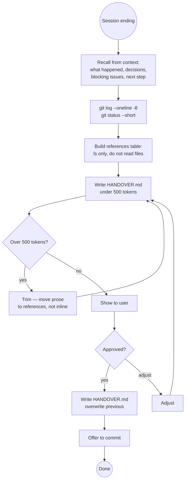

# Session Handoff

Generates a concise `HANDOVER.md` — a pointer document designed to give
the next Claude session enough context to resume immediately, without
loading everything upfront. References are read on demand; the handover
itself stays small.

**Token budget:** The generated HANDOVER.md should be readable in under
500 tokens. If it's longer, trim — it's become a document, not a handover.

---

## What This Is Not

- **Not a design snapshot** — design-snapshot freezes design state as an
  immutable archival record. The handover is operational, mutable, replaced
  each significant session.
- **Not a project blog entry** — the blog captures narrative for posterity.
  The handover captures operational context for the next 24–48 hours.
- **Not a knowledge-garden entry** — cross-project technical gotchas go in
  the garden. Session-specific context goes in the handover.
- **Not a replacement for CLAUDE.md** — CLAUDE.md is already auto-loaded
  and covers permanent conventions. Don't duplicate it here.

---

## The Lazy-Reference Principle

**Read nothing just to reference it.** If a file is already in context
because it was used this session, summarise from memory. If it isn't,
write the path and a one-line description — the next session reads it
only if the task requires it.

This is the knowledge-garden index approach applied to session continuity:
GARDEN.md tells you what's there without loading the detail; HANDOVER.md
tells you where to look without loading everything.

---

## Workflow

### Step 1 — Take stock of what's already in context (free)

From the current session, recall:
- What was worked on? What was the goal?
- What was completed? What remains?
- What decisions were made? What was tried and didn't work?
- What's blocking or uncertain?
- What's the single most important next action?

Do NOT read any files to answer these questions. Work from conversation
memory. This costs zero tokens.

### Step 2 — Gather cheap context

```bash
# Last few commits — tells the next session where the codebase is
git log --oneline -8

# Any staged or unstaged changes
git status --short
```

These are fast, small, and orient the next session without reading files.

### Step 3 — Build the references table (don't read, just locate)

Construct the references table by knowing what exists, not by reading it:

| What to reference | How to find it |
|-------------------|----------------|
| Latest design snapshot | `ls docs/design-snapshots/ \| sort \| tail -1` |
| Latest project-blog entry | `ls docs/project-blog/ \| sort \| tail -1` |
| Knowledge garden index | `~/claude/knowledge-garden/GARDEN.md` (always the index) |
| Open ideas | `docs/ideas/IDEAS.md` |
| Recent ADRs | `ls docs/adr/ \| sort \| tail -3` |
| CLAUDE.md | Already auto-loaded — omit from table |

Only run these `ls` commands — do **not** read the files themselves.
The next session reads them when a task demands it.

### Step 4 — Write HANDOVER.md

Write to `HANDOVER.md` in the project root. Keep it under 500 tokens.
Previous HANDOVER.md is overwritten — it's not a log, it's a baton.

### Step 5 — Offer to commit

```bash
git add HANDOVER.md
git commit -m "docs: update session handover YYYY-MM-DD"
```

Committing ensures the handover survives across machines and is in the
git log. But it's fine to skip if the session is continuing locally.

---

## HANDOVER.md Template

```markdown
# Handover — YYYY-MM-DD

**Head commit:** `<hash>` — <subject line>

## What Happened

- <bullet: what was built/fixed/decided>
- <bullet: another action taken>
- <bullet: keep to 3–5 bullets, action-oriented>

## State Right Now

<1–2 sentences. What exists, what works, what doesn't. No history — just now.>

## Immediate Next Step

<Single most important action. Be specific: not "continue work" but "run
python3 scripts/take_screenshots.py and update SKILL-MANAGER.md section 4".>

## Open Questions / Blockers

- <item if any>

## References

Read only what the task requires — do not load all of these upfront.

| Context | Where | Read when |
|---------|-------|-----------|
| Design state | `docs/design-snapshots/<latest>.md` | Architectural question arises |
| Project narrative | `docs/project-blog/<latest>.md` | Need to understand why something was done |
| Technical gotchas | `~/claude/knowledge-garden/GARDEN.md` | Hitting a tool/framework issue |
| Open ideas | `docs/ideas/IDEAS.md` | Exploring possibilities |
| Recent decisions | `docs/adr/<latest>.md` | Need formal decision context |

## Environment

<Only include if non-obvious — server commands, ports, special setup.
Omit entirely if there's nothing unusual. CLAUDE.md covers permanent setup.>
```

---

## When to Include the Knowledge Garden

Include a knowledge-garden reference when:
- The session involved a specific technology (AppKit, GraalVM, Quarkus, Panama FFM)
- A non-obvious bug was encountered that might recur
- The next session is likely to involve the same technology stack

When including, point to `GARDEN.md` (the index) — never to a specific
entry file. The next session reads GARDEN.md, finds the relevant section
from the dual index (by technology or by symptom type), then reads the
detail file only if it matches the task.

> **Never load knowledge-garden detail files in the handover.** The index
> is enough. The detail is for when the problem is actually encountered.

---

## What Goes in HANDOVER.md vs Other Files

| Information | Where it belongs |
|-------------|-----------------|
| What was done this session | HANDOVER.md |
| Why a design decision was made | project-blog or adr |
| Current architecture | design-snapshot (reference from handover) |
| Cross-project technical gotcha | knowledge-garden (reference from handover) |
| Undecided possibilities | idea-log (reference from handover) |
| Permanent conventions | CLAUDE.md (auto-loaded, don't repeat) |
| Ongoing project type/structure | CLAUDE.md (auto-loaded, don't repeat) |

---

## Decision Flow



---

## Common Pitfalls

| Mistake | Why It's Wrong | Fix |
|---------|----------------|-----|
| Loading the design-snapshot to reference it | Costs tokens that should be saved for the next session | Write the path, don't open the file |
| Copying CLAUDE.md content into HANDOVER.md | It's already auto-loaded — pure duplication | Omit anything in CLAUDE.md entirely |
| Long narrative prose in HANDOVER.md | Turns a handover into a document | Bullets and one-liners only; prose goes in project-blog |
| Overloading the references table | Too many references are as bad as none | Keep to 3–5 most relevant; the rest are findable from those |
| Keeping old HANDOVER.md content | Stale context misleads the next session | Overwrite completely — it's a baton, not a log |
| Including obvious environment setup | Noise that buries the important | CLAUDE.md covers permanent setup; only include session-specific exceptions |

---

## Success Criteria

Handover is complete when:

- ✅ HANDOVER.md exists at project root
- ✅ Readable in under 500 tokens
- ✅ Immediate next step is specific enough to act on without asking
- ✅ References table uses paths only — no file content inline
- ✅ Nothing from CLAUDE.md is duplicated
- ✅ User confirmed before writing

**The test:** Could a fresh Claude instance reading only CLAUDE.md and
HANDOVER.md pick up the work in the next message? If yes — done.

---

## Skill Chaining

**Invoked by:** User directly at end of a session ("create a handover",
"end of session", "prepare for next session")

**Invokes:** [`git-commit`] — to commit HANDOVER.md (optional)

**Reads from (on demand, not automatically):**
- `docs/design-snapshots/` — latest snapshot path for the references table
- `docs/project-blog/` — latest entry path for the references table
- `~/claude/knowledge-garden/GARDEN.md` — only the index, never detail files

**Complements:**
- `design-snapshot` — provides the design context the handover points to
- `project-blog` — provides the narrative context the handover points to
- `knowledge-garden` — provides the technical gotcha context the handover points to
- `idea-log` — provides the undecided possibilities the handover points to

**Does NOT replace:** CLAUDE.md (auto-loaded, covers permanent context),
`--resume` / `--continue` flags (restore conversation history for same
machine continuation)
