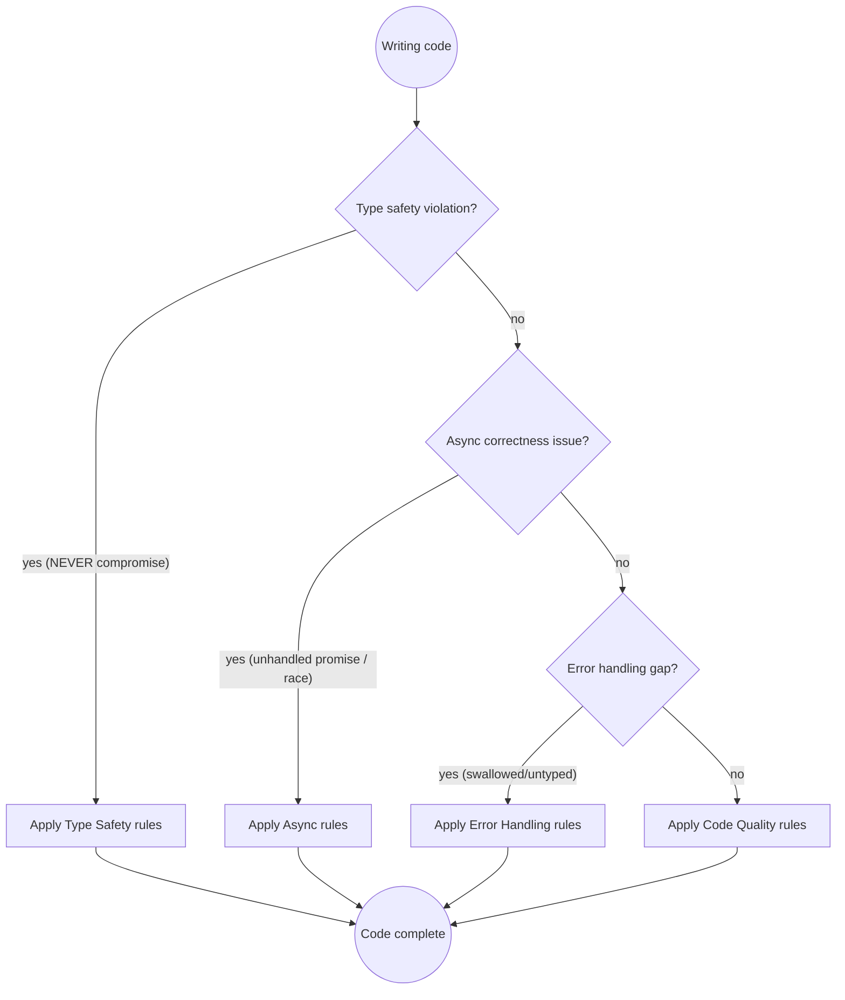

# TypeScript Development

## Quick Reference

| Category | Rule | How to Apply |
|----------|------|--------------|
| **Type Safety** | Never use `any` | Use `unknown` with type guards; `any` defeats the compiler |
| | Avoid type assertions | `as Type` suppresses errors without fixing them |
| | Avoid non-null assertions | `!` crashes on edge cases; use `?.` and `??` instead |
| | Strict mode | `strict: true` in tsconfig.json is non-negotiable |
| | Discriminated unions | Model state explicitly; no boolean flags |
| **Async Patterns** | Always await | Unhandled rejections crash Node.js silently |
| | No await in loops | Use `Promise.all` for parallel; sequential only when required |
| | Partial failures | `Promise.allSettled` when one failure shouldn't abort all |
| **Error Handling** | Type-check caught errors | `catch (e)` is `unknown` in strict mode — narrow before use |
| | Never swallow errors | Log or rethrow; empty catch blocks hide bugs |
| | Result types | Use discriminated unions for expected failures |
| **Testing** | Prefer real implementations | Mocks drift from production; real integrations catch real bugs |
| | Test behavior not impl | Don't test internal state; test observable outcomes |
| | Type-level tests | Use `expectType<T>()` for type assertions |
| **Code Quality** | `const` over `let` | Prevents accidental reassignment; never `var` |
| | `readonly` where possible | Communicates intent; prevents mutation bugs |
| | Template literals | Clearer than concatenation; no escaping issues |

## Rule Priority Decision Flow



**Priority order:** Type Safety > Async Correctness > Error Handling > Code Quality

## Why These Rules Matter

**Unhandled promise rejections:** An async function called without `await` silently discarded its error in a payment handler. Node.js emitted `UnhandledPromiseRejectionWarning` — ignored in the logs — while orders were silently dropped. Fix: one missing `await` keyword.

**`any` typing allowing runtime crashes:** A third-party API response typed as `any` was accessed with `.userId.toUpperCase()`. The field was renamed to `user_id` in a patch release. TypeScript emitted no error; production crashed with `Cannot read properties of undefined`. Fix: type the response with `unknown`, validate the shape.

**Missing null checks:** A function returned `undefined` when no record was found, but the caller assumed it always returned a value. The non-null assertion `!` had been added "because we know it's there". It wasn't, in one edge case. Fix: remove `!`, add a null check.

**Silent promise failures in loops:** `for...of` with `await` inside processed 500 items sequentially — 25 seconds instead of 1 second. The real bug was the developer's next change: wrapping the loop in `Promise.all`, which silently omitted the outer `await`, and the entire batch appeared to succeed while nothing ran. Fix: understand the async model before writing it.

These are real incidents. The rules exist because the pain is real.

## Type Safety

TypeScript's value is catching errors at compile time. Rules that bypass the type system defeat the entire purpose of using TypeScript.

**Never use `any` — use `unknown` with type guards:**
```typescript
// ❌ BAD: any silences the compiler entirely
function parseResponse(data: any): string {
    return data.user.name.toUpperCase();  // Crashes if shape changes
}

// ✅ GOOD: unknown forces you to verify the shape
function parseResponse(data: unknown): string {
    if (
        typeof data === "object" &&
        data !== null &&
        "user" in data &&
        typeof (data as { user: unknown }).user === "object"
    ) {
        const user = (data as { user: { name: string } }).user;
        return user.name.toUpperCase();
    }
    throw new Error("Unexpected response shape");
}
```

**Avoid type assertions (`as Type`) — they suppress the compiler:**
```typescript
// ❌ BAD: Forces a type without verification
const user = response.data as User;
console.log(user.email.toLowerCase());  // Crashes if email is undefined

// ✅ GOOD: Parse and validate
function toUser(data: unknown): User {
    if (!isUser(data)) throw new Error("Invalid user shape");
    return data;
}

function isUser(data: unknown): data is User {
    return (
        typeof data === "object" &&
        data !== null &&
        typeof (data as Record<string, unknown>).email === "string"
    );
}
```

**Avoid non-null assertions (`!`) — prefer optional chaining and nullish coalescing:**
```typescript
// ❌ BAD: Asserts non-null without evidence
const email = user!.profile!.email!.toLowerCase();

// ✅ GOOD: Safe navigation with fallback
const email = user?.profile?.email?.toLowerCase() ?? "unknown";
```

**`strict: true` in tsconfig.json is non-negotiable.**
This enables `strictNullChecks`, `noImplicitAny`, `strictFunctionTypes`, and related checks. A codebase without `strict: true` is TypeScript in name only.

```json
{
  "compilerOptions": {
    "strict": true,
    "noUncheckedIndexedAccess": true,
    "exactOptionalPropertyTypes": true
  }
}
```

**Use discriminated unions for state modeling:**
```typescript
// ❌ BAD: Boolean flags create impossible states
interface FetchState {
    loading: boolean;
    error: boolean;
    data?: User;
}

// ✅ GOOD: Discriminated union — every state is explicit and valid
type FetchState =
    | { status: "idle" }
    | { status: "loading" }
    | { status: "error"; error: Error }
    | { status: "success"; data: User };
```

**Prefer `interface` for object shapes, `type` for unions and intersections:**
```typescript
// Object shapes → interface (extensible, better error messages)
interface User {
    id: string;
    email: string;
}

// Unions and intersections → type
type ID = string | number;
type AdminUser = User & { role: "admin" };
```

## Async Patterns

Async bugs are among the hardest to reproduce. They often only surface under load, on slow networks, or in specific timing windows.

**Always `await` promises — unhandled rejections crash Node.js:**
```typescript
// ❌ BAD: Promise returned but not awaited — error silently discarded
async function saveOrder(order: Order): Promise<void> {
    db.insert(order);  // Missing await — failure is invisible
    sendConfirmationEmail(order.email);  // Also missing await
}

// ✅ GOOD: Explicit await — errors propagate correctly
async function saveOrder(order: Order): Promise<void> {
    await db.insert(order);
    await sendConfirmationEmail(order.email);
}
```

**Never mix callbacks and promises without promisifying first:**
```typescript
// ❌ BAD: Error from callback not caught in promise chain
async function readFile(path: string): Promise<string> {
    return new Promise((resolve) => {
        fs.readFile(path, "utf-8", (err, data) => {
            if (err) throw err;  // Throws inside callback — unhandled
            resolve(data);
        });
    });
}

// ✅ GOOD: Rejection passed to the promise
async function readFile(path: string): Promise<string> {
    return new Promise((resolve, reject) => {
        fs.readFile(path, "utf-8", (err, data) => {
            if (err) reject(err);
            else resolve(data);
        });
    });
}
```

**Use `Promise.allSettled` instead of `Promise.all` when partial failure is acceptable:**
```typescript
// ❌ BAD: One failure aborts all — other results lost
const results = await Promise.all(userIds.map(fetchUser));

// ✅ GOOD: Each settles independently
const results = await Promise.allSettled(userIds.map(fetchUser));
const users = results
    .filter((r): r is PromiseFulfilledResult<User> => r.status === "fulfilled")
    .map((r) => r.value);
```

**Never `await` inside a loop unless sequential order is required:**
```typescript
// ❌ BAD: Sequential when parallel is possible — 500ms × N items
for (const id of userIds) {
    const user = await fetchUser(id);  // Waits for each before starting next
    results.push(user);
}

// ✅ GOOD: Parallel — all requests in flight simultaneously
const results = await Promise.all(userIds.map(fetchUser));
```

## Error Handling

**`catch (e)` gives `unknown` in strict mode — type-check before accessing:**
```typescript
// ❌ BAD: Accessing properties on unknown type
try {
    await processPayment(order);
} catch (e) {
    console.error(e.message);  // Error: 'e' is of type 'unknown'
}

// ✅ GOOD: Narrow the type before use
try {
    await processPayment(order);
} catch (e) {
    const message = e instanceof Error ? e.message : String(e);
    logger.error("Payment failed", { orderId: order.id, error: message });
    throw e;
}
```

**Don't swallow errors silently — log or rethrow:**
```typescript
// ❌ BAD: Error swallowed — failure invisible to caller
try {
    await syncInventory();
} catch (_e) {
    // silently continue
}

// ✅ GOOD: Log and propagate — caller can handle or escalate
try {
    await syncInventory();
} catch (e) {
    logger.error("Inventory sync failed", { error: e });
    throw e;
}
```

**Use discriminated union Result types for expected failures (not exceptions):**
```typescript
// For expected error paths (validation, not-found), prefer Result types over exceptions
type Result<T, E = Error> =
    | { ok: true; value: T }
    | { ok: false; error: E };

async function findUser(id: string): Promise<Result<User, "not-found" | "db-error">> {
    try {
        const user = await db.users.findById(id);
        if (!user) return { ok: false, error: "not-found" };
        return { ok: true, value: user };
    } catch {
        return { ok: false, error: "db-error" };
    }
}

// Callers must handle both paths — the type enforces it
const result = await findUser(id);
if (!result.ok) {
    if (result.error === "not-found") return Response.notFound();
    return Response.serverError();
}
return Response.ok(result.value);
```

**Separate expected errors from unexpected errors.** Network timeouts and validation failures are expected — use Result types. Programmer errors and invariant violations are unexpected — throw and let them crash loudly.

## Testing

Preferred stack:
- **Jest** or **Vitest** — both support TypeScript natively with minimal config
- **`@testing-library/*`** — for UI component tests; test what the user sees, not implementation
- **`ts-expect`** or `expectTypeOf` (Vitest) — for type-level assertions
- **`msw` (Mock Service Worker)** — for HTTP mocking at the network level; prefer over manual fetch mocks
- **`testcontainers`** — for real database/service integration tests

**Prefer real implementations over mocks for integration tests:**
```typescript
// ❌ BAD: Mock hides real integration surface
jest.mock("../db/userRepository");
const mockRepo = userRepository as jest.Mocked<typeof userRepository>;
mockRepo.findById.mockResolvedValue({ id: "1", email: "test@example.com" });

// ✅ GOOD: In-memory implementation matches production contract
class InMemoryUserRepository implements UserRepository {
    private users = new Map<string, User>();
    async findById(id: string): Promise<User | null> {
        return this.users.get(id) ?? null;
    }
    async save(user: User): Promise<void> {
        this.users.set(user.id, user);
    }
}
```

**Test the types too — use type-level assertions:**
```typescript
import { expectTypeOf } from "vitest";

test("parseUser returns User type", () => {
    const result = parseUser({ id: "1", email: "a@b.com" });
    expectTypeOf(result).toEqualTypeOf<User>();
});
```

**Don't test implementation details — test behavior:**
```typescript
// ❌ BAD: Tests internal structure — breaks on refactor
expect(service["_cache"].size).toBe(1);

// ✅ GOOD: Tests observable behavior
const result = await service.getUser("1");
expect(result).toEqual({ id: "1", email: "a@b.com" });
```

**Use `beforeEach` to reset state; never share mutable state between tests:**
```typescript
// ❌ BAD: Shared state causes test-order dependencies
const repo = new InMemoryUserRepository();

// ✅ GOOD: Fresh instance per test
let repo: InMemoryUserRepository;
beforeEach(() => {
    repo = new InMemoryUserRepository();
});
```

### ⛔ Bug Fix Workflow — Mandatory

When investigating a bug:

1. **Write a failing test first.** Before touching the fix, write a test that
   reproduces the problem. Run it and confirm it fails for the right reason.
2. **Apply the fix.** Only after seeing the test fail.
3. **Verify the test passes.** Run the test again. It must go green.
4. **Verify no regressions.** Run the full test suite.
5. **Report back to the user only after step 4 passes.** Never claim a fix is
   complete until the tests confirm it.

A test written after the fix can pass for the wrong reasons. The failing test
is the evidence that the fix addresses the actual bug, not a coincidental
symptom.

## Code Quality

**Mark parameters and variables `readonly` where possible:**
```typescript
// ❌ BAD: Mutable parameter — caller's array could be mutated
function processUsers(users: User[]): void {
    users.sort((a, b) => a.name.localeCompare(b.name));  // Mutates caller's array
}

// ✅ GOOD: readonly prevents accidental mutation
function processUsers(users: readonly User[]): void {
    const sorted = [...users].sort((a, b) => a.name.localeCompare(b.name));
    // ...
}
```

**Prefer `const` over `let`, never `var`:**
```typescript
// ❌ BAD
var count = 0;
let message = "hello";  // message is never reassigned

// ✅ GOOD
const count = 0;
const message = "hello";
```

**Use template literals over string concatenation:**
```typescript
// ❌ BAD
const url = "https://api.example.com/users/" + userId + "/orders/" + orderId;

// ✅ GOOD
const url = `https://api.example.com/users/${userId}/orders/${orderId}`;
```

**Avoid deeply nested callbacks — use async/await:**
```typescript
// ❌ BAD: Callback pyramid
fetchUser(id, (user) => {
    fetchOrders(user.id, (orders) => {
        fetchInvoices(orders[0].id, (invoices) => {
            processAll(user, orders, invoices);
        });
    });
});

// ✅ GOOD: Linear async flow
const user = await fetchUser(id);
const orders = await fetchOrders(user.id);
const invoices = await fetchInvoices(orders[0].id);
processAll(user, orders, invoices);
```

## Common Pitfalls — These Thoughts Mean STOP

If you catch yourself thinking any of these, **STOP** and apply the correct approach:

| Rationalization | Problem | Impact | Fix |
|-----------------|---------|--------|-----|
| "TypeScript is just JavaScript, type errors are fine" | Type errors signal real bugs | Runtime crashes that strict mode prevents | Fix the type error; don't suppress it |
| "I'll add proper types later" | Technical debt never gets paid | `any` spreads — typed code calls untyped code | Type it now while context is fresh |
| "`as any` fixes it quickly" | Defeats the entire type system | Silent runtime failures TypeScript was meant to catch | Use `unknown` and a type guard |
| "Promise errors are handled somewhere up the chain" | They're not unless explicitly propagated | UnhandledPromiseRejection crashes Node.js | Explicitly `await` and `catch` |
| "`await` in a loop is fine for now" | Sequential when parallel is correct | 50× performance regression | Use `Promise.all` |
| "I'll mock the database in tests" | Mock diverges from real behavior | Tests pass, production burns | Use in-memory implementation or real DB |
| "`catch (e) { console.log(e) }`" | Error swallowed after logging | Caller doesn't know it failed; state corrupted | Log AND rethrow |
| "Non-null assertion is safe here" | Crashes on edge cases | `Cannot read properties of undefined` in prod | Use optional chaining and null check |
| "I know this is a string" (using `as string`) | Runtime value may not be | Silent failure — wrong type passed downstream | Use a type guard to verify |
| "The types are too complex, I'll use `any`" | Complexity is a design smell | Cascading `any` propagates through the codebase | Simplify the design or use `unknown` |
| "This works at runtime, types are just noise" | Types are a correctness contract | The next person breaks it without warning | Fix the types to match the runtime |
| "`@ts-ignore` just for now" | Suppresses errors without fixing them | Real bug hidden until it surfaces in production | Fix the root cause instead |

## Skill Chaining

- **Before committing:** invoke `ts-code-review` to catch type safety, async, and error handling issues
- **For security-critical code:** invoke `ts-security-audit` when handling authentication, authorization, payment, or PII
- **For dependency updates:** invoke `npm-dependency-update` when adding or upgrading packages
- **For architectural decisions:** suggest running `adr` to document significant design choices
