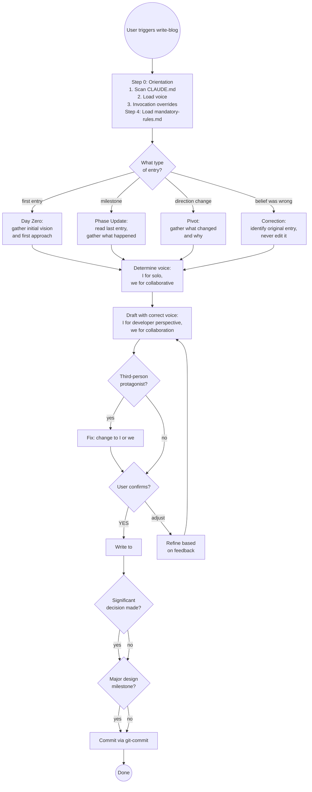

# Project Blog

A living diary of a project as it evolves — written in the moment, not in
hindsight. Each entry captures what the developer believed and intended at
that point, including aspirations that later changed, approaches that were
rejected, and pivots that happened mid-build.

Entries are written in the author's personal voice from the first draft,
using a personal writing style guide loaded before each entry. They are
intended to be published — individually or as a series — once a phase or
project reaches a natural point. The raw honesty is the value: readers see
how decisions actually get made, not a sanitised retrospective.

The `publish-blog` skill handles restructuring for publication when
entries are ready — front matter, platform formatting, final polish. But the
voice is consistent from diary to published article: personal, direct, and
yours from the start.

---

## What This Is Not

- **Not a design snapshot** — Snapshots are formal, structured, and capture
  full design state. The blog is informal diary voice, written phase by phase.
- **Not an ADR** — ADRs record one decision formally. The blog narrates the
  story of how you got there, including everything considered and rejected.
- **Not the idea log** — The idea log parks undecided possibilities. The blog
  records what happened and why — including decisions, pivots, and discoveries.
- **Not a retrospective** — Never written after the fact. If a belief was
  wrong, a new entry corrects it — the old entry is never revised.
- **Not a technical spec** — Diary voice only.
- **Not a finished article** — `publish-blog` restructures entries for
  a specific publication platform (Jekyll front matter, section structure,
  final polish). The voice and style are the same; the formatting and
  structure differ.

---

## Voice and Perspective Rules

The **complete and authoritative register rules** are in
`write-blog/defaults/mandatory-rules.md` — loaded as Layer 1 of Step 0.
Follow mandatory-rules.md as the binding specification.

**The rule in brief:** "I" for what I thought, believed, wanted, or decided.
"we" for what we actually built, tried, found, or fixed together with Claude.
Never third-person for the developer ("Mark Proctor", "the developer", "the user").

---

## Tone Calibration by Phase

Match tone to the phase — see **[entry-template.md](entry-template.md)** for the full table and signs the tone is wrong.

---

## Entry Types

| Type | When to use |
|------|------------|
| **Day Zero** | Before any work begins — initial vision, first approach, known unknowns |
| **Phase Update** | At a natural milestone — phase completed, significant work done |
| **Pivot** | When direction changes — what was considered, rejected, what forced the change |
| **Correction** | When something believed in an earlier entry proves wrong — honest about it, never edits the original |
| **Retrospective** | Covering all work to date in one pass — scans git history, proposes phases, confirms selection, writes in sequence |

---

## File Location

```
<BLOG_DIR>/YYYY-MM-DD-<initials>NN-phase-title.md
```

`<BLOG_DIR>` is resolved in Step 0 Layer 0. Default: `blog/`.

One file per entry. `<initials>` is the author's 2–4 letter identifier (e.g. `mdp`), read from `~/.claude/settings.json` § `initials`. `NN` is a two-digit per-author sequence number starting at `01`. Kebab-case title, ≤30 chars (no "the", "a", "an").

The initials prefix prevents same-day filename collisions when multiple authors contribute to the same blog. Per-author sequencing means each author's entries sort independently.

Previous entries are never edited — new entries reference them if needed.

---

## Entry Template

Full template and heading guidance: **[entry-template.md](entry-template.md)**

---

## What Makes an Entry Credible

The most valuable entries show the iteration, not just the conclusion. These
signals make an entry feel like a real development diary rather than a
retrospective dressed up as one:

**Include:**
- Specific error messages verbatim: `"sync-local: unrecognized arguments: --skills"`
- Exact file paths: `scripts/validation/validate_web_app.py`
- What was tried before the fix, and why each attempt failed
- Numbers: "48 false positives," "17 validators," "six days"
- Code blocks for the interesting parts — not just references to code, actual code; readers should feel the texture of the work
- The moment something surprised you
- Illustrations: small images (found via web search or AI-generated) to give posts visual rhythm and break up dense prose
- Screenshots for any UI work — **mandatory**; clip to the relevant component or area to avoid excessive scroll

**Avoid:**
- Smooth narratives with no failed attempts
- "We decided to use X" without saying what else was considered
- "This was complex" without saying *specifically* what was complex
- Vague future commitment: "we'll address this later"
- Describing a UI without showing it — words cannot substitute for a screenshot

---

## Visual Elements

Three kinds: code blocks (show the real snippet), illustrations (web-sourced or AI-generated), screenshots (mandatory for UI work — clip to the relevant area).

Full rules and image path conventions: **[visual-elements.md](visual-elements.md)**

---

## Workflow

### Step 0 — Orientation (layers in this order)

**Layer 0 — Resolve blog directory**

```bash
grep -i "blog directory:" CLAUDE.md 2>/dev/null
```

If a line matching `Blog directory:` is found (e.g. `Blog directory: site/_posts/`), extract that path and use it as `<BLOG_DIR>` throughout all subsequent steps.

If not found, default to `blog/`.

**Layer 1 — Scan CLAUDE.md for context**

```bash
cat CLAUDE.md 2>/dev/null | head -80
```

Extract:
- **Audience** — project type (`type: java` → JVM practitioners), frameworks and
  tools mentioned (assume the audience knows them), domain (AI/LLM tools → AI-literate)
- **Topics** — what the project is building, what problems it's solving

Note both. They calibrate what to explain vs. what to assume throughout the entry.

**Layer 2 — Load voice (one of two, never both)**

```bash
echo "$PERSONAL_WRITING_STYLES_PATH"
```

If set → it points to a directory. List the `.md` files there, select the
blog/diary style guide (typically `blog-technical.md` or equivalent), and
read it in full. It overrides and extends the common voice.

If not set → load `write-blog/defaults/common-voice.md`. This is the fallback voice:
peer-to-peer tone, ~17 word sentences, direct, no AI filler. Functional but not
personal — the author can create a personal guide at any time.

**Layer 3 — Parse invocation-time overrides (highest priority)**

If the user's invocation includes explicit audience, tone, or scope instructions —
`/write-blog the auth system — writing for non-technical stakeholders` — those
override the CLAUDE.md inference and the voice layer for this entry only.

Note what was overridden so the framing is transparent.

**Layer 4 — Resolve author initials**

```bash
python3 -c "import json; d=json.load(open('$HOME/.claude/settings.json')); print(d.get('initials',''))" 2>/dev/null
```

If initials are set → use them throughout as the filename prefix (e.g. `mdp`).

If not set → prompt once:
> "Blog filenames include author initials to prevent merge conflicts when multiple contributors write on the same day. What are your initials? (e.g. 'mdp')"
>
> Then save to `~/.claude/settings.json`:
> ```python
> d['initials'] = '<answer>'
> ```
> and proceed.

### Step 0b — Determine mode from invocation

**Invoked via `/write-blog` with no argument** → load [retrospective-workflow.md](retrospective-workflow.md) and follow that workflow. Skip Steps 1–7 below.

**Invoked via `/write-blog <context>`** → the provided text is the starting point for a single entry. Use it to propose the entry type and focus before asking anything:

> "Based on what you've described, I'd suggest a **Phase Update** entry covering [specific topic]. Shall I draft it with that framing, or would you prefer a different angle?"

Confirm the framing, then continue with Step 1.

**Invoked via direct conversation** → determine from context whether this is a single entry or a retrospective request ("blog all the work to date", "catch the blog up").

### Step 0c — Ensure CLAUDE.md has the style guide pointer

This runs before drafting anything — not after. It is a gate, not an offer.

```bash
# Check if <BLOG_DIR> already exists
ls <BLOG_DIR>/ 2>/dev/null

# Check if CLAUDE.md already has the pointer
grep -l "blog-technical\|writing style guide" CLAUDE.md 2>/dev/null
```

**If `<BLOG_DIR>` exists but the pointer is missing** (or this is the very first entry and `<BLOG_DIR>` is about to be created):
1. Propose adding the Writing Style Guide section to CLAUDE.md
2. Get user confirmation
3. Apply the change via `update-claude-md`
4. Only then proceed to Step 1

**If the pointer is already in CLAUDE.md** → proceed silently. No prompt, no mention.

---

### Step 1 — Confirm entry type and voice

If invoked via `/write-blog <context>`, the type was already proposed in Step 0b — confirm or adjust here, don't ask again from scratch.

If type is still undetermined, infer from context:
- First entry ever? → **Day Zero**
- Phase milestone or significant work? → **Phase Update**
- Direction changing? → **Pivot**
- Earlier entry proved wrong? → **Correction**

Also determine: is this primarily solo exploration (use "I") or collaborative
work (use "we")? Both can appear in the same entry — use whichever fits each
sentence.

### Step 2 — Check existing entries

```bash
ls <BLOG_DIR>/ 2>/dev/null | sort
```

For all types except Day Zero: read the most recent entry to understand
where the project left off. Note what was believed then — that context
shapes the new entry and ensures continuity.

For Correction entries: identify which entry is being corrected. The new
entry references it; **never edit the original**.

### Step 3 — Gather the story

Extract from conversation context rather than asking for all fields one by one.
Only ask for what's genuinely unclear:

- What was the goal at this point?
- What was believed going in (especially things that turned out to be wrong)?
- What was built/tried/found? What specific things failed before the fix?
- What changed direction, if anything?
- What's true now, knowing what we know?

### Step 4 — Draft with correct voice, tone, and style

**This step is a gate. Do not generate any prose until both parts below are complete.**

**Part A — Load mandatory rules:**

Read `write-blog/defaults/mandatory-rules.md` in full. These rules apply to every entry regardless of author or project. They cannot be overridden. Do not draft until this file is loaded.

**Part B — Pre-draft classification — required before writing a single sentence:**

1. **Is Claude a participant in this entry?** If yes, for each section identify in advance: is this "I" (developer's perspective alone), "we" (Mark and Claude collaborating), or "Claude [verb]" (Claude acting distinctly — catching something, reporting back, going off-script, getting it wrong)?
2. **Which moments are Claude-naming moments?** List them before drafting. These are the moments where Claude's specific behaviour is the story — not just that the work got done.
3. **Tone check:** Which entry type does this match (Day Zero / Phase Update / Pivot)? What does the Tone Calibration table say the natural tone should be?

Only after completing this classification: draft.

**Do not default to "we" for everything.** A day-zero entry where the developer is exploring ideas alone should be almost entirely "I." A phase update where Claude was materially involved should use "we" throughout the work sections.

**After drafting — verify before showing:**

Go through the style guide's "What to Avoid" section line by line. If the draft fails any item, fix it before presenting. Do not show a draft that fails the style guide — fix first, then show.

The diary voice (honest, uncertain, in-the-moment) and the personal style guide work together — one shapes *what* is said, the other shapes *how* it sounds. Both are mandatory, not advisory.

Present the full draft. **Do NOT write to disk until the user confirms.**

### Step 5 — Confirm

> Here is the draft entry. Review it carefully — once committed, it is
> immutable (corrections go in a new entry, not an edit).
>
> [draft content]
>
> Confirm to write? **(YES / adjust)**

Wait for explicit YES or feedback. Iterate on feedback before writing.

### Step 6 — Write to disk

```bash
# determine per-author sequence number (initials resolved in Step 0 Layer 4)
ls <BLOG_DIR>/YYYY-MM-DD-<initials>*.md 2>/dev/null | wc -l  # count this author's same-day entries
# NN = count + 1, zero-padded to 2 digits (01, 02, ...)
# write entry file
```

File name: `YYYY-MM-DD-<initials>NN-<kebab-case-title>.md` — today's date, author initials, two-digit per-author sequence number, topic slug ≤30 chars.

Count only this author's same-day entries (filter by initials) — other authors' entries don't affect the sequence. First entry of the day is `<initials>01`, second `<initials>02`.

After writing the entry file, update `<BLOG_DIR>/INDEX.md`:
- If `<BLOG_DIR>/INDEX.md` doesn't exist yet, create it with:
  ```markdown
  # Blog Index

  | File | Date | Title |
  |------|------|-------|
  ```
- Append a row:
  ```
  | [YYYY-MM-DD-initialsNN-title.md](YYYY-MM-DD-initialsNN-title.md) | YYYY-MM-DD | <one-line summary> |
  ```

### Step 7 — Offer related actions

After writing:

1. **Significant decision in the entry?** — offer to create a formal `adr`
2. **Major milestone?** — offer a `design-snapshot` to freeze the full state
3. **Commit** — invoke `git-commit` with message:
   ```
   docs: add project blog entry YYYY-MM-DD-<title>
   ```

---

## RETROSPECTIVE Workflow

See [retrospective-workflow.md](retrospective-workflow.md) — loaded by Step 0b when invoked blank. Contains Steps R1–R5, the decision flow, and phase identification heuristics.

---

## Decision Flow



---

## Common Pitfalls

| Mistake | Why It's Wrong | Fix |
|---------|----------------|-----|
| Using "Mark Proctor" as third-person | Creates distance; this is his diary | Change to "I" throughout |
| Using "we" for everything including solo thinking | Dilutes the collaboration signal; "we" should mean something | "I" for the developer's internal thinking; "we" for actual collaboration |
| Using "the developer" or "the user" | Same distancing problem as third-person names | Just use "I" |
| Writing in past tense throughout | Sounds like a retrospective, not a diary | Mix present-tense thinking: "I believed," "we think," "the question is" |
| Smooth narrative with no failed attempts | The value is in the iteration, not the conclusion | Include what was tried first, specifically why it failed |
| Vague errors: "X didn't work" | Tells future readers nothing useful | Include exact error messages, commands, file paths |
| Editing an earlier entry when beliefs change | Destroys the historical record | Write a new Correction entry that references the original |
| Skipping Day Zero | Loses the initial vision; no baseline for what was believed before anything was tried | Write Day Zero before work begins; if writing retrospectively, write it first using git history to reconstruct the initial state honestly |
| Using a "Next:" footer | Creates a template slot at the end of every entry; sounds like scaffolding, not writing | Integrate the forward-looking note as a natural sentence in the closing, or end on the last real point. **Series exception:** navigation links (← Previous / → Next) are added by `publish-blog` at publish time — not at write time |
| Linking to ADRs that don't exist yet | Creates dead links | Create the ADR first, then reference it |
| Replacing a thematic heading with a structural slot | Extracts character and leaves nothing — "The Pivots (There Were Several)" → "What we tried" is always a loss | Keep headings that already have personality; add structural labels only to bare slots |
| Dropping a heading entirely when merging two sections | Buries the structure the reader was using; the content is still there but now unfindable | If you merge sections, check that the surviving heading still signals what the merged content is about |
| Bare structural H2 as a container when H3s carry all the character | "What we tried" says nothing — the H3s do all the work, but H3s are invisible to a scanner | The H2 must carry meaning too; make it thematic or use a dual heading |
| Writing about UI work with no screenshot | Words describe what a screenshot shows instantly; readers can't evaluate design from prose | Include at least one clipped screenshot of the relevant component — mandatory for UI entries |
| Full-page screenshot when one component is the subject | Creates scroll, buries the focus, makes readers hunt for the relevant part | Clip to the area that matters; if the whole page is relevant, show it full then annotate |
| Omitting code when the implementation detail is the story | Readers get the conclusion without the texture; loses the "feel of the work" | Include the actual snippet — 5–10 lines that show the interesting part |

---

## Before you commit: heading smell check

Run the five checks in **[heading-checks.md](heading-checks.md)** before committing any entry.

---

## Success Criteria

Entry is complete when:

- ✅ File exists at `<BLOG_DIR>/YYYY-MM-DD-<initials>NN-<title>.md` with correct initials and per-author sequence number
- ✅ Voice is correct: "I" for developer perspective, "we" for collaboration, no third-person protagonist
- ✅ Headings: thematic headings were kept or enhanced — none were replaced with bare structural slots
- ✅ All required sections filled — no TBDs; "What Changed" may be omitted only if nothing pivoted
- ✅ No "Next:" footer — any forward-looking note integrated naturally or entry ends on the last real point
- ✅ Specific details: error messages, file paths, failed attempts documented
- ✅ Code blocks present where implementation detail is part of the story
- ✅ If entry covers UI work: at least one screenshot present, clipped to the relevant area, saved to `blog/images/`
- ✅ User confirmed the draft before it was written
- ✅ File committed to git (including any images in `blog/images/`)

For Correction entries additionally:
- ✅ Original entry NOT edited
- ✅ New entry links to the entry being corrected
- ✅ New entry explains what was wrong and what is now believed

For Retrospective runs additionally:
- ✅ All confirmed entries written and committed
- ✅ Day Zero entry exists (written first if missing)
- ✅ See RETROSPECTIVE Workflow Step R5 for final summary

**Not complete until** all criteria met and entry appears in git log.

---

## Skill Chaining

**Invoked by:** User directly — single entry ("write a blog entry", "update the project blog", "document this pivot") or full retrospective ("blog all the work to date", "catch the blog up", "write a retrospective series"); also after `adr` captures a major decision, after `design-snapshot` marks a significant milestone, or automatically as part of the `handover` wrap checklist

**Invokes:** [`update-claude-md`] — on first entry ever in a project, to add the mandatory Writing Style Guide section to CLAUDE.md; [`adr`] — when a significant decision in the blog entry warrants a formal record; [`design-snapshot`] — when the entry marks a major milestone worth freezing as a formal state record; [`git-commit`] — to commit the entry (routes to `java-git-commit`, `custom-git-commit`, etc. per CLAUDE.md project type)

**Feeds into:** `publish-blog` (personal skill, not in cc-praxis) — handles the publishing mechanics when entries are ready to go out. `write-blog` is the writing step; `publish-blog` is the delivery step (currently Jekyll, but the platform may change — only `publish-blog` needs to change, not the entries)

**Complements:** `adr` (formal decision record vs narrative story), `design-snapshot` (formal state freeze vs diary account of the journey), `idea-log` (undecided possibilities vs what actually happened and why)

**Does NOT invoke:** `update-primary-doc` or `java-update-design` — blog entries are a separate artifact, not a sync of an existing living doc
