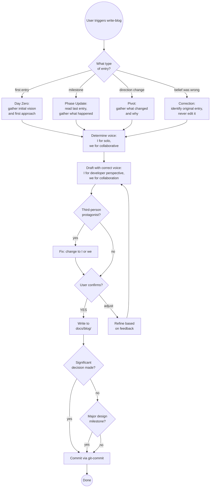

# Project Blog

A living diary of a project as it evolves — written in the moment, not in
hindsight. Each entry captures what the developer believed and intended at
that point, including aspirations that later changed, approaches that were
rejected, and pivots that happened mid-build.

Entries are written in the author's personal voice from the first draft,
using a personal writing style guide loaded before each entry. They are
intended to be published — individually or as a series — once a phase or
project reaches a natural point. The raw honesty is the value: readers see
how decisions actually get made, not a sanitised retrospective.

The `publish-blog` skill handles restructuring for publication when
entries are ready — front matter, platform formatting, final polish. But the
voice is consistent from diary to published article: personal, direct, and
yours from the start.

---

## What This Is Not

- **Not a design snapshot** — Snapshots are formal, structured, and capture
  full design state. The blog is informal diary voice, written phase by phase.
- **Not an ADR** — ADRs record one decision formally. The blog narrates the
  story of how you got there, including everything considered and rejected.
- **Not the idea log** — The idea log parks undecided possibilities. The blog
  records what happened and why — including decisions, pivots, and discoveries.
- **Not a retrospective** — Never written after the fact. If a belief was
  wrong, a new entry corrects it — the old entry is never revised.
- **Not a technical spec** — Diary voice only.
- **Not a finished article** — `publish-blog` restructures entries for
  a specific publication platform (Jekyll front matter, section structure,
  final polish). The voice and style are the same; the formatting and
  structure differ.

---

## Voice and Perspective Rules

These rules are not optional. Applying them consistently is what makes the
blog feel authentic rather than generated.

**The developer's voice is "I"** — solo thinking, decisions made, what I
believed. Not "Mark Proctor thought X." Not "the developer found." Just "I."

> ✅ "I wanted something visual. A web app that showed all the skills."
> ❌ "Mark Proctor decided to build a web installer."
> ❌ "The developer believed X would work."

**The collaborative voice is "we"** — when Claude is a material participant.
Use "we" for work done together: things we built, bugs we found, decisions we
worked through. The reader understands "we" means the developer and Claude
collaborating.

> ✅ "We built the entire UI as one index.html file."
> ✅ "We discovered this the hard way after thinking everything was working."
> ✅ "We fixed it by making git-commit a BIDIRECTIONAL_EXEMPT skill."

**The rule:** "I" for what I thought, believed, wanted, or decided. "we" for
what we actually built, tried, found, or fixed. If in doubt: was Claude a
participant in doing this, or just hearing about it? "We" = Claude doing
things under the developer's direction. "I" = the developer's perspective
alone.

**Never use third-person for the developer.** If the blog says "Mark Proctor
built X" or "the user discovered Y," it's wrong. Fix it to "I built X" or
"we discovered Y."

---

## Tone Calibration by Phase

Different phases have different natural tones. Match the writing to the moment.

| Phase | Natural tone | Model after |
|-------|-------------|-------------|
| **Day Zero** | Exploratory, honest about assumptions, energetic | "I thought this would be..." |
| **Phase Update** | Problem-solution oriented, showing iteration | "We tried X — it failed because..." |
| **Architecture Deep-dive** | Introspective, constraint-focused, thinking out loud | Short punchy sentences, then longer explanations |
| **Pivot** | Honest about what was abandoned, clear about why | "We were wrong about X. Here's what actually happened." |
| **Milestone** | Forward-looking, pragmatic, naming what was validated | "This phase proved that..." |

**Signs the tone is wrong:**
- Past tense throughout — sounds like a report, not a diary
- "X was chosen because" — passive voice hides who decided
- "Future work will determine" — distance from uncertainty, not honest engagement
- Smooth narrative with no failed attempts — sanitised, not real

---

## Entry Types

| Type | When to use |
|------|------------|
| **Day Zero** | Before any work begins — initial vision, first approach, known unknowns |
| **Phase Update** | At a natural milestone — phase completed, significant work done |
| **Pivot** | When direction changes — what was considered, rejected, what forced the change |
| **Correction** | When something believed in an earlier entry proves wrong — honest about it, never edits the original |
| **Retrospective** | Covering all work to date in one pass — scans git history, proposes phases, confirms selection, writes in sequence |

---

## File Location

```
docs/blog/YYYY-MM-DD-phase-title.md
```

One file per entry. Dated, kebab-case title, ≤30 chars, no articles.
Previous entries are never edited — new entries reference them if needed.

---

## Entry Template

```markdown
# <Project Name> — <Phase Title>

**Date:** YYYY-MM-DD
**Type:** day-zero | phase-update | pivot | correction
**Corrects:** [YYYY-MM-DD-entry](YYYY-MM-DD-entry.md) *(only for correction entries)*

---

## What I was trying to achieve: <specific goal for this phase>
*(or "What we were trying to achieve: ..." for collaborative phases)*

<Context at this point. Where are we? What's the goal right now?
Write for a reader who hasn't followed the project — 2–4 sentences.>

## What we believed going in: <the assumption that turned out to matter>

<Assumptions, expectations, what I thought would happen. Include things that
turned out to be wrong — that's the point. Write what you actually believed,
not what you wish you'd believed.>

## <Thematic heading for the bulk of the work — name what actually happened>
*(e.g. "Three install attempts and a taxonomy", "The --skills flag that didn't exist",
"Six pivots, zero architecture changes". If this section has distinct sub-stories,
use thematic H3s beneath it rather than one undifferentiated block.)*

<The actual work done. For planning sessions: decisions made and why.
For implementation: what was built, bugs found, unexpected constraints,
real vs expected behaviour. Be specific — include exact error messages,
command output, file paths. "No error" is important context.>

## What changed and why: <the pivot or constraint that forced it>

<If anything pivoted, was rejected, or turned out differently than expected —
explain what changed and what caused it. Include what was tried before.
Omit this section if nothing changed.>

## What it is now
*(or another thematic close — "The discipline is the work", "Where this leaves us")*

<Current state and thinking, knowing it may change again. Honest about remaining
uncertainty. Don't pretend to certainty you don't have. End naturally — no
summary of what was just said, no "Thanks for reading". If there's a
forward-looking note, integrate it as a sentence here, not as a footer.>
```

**These headings are starting points, not rigid slots.** If a heading already has thematic character — `## The Pivots (There Were Several)`, `## Six Pivots, Zero Architecture Changes` — keep it. The structural label (`What we tried:`) is additive scaffolding, not a replacement. If a section heading is already specific and interesting, adding a structural prefix is optional. If it's a bare slot with no content, pair it with a thematic description. Never trade a heading that has personality for one that doesn't.

---

## What Makes an Entry Credible

The most valuable entries show the iteration, not just the conclusion. These
signals make an entry feel like a real development diary rather than a
retrospective dressed up as one:

**Include:**
- Specific error messages verbatim: `"sync-local: unrecognized arguments: --skills"`
- Exact file paths: `scripts/validation/validate_web_app.py`
- What was tried before the fix, and why each attempt failed
- Numbers: "48 false positives," "17 validators," "six days"
- Code snippets even in day-zero posts if they clarify scope
- The moment something surprised you

**Avoid:**
- Smooth narratives with no failed attempts
- "We decided to use X" without saying what else was considered
- "This was complex" without saying *specifically* what was complex
- Vague future commitment: "we'll address this later"

---

## Workflow

### Step 0 — Load personal writing style guide

Entries are written in the author's personal voice from the first draft —
not generic AI prose cleaned up later. Load the style guide before drafting.

```bash
echo "$PERSONAL_WRITING_STYLES_PATH"
```

If empty → try the default: `~/claude-workspace/writing-styles/`

Select the guide for a development diary / blog post (typically
`blog-technical.md` or equivalent). If none exists, proceed without it but
note that entries will follow the voice rules below without a style
constraint. The user can create a style guide at any time and it will be
picked up on the next entry.

Read the selected guide in full. Everything in it constrains the output —
vocabulary, sentence patterns, what to avoid, how to open and close.

### Step 0b — Determine mode from invocation

**Invoked via `/write-blog` with no argument** → go to RETROSPECTIVE workflow. Skip Steps 1–7.

**Invoked via `/write-blog <context>`** → the provided text is the starting point for a single entry. Use it to propose the entry type and focus before asking anything:

> "Based on what you've described, I'd suggest a **Phase Update** entry covering [specific topic]. Shall I draft it with that framing, or would you prefer a different angle?"

Confirm the framing, then continue with Step 1.

**Invoked via direct conversation** → determine from context whether this is a single entry or a retrospective request ("blog all the work to date", "catch the blog up").

### Step 1 — Determine entry type and voice

Ask the user (or infer from context):
- First entry ever? → **Day Zero**
- Phase milestone? → **Phase Update**
- Direction changing? → **Pivot**
- Earlier entry proved wrong? → **Correction**

Also determine: is this primarily solo exploration (use "I") or collaborative
work (use "we")? Both can appear in the same entry — use whichever fits each
sentence.

### Step 2 — Check existing entries

```bash
ls docs/blog/ 2>/dev/null | sort
```

For all types except Day Zero: read the most recent entry to understand
where the project left off. Note what was believed then — that context
shapes the new entry and ensures continuity.

For Correction entries: identify which entry is being corrected. The new
entry references it; **never edit the original**.

### Step 3 — Gather the story

Extract from conversation context rather than asking for all fields one by one.
Only ask for what's genuinely unclear:

- What was the goal at this point?
- What was believed going in (especially things that turned out to be wrong)?
- What was built/tried/found? What specific things failed before the fix?
- What changed direction, if anything?
- What's true now, knowing what we know?

### Step 4 — Draft with correct voice, tone, and style

Apply the voice rules: "I" for the developer's perspective, "we" for
developer+Claude collaboration. Match tone to entry type.

**Do not default to "we" for everything.** A day-zero entry where the
developer is exploring ideas alone should be almost entirely "I." A phase
update where Claude was materially involved should use "we" throughout the
"What we tried" section.

Apply the style guide loaded in Step 0. The guide constrains vocabulary,
sentence patterns, and what to avoid — follow it as a hard constraint, not
a suggestion. Check the draft against the "What to avoid" section before
presenting. The diary voice (honest, uncertain, in-the-moment) and the
personal style guide work together — one shapes *what* is said, the other
shapes *how* it sounds.

Present the full draft. **Do NOT write to disk until the user confirms.**

### Step 5 — Confirm

> Here is the draft entry. Review it carefully — once committed, it is
> immutable (corrections go in a new entry, not an edit).
>
> [draft content]
>
> Confirm to write? **(YES / adjust)**

Wait for explicit YES or feedback. Iterate on feedback before writing.

### Step 6 — Write to disk

```bash
mkdir -p docs/blog
# write entry file
```

File name: `YYYY-MM-DD-<kebab-case-title>.md` — today's date, topic slug ≤30 chars.

### Step 7 — Offer related actions

After writing:

1. **Significant decision in the entry?** — offer to create a formal `adr`
2. **Major milestone?** — offer a `design-snapshot` to freeze the full state
3. **Commit** — invoke `git-commit` with message:
   ```
   docs: add project blog entry YYYY-MM-DD-<title>
   ```

---

## RETROSPECTIVE Workflow

Use when the user says "blog all the work to date", "catch the blog up", "write a retrospective series", or "cover everything we've done". Scans git history, proposes a set of entries as a journey, lets the user confirm the selection, then writes them in sequence.

### Step R1 — Scan git history for natural phases

```bash
git log --oneline --no-merges | head -60
git log --format="%ad %s" --date=short | head -60
```

Look for natural breakpoints — clusters of related commits, date gaps, significant changes in theme (infrastructure → features → quality → UI), version tags, or explicit milestone commits. Group commits into candidate phases.

### Step R2 — Check what's already been written

```bash
ls docs/blog/ 2>/dev/null | sort
```

Any phases already covered by existing entries are excluded from the proposed list.

### Step R3 — Present the proposed entry list for selection

Show each proposed phase as a numbered item with a `[x]` marker (all ticked by default), a date range, and a one-line description of what that phase covers:

```
Proposed blog entries — all selected by default.
Type numbers to deselect (e.g. "2 4"), or press Enter to write all:

[x] 1  2026-03-29        Day Zero: The First Nine Skills
[x] 2  2026-03-31        Building the Infrastructure
[x] 3  2026-04-02        Health, TypeScript, and Python
[x] 4  2026-04-03        The Web Installer
[x] 5  2026-04-04        The Methodology Family
```

Wait for the user's response before proceeding:
- **Enter / "all"** → proceed with all ticked entries
- **Numbers** → deselect those entries, show updated list, confirm again
- **"none X"** → deselect entry X specifically

Once confirmed, show the final selection and ask for a final go-ahead before writing anything.

### Step R4 — Write entries in sequence

For each confirmed entry, follow the full standard write-blog workflow (Steps 0–7):

- Load the writing style guide (Step 0) — load once, apply to all entries
- Determine the entry type — Day Zero for the first, Phase Update for subsequent, Pivot where direction changed
- Gather the story from git history and commit messages for that phase
- Draft with correct voice, style, and tone
- Show the draft and confirm before writing to disk
- Write to `docs/blog/YYYY-MM-DD-<slug>.md`
- Offer to commit each entry, or batch-commit at the end

After each entry is confirmed, move to the next. Do not draft the next entry until the current one is written and committed.

### Step R5 — Final summary

After all selected entries are written:

```
Blog series complete:
  ✅ 2026-03-29-day-zero.md
  ✅ 2026-03-31-building-the-infrastructure.md
  ✅ 2026-04-02-health-typescript-python.md

All committed. Ready to publish via publish-blog when you're ready.
```

### Phase identification heuristics

When grouping commits into phases, look for:

- **Date clustering** — commits bunched close together then a gap suggest a natural phase boundary
- **Theme shifts** — commits about one feature area give way to another (infrastructure → UI → quality)
- **Milestone markers** — version tags, "feat:" commits that name a significant capability, commits with "initial" or "first" in the message
- **Volume changes** — a burst of commits on one topic followed by silence suggests a completed phase
- **Existing ADRs or snapshots** — `git log -- docs/adr/ docs/design-snapshots/` shows when formal decisions were captured, which often coincides with phase boundaries

When in doubt, propose more phases rather than fewer — the user can deselect. A phase should represent 2–5 days of work or a coherent body of work, not individual commits.

---

## Decision Flow



---

## Common Pitfalls

| Mistake | Why It's Wrong | Fix |
|---------|----------------|-----|
| Using "Mark Proctor" as third-person | Creates distance; this is his diary | Change to "I" throughout |
| Using "we" for everything including solo thinking | Dilutes the collaboration signal; "we" should mean something | "I" for the developer's internal thinking; "we" for actual collaboration |
| Using "the developer" or "the user" | Same distancing problem as third-person names | Just use "I" |
| Writing in past tense throughout | Sounds like a retrospective, not a diary | Mix present-tense thinking: "I believed," "we think," "the question is" |
| Smooth narrative with no failed attempts | The value is in the iteration, not the conclusion | Include what was tried first, specifically why it failed |
| Vague errors: "X didn't work" | Tells future readers nothing useful | Include exact error messages, commands, file paths |
| Editing an earlier entry when beliefs change | Destroys the historical record | Write a new Correction entry that references the original |
| Skipping Day Zero | Loses the initial vision; no baseline | Always write the first entry before any work begins |
| Using a "Next:" footer | Creates a template slot at the end of every entry; sounds like scaffolding, not writing | Integrate the forward-looking note as a natural sentence in the closing, or end on the last real point |
| Linking to ADRs that don't exist yet | Creates dead links | Create the ADR first, then reference it |
| Replacing a thematic heading with a structural slot | Extracts character and leaves nothing — "The Pivots (There Were Several)" → "What we tried" is always a loss | Keep headings that already have personality; add structural labels only to bare slots |
| Dropping a heading entirely when merging two sections | Buries the structure the reader was using; the content is still there but now unfindable | If you merge sections, check that the surviving heading still signals what the merged content is about |
| Bare structural H2 as a container when H3s carry all the character | "What we tried" says nothing — the H3s do all the work, but H3s are invisible to a scanner | The H2 must carry meaning too; make it thematic or use a dual heading |

---

## Before you commit: heading smell check

After writing or editing headings, run these five checks. Each one catches a specific failure mode.

**1. The character drain check.** Read just the H2 headings in order, like a table of contents. Could any of them appear unchanged in a completely different blog post about a completely different project? If yes, they've lost their specificity. `## What we tried` could be in any post ever written. `## The Pivots (There Were Several)` belongs to this one.

**2. The before/after check.** For every heading you changed, ask: did the new version gain something, lose something, or both? If the new version is shorter and more generic — stop. You replaced thematic content with structural scaffolding. Changes should add, never only subtract.

**3. The dropped heading check.** For every heading that existed before your edit and doesn't exist after — where did its content go? If the answer is "I merged it into another section," check that the merged section still has a heading that signals what the content is. Merging two sections into headingless prose quietly buries the structure the reader was using.

**4. The H2 container check.** If you have an H2 with H3 subsections beneath it, read the H2 alone. Does it say anything interesting? `## What we tried` says nothing — the H3s do all the work. But H3s are invisible to a scanner. The H2 needs to carry meaning too.

**5. The substitution test.** For any heading you replaced, ask: if the original author saw this new heading, would they recognise it as an improvement or feel like something was lost? A thematic heading that someone wrote with care — `## Six Pivots, Zero Architecture Changes`, `## The GCD Block That Never Ran` — signals intent. Replacing it with a structural slot signals you didn't read it carefully.

**The underlying principle:** thematic headings are primary, structural labels are additive. Before changing any heading, ask: am I adding value or extracting it?

---

## Success Criteria

Entry is complete when:

- ✅ File exists at `docs/blog/YYYY-MM-DD-<title>.md`
- ✅ Voice is correct: "I" for developer perspective, "we" for collaboration, no third-person protagonist
- ✅ Headings: thematic headings were kept or enhanced — none were replaced with bare structural slots
- ✅ All five sections filled — no TBDs (except "What Changed" which is optional if nothing changed)
- ✅ Specific details: error messages, file paths, failed attempts documented
- ✅ "Next:" teaser is specific, not vague
- ✅ User confirmed the draft before it was written
- ✅ File committed to git

For Correction entries additionally:
- ✅ Original entry NOT edited
- ✅ New entry links to the entry being corrected
- ✅ New entry explains what was wrong and what is now believed

**Not complete until** all criteria met and entry appears in git log.

---

## Skill Chaining

**Invoked by:** User directly — single entry ("write a blog entry", "update the project blog", "document this pivot") or full retrospective ("blog all the work to date", "catch the blog up", "write a retrospective series"); also appropriate after `adr` captures a major decision, or after `design-snapshot` marks a significant milestone

**Invokes:** [`adr`] — when a significant decision in the blog entry warrants a formal record; [`design-snapshot`] — when the entry marks a major milestone worth freezing as a formal state record; [`git-commit`] — to commit the entry (routes to `java-git-commit`, `custom-git-commit`, etc. per CLAUDE.md project type)

**Feeds into:** `publish-blog` (personal skill, not in cc-praxis) — handles the publishing mechanics when entries are ready to go out. `write-blog` is the writing step; `publish-blog` is the delivery step (currently Jekyll, but the platform may change — only `publish-blog` needs to change, not the entries)

**Complements:** `adr` (formal decision record vs narrative story), `design-snapshot` (formal state freeze vs diary account of the journey), `idea-log` (undecided possibilities vs what actually happened and why)

**Does NOT invoke:** `update-primary-doc` or `java-update-design` — blog entries are a separate artifact, not a sync of an existing living doc
