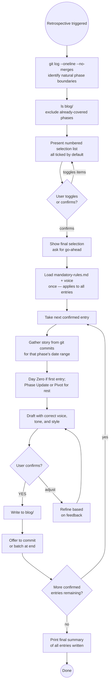

# Retrospective Workflow

Used by `write-blog` when invoked blank (`/write-blog` with no argument),
or when user says "blog all the work to date", "catch the blog up", or
"write a retrospective series". Scans git history, proposes entries as a
journey, lets the user confirm the selection, then writes them in sequence.

Writing rules (mandatory-rules.md, voice) are loaded once before the first
draft — not before scanning and proposing.

---

## Step R1 — Scan git history for natural phases

```bash
git log --oneline --no-merges | head -60
git log --format="%ad %s" --date=short | head -60
```

Look for natural breakpoints — clusters of related commits, date gaps,
significant changes in theme (infrastructure → features → quality → UI),
version tags, or explicit milestone commits. Group commits into candidate phases.

## Step R2 — Check what's already been written

```bash
ls blog/ 2>/dev/null | sort
```

Any phases already covered by existing entries are excluded from the proposed list.

## Step R3 — Present the proposed entry list for selection

Show each proposed phase as a numbered item with a `[x]` marker (all ticked
by default), a date range, and a one-line description of what that phase covers:

```
Proposed blog entries — all selected by default.
Type numbers to deselect (e.g. "2 4"), or "go" to write all:

[x] 1  2026-03-29        Day Zero: The First Nine Skills
[x] 2  2026-03-31        Building the Infrastructure
[x] 3  2026-04-02        Health, TypeScript, and Python
[x] 4  2026-04-03        The Web Installer
[x] 5  2026-04-04        The Methodology Family
```

Wait for the user's response before proceeding:
- **Enter / "all"** → proceed with all ticked entries
- **Numbers** → deselect those entries, show updated list, confirm again
- **"none X"** → deselect entry X specifically

Once confirmed, show the final selection and ask for a final go-ahead before
writing anything.

## Step R4 — Write entries in sequence

For each confirmed entry, follow the full standard write-blog workflow (Steps 0–7):

- Load mandatory-rules.md and writing voice once — applies to all entries
- Determine the entry type — Day Zero for the first, Phase Update for subsequent, Pivot where direction changed
- Gather the story from git history and commit messages for that phase
- Draft with correct voice, style, and tone
- Show the draft and confirm before writing to disk
- Write to `blog/YYYY-MM-DD-<initials>NN-<slug>.md` — initials from `~/.claude/settings.json`, per-author sequence number determined at write time
- Offer to commit each entry, or batch-commit at the end

After each entry is confirmed, move to the next. Do not draft the next entry
until the current one is written and committed.

## Step R5 — Final summary

After all selected entries are written:

```
Blog series complete:
  ✅ 2026-03-29-01-day-zero.md
  ✅ 2026-03-31-01-building-the-infrastructure.md
  ✅ 2026-04-02-01-health-typescript-python.md

All committed. Ready to publish via publish-blog when you're ready.
```

---

## Decision Flow



---

## Phase identification heuristics

When grouping commits into phases, look for:

- **Date clustering** — commits bunched close together then a gap suggest a natural phase boundary
- **Theme shifts** — commits about one feature area give way to another (infrastructure → UI → quality)
- **Milestone markers** — version tags, "feat:" commits that name a significant capability, commits with "initial" or "first" in the message
- **Volume changes** — a burst of commits on one topic followed by silence suggests a completed phase
- **Existing ADRs or snapshots** — `git log -- adr/ snapshots/` shows when formal decisions were captured, which often coincides with phase boundaries

When in doubt, propose more phases rather than fewer — the user can deselect.
A phase should represent 2–5 days of work or a coherent body of work, not
individual commits.
